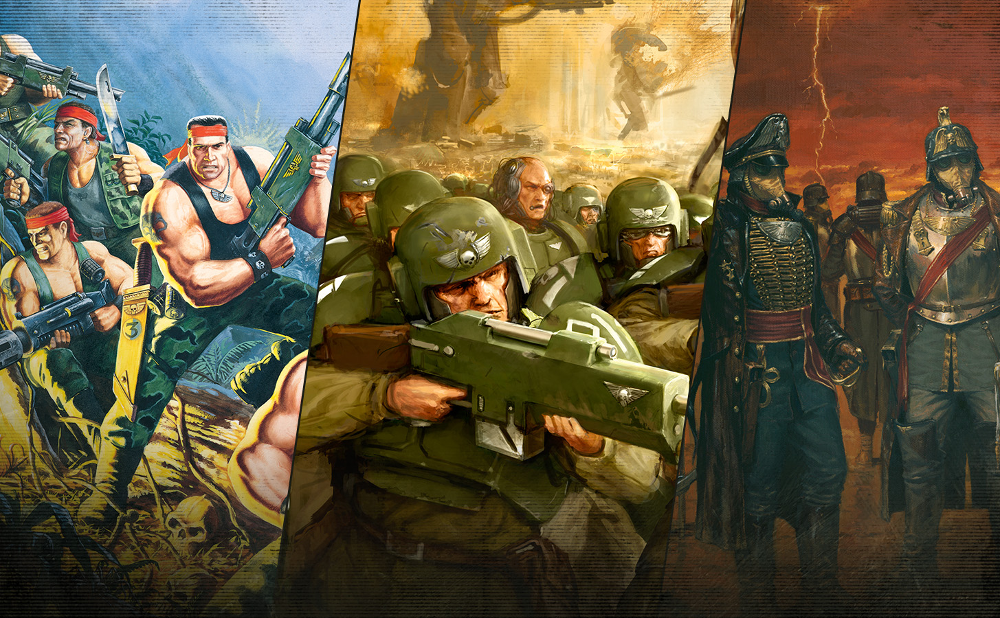

# Gestion des tableaux dans les .md

## Tableau dans une colone de la page
*Evolution des personnages*{.table-title}

| Point d'expérience (XP) | Niveau | Bonus de maîtrise |
| :---------------------: | :----: | :---------------: |
| 0                       | 1      | +2                |
| 300                     | 2      | +2                |
| 900                     | 3      | +2                |
| 2,700                   | 4      | +2                |
| 6,500                   | 5      | +3                |

## Tableau en pleine largeur de page

*Evolution des personnages*{.table-title .wide}

| Point d'expérience (XP) | Niveau | Bonus de maîtrise |
| :---------------------: | :----: | :---------------: |
| 0                       | 1      | +2                |
| 300                     | 2      | +2                |
| 900                     | 3      | +2                |
| 2,700                   | 4      | +2                |
| 6,500                   | 5      | +3                |

## Tableaux jumeaux

*Coût des points de caractéristiques*{.table-title}

| Score | Coût |
| :----:| :--: |
| 8     | 0    |
| 9     | 1    |
| 10    | 2    |
| 11    | 3    |

| Score | Coût |
| :----:| :--: |
| 12    | 4    |
| 13    | 5    |
| 14    | 7    |
| 15    | 9    |

# Gestion des titres

## Titres qui ne sont pas interprétés

recherche (mode regex .*) : (?<=^#{1,6})\u00A0  et remplacer par un espace normal

## Forcer un titre (quelque soit le niveau) sur une nouvelle page

Exemple :  #### Mon-titre {.newpage}

# Gestion des images

## Mettre une image en pleine largeur

{.wide}
