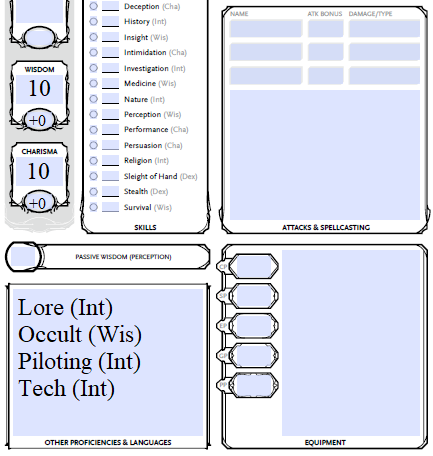
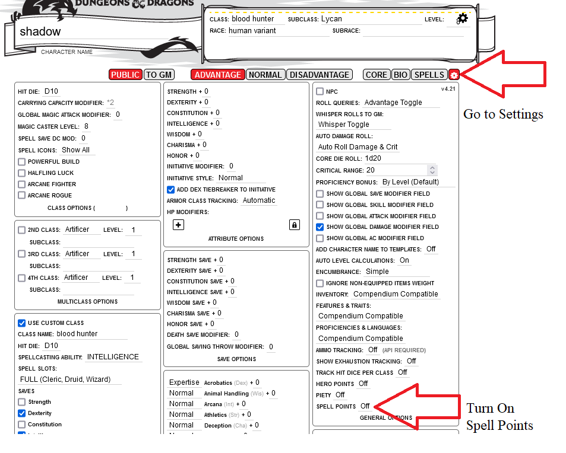

## Adaptation des règles

Le Manuel du joueur à pour objet de reproduire la structure du Manuel du joueur classique de la 5em édition.
Il comportera un certain nombre de différences.

### Éléments généraux

##### Création de personnage

**Races/Espèces**

Les *espèces* s’inspirent de celles présentes dans la galaxie.
Certaines *espèces exotiques* pourraient ne pas convenir à votre campagne.
Presque toutes les races existantes sont des versions entièrement nouvelles ou modifiées de races déjà publiées.

**Classes**

Les classes ont été revues, à l’exception du Soldat (Guerrier) et du Renégat (Voleur).

- Les *Augmentistes* s’apparentent aux moines, mais exploitent la technologie pour améliorer leur corps, ce qui déclenche des effets spéciaux.
- Les *Berserkers* sont des barbares, mais leurs sous-classes ont été légèrement modifiées pour s’adapter à l’univers du jeu.
- Le *Coursier* s’inspire vaguement du ranger, mais utilise la technologie pour alimenter ses effets uniques.
- Le *Croisé* est une nouvelle classe qui mêle des aspects du combattant et du barde pour créer une classe axée sur le combat au corps à corps, capable de soutenir ses alliés par des actes héroïques.
- L’*Exorciste* s’inspire du paladin et dispose de nouvelles capacités qui s’intègrent parfaitement à l’univers et à son archétype consistant à exorciser les démons et à bannir les créatures d’un autre monde.
- Le *Mécanicien* est un lanceur de sorts axé sur la technologie qui exploite pleinement la puissance de celle-ci pour ses effets et peut augmenter ses capacités physiques grâce à des modifications cybernétiques.
- Les *Psykers* utilisent les pouvoirs du Warp pour manipuler leurs capacités et leurs effets, et étudient les disciplines psychiques afin d’obtenir des effets spéciaux.
- Les *Sorciers* concluent des pactes avec des démons et d’autres êtres du Warp pour acquérir ou renforcer leurs pouvoirs psychiques.

**Autres Éléments**

Les *langues* et les *origines* ont été adaptées au contexte, et les *origines* proposent un choix de 4 compétences.

Les *Dons* ont été légèrement modifiés et quelques-uns ont été ajoutés.

##### Équipement

La monnaie standard est le *Gelt* abrégé en *g*. 10 gelts équivalent à 1 pièce d'or.

Les armes, armures et objets les plus courants sont répertoriés au chapitre « Équipement ». Tout le reste se trouve dans la section « Objets améliorés » dans le livre du Maître du Jeu.

##### Magie

Les effets magiques /sorts sont classés en deux catégories : techniques ou psychiques. Les sorts sont appelés « pouvoirs » et sont répartis en deux listes : les pouvoirs techniques et les pouvoirs psychiques. Les objets magiques sont des objets améliorés.

Afin de mieux refléter la fatigue lié à l'usage de ces catégories de pouvoir, un système de "point de pouvoir" à été mis en place.
Chaque sort de niveau 1 et plus demandera de dépenser ces points de pouvoir.

##### Déroulement du jeu

**Compétences**

- Compétences supprimées : Histoire, Religion, Arcane et Dressage d’animaux.
- Compétences ajoutées : Connaissances, Occultisme, Pilotage et Technologie.
- La compétence Dressage d’animaux a été intégrée à la compétence Survie.

**Environnement**

Des mécanismes ont été ajoutés pour les zone radioactive et le vide spatial.

**Types de dégats**

- Les dégâts contondants, perforants et tranchants ont été regroupés sous la catégorie des dégâts cinétiques.
- Nouveau type de dégâts : l’énergie. Il concerne les armes laser et les armes à énergie.

**Types de créatures**

Certains types de créatures ont été modifiés. Les célestes, les démons et les fées ont tous été regroupés sous la catégorie des démons. Chaque démon est aligné sur un dieu, indiqué entre parenthèses, par exemple Démon (Khorne).

### Comment jouer

Il n’existe actuellement aucune fiche de personnage disponible pour cette adaptation. Voici les options proposées.

##### Modification sur une fiche personnage standard de D&D 5e.

**Compétences**

Sur la fiche de personnage de D&D 5e, vous pouvez apporter les modifications suivantes :
1. Notez que « Maîtrise des animaux », « Arcane », « Histoire » et « Religion » ne sont plus des compétences.
2. Notez que Connaissances (Int), Occultisme (Sag), Pilotage (Int) et Technologie (Int) sont des compétences.

Vous pouvez ajouter vos nouvelles compétences dans la case située dans le coin inférieur gauche de la fiche de personnage, comme indiqué ci-dessous.

{height=5.5cm}

**Pouvoirs technologiques / Pouvoirs psychiques**

Si vous utilisez Roll20, vous pouvez modifier les paramètres de la fiche de personnage pour y inclure les points de sort.

**Utilisation de la fiche de personnage de SW5e (Roll20)**

Si vous jouez sur Roll20, vous pouvez choisir d’utiliser la fiche de personnage de Star Wars 5e, qui est similaire à cette conversion.

Si vous optez pour cette solution, veuillez noter les différences suivantes :
1. Il n’y a pas de compétence « Maîtrise des animaux » dans 40k5e. La compétence « Survie » remplit toutes les fonctions de la compétence « Maîtrise des animaux ».
2. Ajoutez « Occulte (Sagesse) » à la section « Compétences et outils supplémentaires » en bas à gauche de la fiche de personnage.
3. Tout ce qui est libellé « Force » devient « Psychique ».

### FAQ {.newpage}

- **Pourquoi faire ça ?**

Cet univers demande un engagement plus important que la plupart des autres univers. Klefgun voulait créer un jeu de table facile à jouer, basé sur les règles familières de la 5e édition.

Pour ma part (DrDam), je n'ai pas trouvé de système de jeu "officiel" pour warhammer 40 000 qui permettait de créer la diversité des personnages que je souhait. J'aime imaginer faire ensemble des joueurs qui incarneraient un tétrarque nécron avec un sorcier thousand-sons et un techno-prêtre, le tout sous la surveillance d'un SpaceMarine.

- **Avez-vous pensé à ajouter xxx ?**
- **Puis-je aider à quelque chose ?**

Le projet est en open-source sur github, n'hésitez pas à proposer une merge-request ou sur le serveur Discord qui lui est associé (en cours de création).

- **Pourquoi xxx est-il si faible/puissant ?**

Klefgun essayé de faire en sorte que chaque choix de personnage ait un niveau de puissance similaire. Certaines situations permettent simplement à certaines forces de mieux s’exprimer que d’autres. Faites-nous part de vos préoccupations et ensemble nous verrons comment on peut les réajuster.

- **Pourquoi ne publier que la traduction française ?**

La question est ouverte. A l'origine, cette traduction ne servait qu'a créer un lore-kit pour une campagne que je (DrDam) souhaite monter. Une fois avoir traduit les règles qui me semblaient nécessaire (soit 80% du kit de conversion), il m'a semblé stupide de le garder pour moi.

La version originale est toujours à son emplacement d'origine sur [google-drive](https://drive.google.com/drive/folders/1AT8ULp7qcFHrVLDQB4iKrGdvRcQSodNA). Est-ce qu'a terme ce projet proposera également la version anglaise, je (DrDam) ne sais pas encore.

**Tu as pas l'impression de profiter du travail d'un autre ?**

En réalité oui, mais Klefgun a été clair à ce propos. Ce kit de conversion est un projet qu'il a mené, qu'il a mis à disposition et (de son point de vu) cela s'arrête là.
