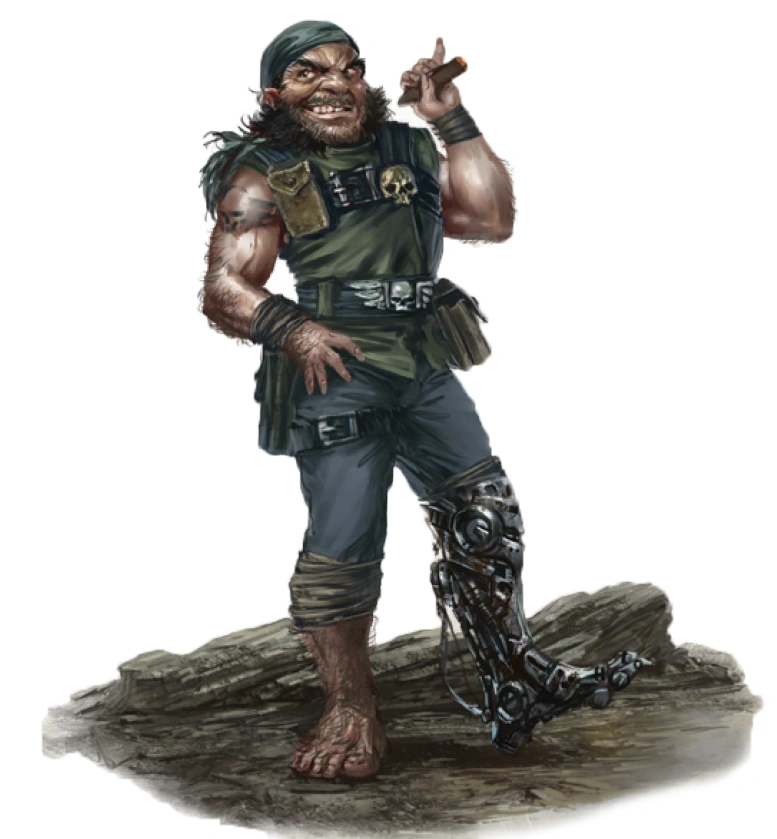

{.newpage height=8cm}

### Agent {#agent}

Un espion ratling prend un instant pour ajuster ses lunettes de vision nocturne. Balayant du regard les contours de la pièce, il enjambe avec agilité les capteurs désormais visibles qui tapissent le sol, pour atteindre la console principale. En un clin d’œil, il sort une panoplie d’outils et se met à forcer et à arracher les cogitateurs et les rouages jusqu’à ce que la machine émette un dernier grincement et cesse de fonctionner. Après avoir rangé ses outils dans ses poches, il surveille sa tablette de données tandis que ses alliés enfoncent les portes du complexe, tirant à tout va.

Un Kroot avance furtivement à travers l’épaisse jungle, repérant une feuille à la lame fine, sur laquelle une goutte de sang laisse une légère trace. Silencieusement, il grimpe le long du tronc d’un arbre, scrutant l’horizon pour apercevoir le camp des gardes qu’il suit depuis des jours. Il pousse un petit cri de joie en abaissant son fusil kroot et en stabilisant son tir.

La caste Tau danse devant les nobles impériaux hautains, leurs visages rougis par le vin dont les bouteilles jonchent la pièce. Alors que le spectacle prend fin et que la musique s’éteint, les lumières s’éteignent, et la Tau dégaine le poignard caché dans sa botte, traversant rapidement la pièce à toute vitesse, mêlant le sang au vin.

Les Agents, qu’ils soient bons, mauvais ou neutres, sont ceux qui se concentrent sur une pratique spécifique et l’utilisent pour prendre le dessus. Ils peuvent provenir de n’importe quel monde ou région de la galaxie, leurs origines allant du plus humble des vauriens à l’élite sociale, des gangsters lâches aux espions respectés.

**Création Rapide**

Vous pouvez créer rapidement un Agent en suivant ces conseils. Tout d’abord, faites en sorte que la Dextérité soit votre modificateur de caractéristique le plus élevé. Votre deuxième score le plus élevé devrait être celui de l’Intelligence ou du Charisme. Ensuite, choisissez le parcours « criminel ».

#### Bonus de classe

En tant qu'Agent, vous bénéficiez des caractéristiques de classe suivantes :

**Points de vie**

*Dés de vie* : 1d8 par niveau d'Agent

*Points de vie au niveau 1* : 8 + votre modificateur de Constitution

*Points de vie aux niveaux supérieurs* : 1d (ou 5) + votre modificateur de Constitution par niveau d'Agent après le niveau 1

**Compétences de départ**

Vous maîtrisez les objets suivants, en plus des compétences fournies par votre espèce ou votre historique.

*Armures* : armure légère

*Armes* : armes simples, armes de guerre

*Outils* : Kit de sécurité

*Jets de sauvegarde* : Dextérité, Intelligence

*Compétences* : Choisissez-en quatre parmi les suivantes : Acrobatie, Connaissances, Intimidation, Investigation, Perception, Perspicacité, Persuasion, Pilotage, Prestidigitation, Représentation, Survie, Technologie et Tromperie.

*Équipement de départ*

Vous commencez avec les objets suivants, auxquels s’ajoutent ceux fournis par votre historique :

- (a) une rapière ou (b) une épée courte
- (a) un pistolet et 2 chargeurs ou (b) une épée courte
- (a) un sac de cambrioleur, (b) un sac d’explorateur de ruines ou (c) un sac d’explorateur
- Une armure de mailles, deux dagues et un kit de sécurité

#### Aptitudes de l'Agent

##### Expertise

Au niveau 1, choisissez deux de vos compétences, ou une de vos compétences et votre maîtrise du kit de sécurité. Votre bonus de maîtrise est doublé pour tout test de capacité que vous effectuez et qui fait appel à l’une des compétences choisies.

Au niveau 6, vous pouvez choisir deux autres de vos compétences (ou votre maîtrise du kit de sécurité) pour bénéficier de cet avantage.

##### Attaque sournoise

À partir du niveau 1, vous savez frapper avec subtilité et tirer parti de la distraction d’un adversaire. Une fois par tour, vous pouvez infliger 1d6 points de dégâts supplémentaires à une créature que vous touchez avec une attaque si vous bénéficiez d’un avantage au jet d’attaque. L’attaque doit être effectuée avec une arme de finesse ou une arme à distance.

Vous n’avez pas besoin d’avantage au jet d’attaque si un autre ennemi de la cible se trouve à moins de 1,5 mètres de celle-ci, que cet ennemi n’est pas hors de combat et que vous n’avez pas de désavantage au jet d’attaque.

Le montant des dégâts supplémentaires augmente à mesure que vous gagnez des niveaux dans cette classe, comme indiqué dans la colonne « Attaque sournoise » du tableau de l'Agent.

*Les aptitudes de l'Agent*{.table-title .wide}

| Niveau | Bonus de Maîtrise | Aptitudes | Attaque sournoise |
| :-: | :---: | ---------------- | :----: |
| 1 | +2 | Expertise, Attaque sournoise | 1d6 |
| 2 | +2 | ruse | 1d6 |
| 3 | +2 | Archétype d'Agent | 2d6 |
| 4 | +2 | Amélioration des caractéristiques | 2d6 |
| 5 | +3 | Esquive surnaturelle | 3d6 |
| 6 | +3 | Expertise | 3d6 |
| 7 | +3 | Evasion | 4d6 |
| 8 | +3 | Amélioration des caractéristiques | 4d6 |
| 9 | +4 | Amélioration de l'archétype d'Agent | 5d6 |
| 10 | +4 | Amélioration des caractéristiques | 5d6 |
| 11 | +4 | Talent fiable | 6d6 |
| 12 | +4 | Amélioration des caractéristiques | 6d6 |
| 13 | +5 | Amélioration de l'archétype d'Agent  | 7d6 |
| 14 | +5 | Sens de l'aveugle | 7d6 |
| 15 | +5 | Esprit insaisissable | 8d6 |
| 16 | +5 | Amélioration des caractéristiques | 8d6 |
| 17 | +6 | Amélioration de l'archétype d'Agent  | 9d6 |
| 18 | +6 | Insaisissable | 9d6 |
| 19 | +6 | Amélioration des caractéristiques | 10d6 |
| 20 | +6 | Coup de chance | 10d6 |

##### Action astucieuse

À partir du niveau 2, votre vivacité d’esprit et votre agilité vous permettent de vous déplacer et d’agir rapidement. Vous pouvez effectuer une action bonus à chacun de vos tours au combat. Cette action ne peut être utilisée que pour effectuer les actions « Fente », « Désengagement » ou « Se cacher ».

##### Archétype du voleur

Au niveau 3, vous choisissez un archétype que vous imitez dans l’exercice de vos capacités des Agents. Le choix de votre archétype vous confère des caractéristiques au niveau 3, puis à nouveau aux niveaux 9, 13 et 17.

##### Amélioration des caractéristiques

Lorsque vous atteignez le niveau 4, puis à nouveau aux niveaux 8, 10, 12, 16 et 19, vous pouvez choisir parmis les modifications suivantes :

- Augmenter de 2 points une caractéristique de votre choix
- Augmenter d’un point deux caractéristiques de votre choix
- Choisir un Don

Comme d’habitude, si vous choisissez d'augmenter vos caractéristiques, vous ne pouvez pas le faire au-delà de 20 via de cette capacité.

##### Esquive surnaturelle

À partir du niveau 5, lorsqu’un attaquant que vous pouvez voir vous touche avec une attaque, vous pouvez utiliser votre réaction pour réduire de moitié les dégâts de cette attaque.

##### Évasion

À partir du niveau 7, vous pouvez vous écarter agilement de certains effets de zone, tels que le barrage d’un dreadnought ou le pouvoir « Tempête de glace ». Lorsque vous êtes soumis à un effet vous permettant d’effectuer un jet de sauvegarde de Dextérité pour ne subir que la moitié des dégâts, vous ne subissez aucun dégât si vous réussissez ce jet, et seulement la moitié des dégâts si vous échouez.

##### Talent fiable

Au niveau 11, vous avez perfectionné les compétences que vous avez choisies jusqu’à ce qu’elles frôlent la perfection. Chaque fois que vous effectuez un test de capacité vous permettant d’ajouter votre bonus de maîtrise, vous pouvez considérer un jet de d20 de 9 ou moins comme un 10.

##### Sens de l’aveugle

À partir du niveau 14, si vous êtes capable d’entendre, vous percevez l’emplacement de toute créature cachée ou invisible située à moins de 10 pieds de vous.

##### Esprit vif
À partir du niveau 15, votre ruse vous confère une plus grande souplesse mentale. Vous gagnez la maîtrise des jets de sauvegarde de Sagesse. Si vous maîtrisez déjà les jets de sauvegarde de Sagesse, vous pouvez choisir un autre type de jet de sauvegarde pour lequel vous souhaitez acquérir la maîtrise.

##### Insaisissable

À partir du niveau 18, vous êtes si insaisissable que vos adversaires parviennent rarement à prendre le dessus sur vous. Aucun jet d’attaque ne bénéficie d’un avantage contre vous tant que vous n’êtes pas hors de combat.

##### Coup de chance

Au niveau 20, vous possédez un don incroyable pour réussir quand il le faut. Si votre attaque rate une cible à portée, vous pouvez transformer ce coup manqué en coup réussi. Sinon, si vous échouez à un test de capacité, vous pouvez considérer que le jet de D20 est un 20.

Une fois que vous avez utilisé cette capacité, vous ne pouvez pas l'utiliser à nouveau avant d'avoir terminé un repos court ou long.

#### Les Archétypes d'Agent

Les agents partagent de nombreuses caractéristiques, mais sont hautement spécialisés en fonction de leurs archétypes. Ces archétypes reflètent leur véritable formation, qu’il s’agisse d’assassin, d’espion ou de cambrioleur.

##### Le voleur

Vous perfectionnez vos compétences dans l’art du vol. Les cambrioleurs, bandits, pickpockets et autres criminels suivent généralement cet archétype, tout comme les renégats qui préfèrent se considérer comme des chasseurs de trésors, des explorateurs, des fouilleurs et des enquêteurs professionnels. En plus d’améliorer votre agilité et votre discrétion, vous acquérez des compétences utiles pour explorer des ruines anciennes, lire des langues inconnues et utiliser des objets améliorés que vous ne pourriez normalement pas employer.

**Mains agiles**

À partir du niveau 3, vous pouvez utiliser l’action bonus accordée par votre « Action astucieuse » pour effectuer un jet de Dextérité (Tour de passe-passe), utiliser votre kit de sécurité pour désamorcer un piège ou ouvrir une serrure, ou effectuer l’action « Utiliser un objet ».

**Travail en hauteur**

Lorsque vous choisissez cet archétype au niveau 3, vous gagnez la capacité de grimper plus vite que la normale ; l’escalade ne vous coûte plus de mouvement supplémentaire.

De plus, lorsque vous effectuez un saut en course, la distance que vous parcourez augmente d’un nombre de pieds égal à votre modificateur de Dextérité.

**Furtivité suprême**

À partir du niveau 9, vous bénéficiez d’un avantage lors d’un jet de Dextérité (Furtivité) si vous ne vous déplacez pas de plus de la moitié de votre vitesse au cours du même tour.

**Utilisation d’objets**

Au niveau 13, vous en savez suffisamment sur le fonctionnement de la technologie et des objets exotiques pour pouvoir improviser l’utilisation d’objets même lorsqu’ils ne vous sont pas destinés. Vous ignorez toutes les conditions de classe, de race et de niveau liées à l’utilisation d’objets améliorés et psychiques.

**Réflexes de voleur**

Lorsque vous atteignez le niveau 17, vous êtes devenu un expert dans l’art de tendre des embuscades et de vous échapper rapidement du danger. Vous pouvez effectuer deux tours au cours du premier round de n’importe quel combat. Vous effectuez votre premier tour à votre initiative normale et votre deuxième tour à votre initiative moins 10. Vous ne pouvez pas utiliser cette capacité lorsque vous êtes pris par surprise.

##### L'assassin

Les assassins se consacrent entièrement à traquer leur cible et à la tuer aussi rapidement que possible.

**Compétences supplémentaires**

Lorsque vous choisissez cet archétype au niveau 3, vous acquérez la maîtrise du kit de déguisement et du kit d’empoisonneur.

**Assassinat**

À partir du niveau 3, c’est lorsque vous prenez vos ennemis par surprise que vous êtes le plus redoutable. Vous bénéficiez d’un avantage aux jets d’attaque contre toute créature qui n’a pas encore joué son tour dans le combat. De plus, tout coup que vous portez à une créature surprise est un coup critique.

**Expertise en infiltration**

À partir du niveau 9, vous pouvez créer sans faute de fausses identités pour vous-même. Vous devez consacrer sept jours et dépenser 25 po pour établir l’histoire, la profession et les affiliations d’une identité. Vous ne pouvez pas créer une identité appartenant à quelqu’un d’autre. Par exemple, vous pourriez vous procurer des vêtements appropriés, des lettres de recommandation et des certificats d’apparence officielle pour vous faire passer pour un membre d’une maison de commerce d’une ville lointaine, afin de vous infiltrer dans le cercle d’autres marchands fortunés.

Par la suite, si vous adoptez cette nouvelle identité comme déguisement, les autres créatures vous prendront pour cette personne jusqu’à ce qu’une raison évidente les incite à douter de vous.

**Imposteur**

Au niveau 13, vous acquérez la capacité d’imiter sans faille la façon de parler, l’écriture et le comportement d’une autre personne. Vous devez passer au moins trois heures à étudier ces trois aspects du comportement de cette personne : écouter sa façon de parler, examiner son écriture et observer ses manières.
Votre ruse est indétectable pour un observateur occasionnel. Si une créature méfiante soupçonne que quelque chose cloche, vous bénéficiez d’un avantage pour tout jet de Charisme (Tromperie) que vous effectuez afin d’éviter d’être démasqué.

**Coup mortel**

À partir du niveau 17, vous devenez un maître de la mort instantanée. Lorsque vous attaquez et touchez une créature prise par surprise, celle-ci doit effectuer un jet de sauvegarde de Constitution (DD 8 + votre modificateur de Dextérité + votre bonus de compétence). En cas d’échec au jet de sauvegarde, doublez les dégâts de votre attaque contre cette créature.
