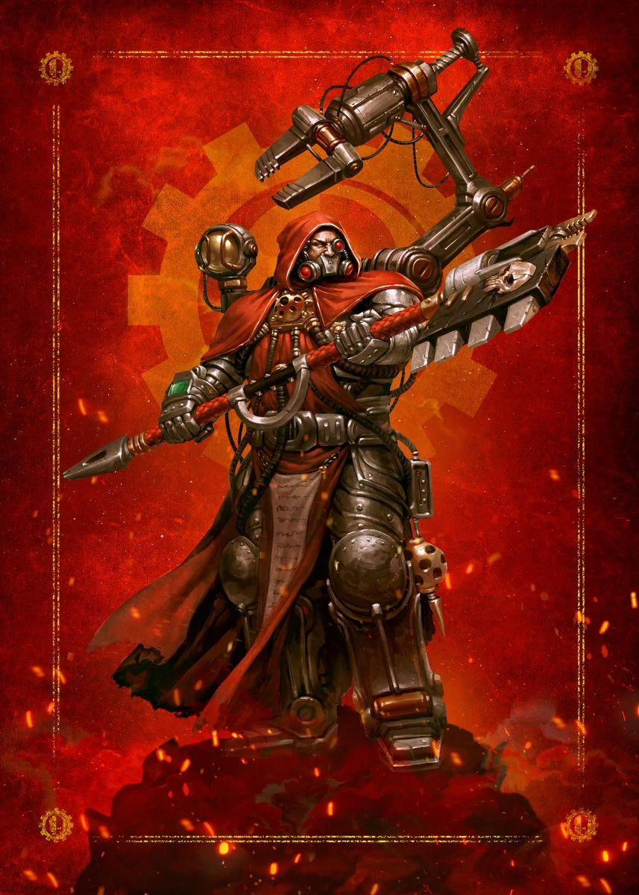

{.newpage height=8cm}

### Augmentiste {#augmentiste}

Ses poings, tels des toupies, s’abattent sur une pluie de balles qui s’abat sur lui ; un homme, fait plus de métal que de chair, bondit par-dessus la barricade de police et se jette dans les rangs serrés des arbitres. Son mouvement est un éclair qui projette les arbitres au loin, jusqu’à ce qu’il se retrouve seul debout.

Prenant une profonde inspiration, le mutant sent les pistons automatiques s’enfoncer dans son dos, inondant son corps de substances chimiques et de stimulants pour l’aider à affronter le combat qui l’attend. Dans l’obscurité totale de l’arène, son adversaire s’approche de lui, lui assénant coup après coup, avant de reculer en titubant lorsque ses mains se mettent à saigner sous l’impact de la chair contre le métal.

Une bande de gardes franchit une dernière colline, jusqu’à ce qu’ils aperçoivent le chef de guerre — un Ork de 3 mètres de haut, fait de plus de métal que de chair verte, la mâchoire constituée des restes d’un pare-chocs de voiture, et la poitrine équipée pour rejeter des gaz d’échappement et des fumées à chaque inspiration. Le chef de guerre se retourne, ses yeux brillant d’un rouge perçant dans la nuit, et fait vrombir les moteurs de son cœur.

Quels que soient leurs implants, les augmentistes sont unis par leur passion pour l’amélioration de leur corps afin de mieux répondre à leurs désirs. Que ce soit pour ressembler au gangster le plus imposant et le plus redoutable du quartier, ou pour écraser leurs ennemis à coups dévastateurs, la cybernétique est le pain quotidien des augmentistes.

**Création Rapide**

Vous pouvez créer rapidement un « augmentiste » en suivant ces conseils. Tout d’abord, faites en sorte que votre modificateur de caractéristique le plus élevé soit la Force ou la Dextérité. Votre deuxième score le plus élevé devrait être la Constitution. Ensuite, choisissez l'historique « pilote ».

#### Bonus de classe

En tant qu’augmentiste, vous bénéficiez des caractéristiques de classe suivantes :

**Points de vie**

*Dés de vie* : 1d8 par niveau d’augmentiste

*Points de vie au niveau 1* : 8 + votre modificateur de Constitution

*Points de vie aux niveaux supérieurs* : 1d8 (ou 5) + votre modificateur de Constitution par niveau d’augmentiste après le niveau 1

**Compétences de départ**

Vous maîtrisez les objets suivants, en plus des compétences fournies par votre espèce ou votre historique.

*Armures* : armures légères, armures moyennes, boucliers

*Armes* : armes simples, armes de guerre

*Outils* : trousse de mécanicien

*Jets de sauvegarde* : Force, Dextérité

*Compétences* : choisissez-en deux parmi Acrobatie, Athlétisme, Connaissances, Discrétion, Intimidation, Perception, Perspicacité, Pilotage et Technologie.

*Équipement de départ*

Vous commencez avec les objets suivants, auxquels s’ajoutent ceux fournis par votre historique :

- (a) deux épées courtes ou (b) deux gantelets légers
- (a) un pistolet laser et deux cellules d’énergie ou (b) un pistolet et deux chargeurs
- (a) un paquetage de technologue ou (b) un paquetage d’explorateur
- (a) une armure en mailles ou (b) une armure de soldat
- Une trousse de mécanicien

#### Aptitudes de l'Augmentiste

##### Arme intégrée

Au niveau 1, vous pouvez intégrer jusqu’à deux armes à votre corps. L’intégration d’une arme prend 1 heure et peut être effectuée pendant un repos court. L’arme doit se trouver à votre portée, et vous l’intégrez à votre corps au bout d’une heure. Vous ne pouvez pas intégrer à votre corps des armes dotées de la propriété « à deux mains ».

Tant que l’arme est intégrée, vous bénéficiez des avantages suivants :

- Vous pouvez dégainer une ou plusieurs de vos armes intégrées dans le cadre de l’action d’attaque à votre tour, et vous n’avez pas besoin d’une main libre pour manier une arme intégrée.
- Lorsque vous rangez l’arme, elle est indétectable par des moyens normaux.
- Tant que vous êtes conscient, vos armes intégrées ne peuvent pas être retirées de votre corps contre votre volonté.

Vous pouvez retirer une arme intégrée en l’espace d’une minute.

A partir du niveau 9, vous pouvez intégrer jusqu’à 3 armes à votre corps. A partir niveau 13, vous pouvez intégrer jusqu’à 4 armes à votre corps à la fois.

*Les aptitudes de l'Augmentiste*{.table-title .wide}

| Niveau | Bonus de Maitrise | Aptitudes | Augmentations de combat | Points de sur surcadençage  | Déplacement amélioré |
| :-: | :---: | ---------------- | :----: | :----: | :---: |
| 1 | +2 | Arme intégrée, Améliorations de combat | d6 | — | — |
| 2 | +2 | Surcadençage, Déplacement amélioré | d6 | 2 | + 3m |
| 3 | +2 | Implants cybernétiques, Détourner les missiles | d6 | 3 | + 3m|
| 4 | +2 | Amélioration des caractéristiques, Force hydraulique | d6 | 4 |+ 3m|
| 5 | +3 | Attaque supplémentaire, Frappe étourdissante | d8 | 5 | + 3m|
| 6 | +3 | Frappes améliorées, Implants cybernétiques | d8 | 6 | + 4,5m|
| 7 | +3 | Évasion, Autonomie mentale | d8 | 7 | + 4,5m|
| 8 | +3 | Amélioration des caractéristiques | d8 | 8 | + 4,5m|
| 9 | +4 | Amélioration de l’arme intégrée, Amélioration du mouvement sans armure | d8 | 9 | + 4,5m|
| 10 | +4 | Corps cybernétique | d8 | 10 | + 6m|
| 11 | +4 | Amélioration Implants cybernétiques | d10 | 11 | + 6m|
| 12 | +4 | Amélioration des caractéristiques | d10 | 12 | + 6m|
| 13 | +5 | Amélioration des armes intégrées, Traducteur universel | d10 | 13 | + 6m|
| 14 | +5 | Noyau amélioré | d10 | 14 | + 6m|
| 15 | +5 | Immortalité mécanisée | d10 | 15 | + 7,5m|
| 16 | +5 | Amélioration des caractéristiques | d10 | 16 | + 7,5m|
| 17 | +6 | Amélioration Implants cybernétiques | d12 | 17 | + 7,5m|
| 18 | +6 | Camouflage intégré | d12 | 18 | + 9m|
| 19 | +6 | Amélioration des caractéristiques | d12 | 19 | + 9m|
| 20 | +6 | Améliorations parfaites | d12 | 20 | + 9m|

##### Améliorations de combat

Toujours au niveau 1, vos améliorations de combat vous permettent d’utiliser vos armes intégrées pour submerger vos adversaires grâce à une force et une vitesse supérieures. Vous bénéficiez des avantages suivants lorsque vous attaquez avec vos armes intégrées :

- Vous pouvez utiliser votre Dextérité à la place de votre Force pour les jets d’attaque et de dégâts lorsque vous utilisez vos armes intégrées.
- Vous pouvez lancer un d6 à la place des dégâts normaux de votre arme intégrée. Ces dégâts augmentent à mesure que vous gagnez des niveaux, comme indiqué dans la colonne « Dés des améliorations de combat » du tableau de l’Augmentiste.
- Lorsque vous utilisez l’action « Attaque » avec une arme intégrée pendant votre tour, vous pouvez effectuer une attaque supplémentaire avec une autre arme intégrée en tant qu’action bonus.

Vous ne pouvez pas porter de bouclier et bénéficier des avantages de cette caractéristique en raison de l’encombrement des boucliers.

##### Surcadençage

À partir du niveau 2, vous pouvez pousser vos implants cybernétiques au-delà de leurs limites habituelles, un processus appelé « surcadençage ». Votre capacité à pousser votre corps au-delà de ses limites normales est représentée par vos points de surcadençage, comme indiqué dans la colonne « Points de surcadençage » du tableau de l’Augmentiste.

Vous commencez avec trois capacités de surcadençage : *frappes ciblées*, *défenses automatiques* et *sprint turbo*. Vous apprenez d’autres capacités de surcadençage à mesure que vous gagnez des niveaux dans cette classe.

Vous récupérez tous vos points de surcadençage lorsque vous effectuez un repos court ou long, ce qui permet à vos systèmes internes de refroidir et de se réparer.

Certaines de vos capacités « surcadençage » exigent que votre cible effectue un jet de sauvegarde pour résister à leurs effets. La difficulté (DC) du jet de sauvegarde est calculée comme suit :

DC de sauvegarde « surcadençage » = 8 + votre bonus de maîtrise + votre modificateur de Constitution

*Frappes ciblées.* Immédiatement après avoir effectué l’action « Attaque » et attaqué avec une arme intégrée lors de votre tour, vous pouvez dépenser 1 point de surcadençage pour utiliser une action bonus et effectuer deux attaques avec une autre arme intégrée.

*Défenses automatiques.* Vous pouvez dépenser 1 point de surcadençage pour effectuer l’action « Esquive » en tant qu’action bonus lors de votre tour.

*Sprint turbo.* Vous pouvez dépenser 1 point de surcadençage pour effectuer l’action « Désengagement » ou « Fente » en tant qu’action bonus lors de votre tour, et votre distance de saut est doublée pour ce tour.

##### Déplacement amélioré

À partir du niveau 2, votre vitesse augmente de 10 pieds. Ce bonus augmente lorsque vous atteignez certains niveaux d’augmentiste, comme indiqué dans le tableau des augmentistes.

Au niveau 9, vos cogitateurs à stabilisation automatique vous permettent de vous déplacer le long de surfaces verticales et à la surface de liquides pendant votre tour sans tomber pendant le déplacement.

##### Implants cybernétiques

Lorsque vous atteignez le niveau 3, vous vous faites implanter des dispositifs cybernétiques spécifiques afin d’améliorer vos capacités. Vos implants vous confèrent des capacités au niveau 3, puis à nouveau aux niveaux 6, 11 et 17.

##### Dévier les projectiles

À partir du niveau 3, vos implants cybernétiques vous permettent de repousser les attaques cinétiques et énergétiques. Vous pouvez utiliser votre réaction pour dévier l’attaque lorsque vous êtes touché par une attaque à distance. Lorsque vous le faites, les dégâts que vous subissez sont réduits de 1d10 + votre modificateur de Constitution + votre niveau d’augmentiste.

Si vous réduisez les dégâts à 0, vous pouvez renvoyer l’attaque. Si vous renvoyez une attaque de cette manière, vous pouvez dépenser 1 point de surcharge pour effectuer une attaque à distance (portée 6 mètre/18 mètres) avec l’arme ou la munition que vous venez de renvoyer, dans le cadre de la même réaction. Vous effectuez cette attaque avec maîtrise, quelles que soient vos maîtrises d’armes, et pouvez utiliser vos dés d’augmentations de combat pour déterminer les dégâts.

##### Amélioration des caractéristiques

Lorsque vous atteignez le niveau 4, puis à nouveau aux niveaux 8, 12, 16 et 19, vous pouvez choisir parmis les modifications suivantes :

- Augmenter de 2 points une caractéristique de votre choix
- Augmenter d’un point deux caractéristiques de votre choix
- Choisir un Don

Comme d’habitude, si vous choisissez d'augmenter vos caractéristiques, vous ne pouvez pas le faire au-delà de 20 via de cette capacité.

##### Hydraulique

À partir du niveau 4, vous pouvez utiliser une réaction pour réduire les dégâts de chute que vous subissez d’un montant égal à cinq fois votre niveau d’augmentiste.

De plus, vous pouvez utiliser votre score de Dextérité à la place de votre score de Force pour déterminer vos hauteurs et distances de saut.

##### Attaque supplémentaire

À partir du niveau 5, vous pouvez attaquer deux fois, au lieu d’une seule, chaque fois que vous effectuez une action d’attaque pendant votre tour.

##### Coup assommant

À partir du niveau 5, vos coups peuvent anéantir même les adversaires les plus puissants. Lorsque vous touchez une créature avec une attaque d’arme intégrée, vous pouvez dépenser 1 point de surcharge pour tenter un coup assommant. La cible doit réussir un jet de sauvegarde de Constitution, sinon elle est assommée jusqu’à la fin de votre prochain tour. Une fois qu’une créature a réussi un jet de sauvegarde contre cette capacité, elle est immunisée contre celle-ci jusqu’au début de votre prochain tour.

##### Frappes améliorées

À partir du niveau 6, vos armes intégrées sont considérées comme améliorées pour ce qui est de surmonter la résistance et l’immunité aux attaques et aux dégâts non améliorés.

##### Autonomie d’esprit

À partir du niveau 7, vous pouvez utiliser une action bonus pour mettre fin à un effet sur vous-même qui vous charme ou vous effraie.

##### Évasion

Au niveau 7, votre agilité instinctive vous permet d’esquiver certains effets de zone, tels que le barrage d’un dreadnought ou un sort de boule de feu. Lorsque vous êtes soumis à un effet vous permettant d’effectuer un jet de sauvegarde de Dextérité pour ne subir que la moitié des dégâts, vous ne subissez aucun dégât si vous réussissez ce jet, et seulement la moitié des dégâts en cas d’échec.

##### Corps cybernétique

Au niveau 10, votre corps fortement amélioré vous rend immunisé contre les poisons et les maladies non liées à des améliorations.

##### Traducteur Universel

À partir du niveau 13, vos systèmes intégrés peuvent identifier et traduire n’importe quelle langue parlée. De plus, vos traducteurs intégrés permettent à toute créature capable de comprendre une langue de comprendre ce que vous dites, à condition qu’elle parle au moins une langue.

##### Noyau amélioré

À partir du niveau 14, vos améliorations avancées vous confèrent une maîtrise de tous les jets de sauvegarde.

De plus, chaque fois que vous effectuez un jet de sauvegarde et que vous échouez, vous pouvez dépenser 1 point d’overdrive pour le relancer et retenir le deuxième résultat.

##### Immortalité mécanisée

Au niveau 15, votre corps mécanique vous protège de toute fragilité liée à la vieillesse, et vous ne pouvez pas être vieilli par des moyens artificiels. Vous ne pouvez plus mourir de vieillesse et n’avez plus besoin ni de nourriture ni d’eau.

De plus, vous pouvez utiliser une action pour vous débarrasser d’un niveau d’épuisement.

##### Camouflage intégré

À partir du niveau 18, vous pouvez utiliser votre action bonus pour dépenser 4 points d’overdrive afin d’activer un champ de camouflage, devenant ainsi invisible pendant 1 minute. Pendant ce temps, vous bénéficiez également d’une résistance à tous les dégâts, à l’exception des dégâts psychiques.

##### Améliorations perfectionnées

Au niveau 20, vos scores de Force, de Dextérité et de Constitution augmentent de 2. De plus, lorsque vous réussissez un coup critique, vous regagnez 4 points de surcharge.

#### Implants cybernétiques

Les implants cybernétiques sont courants dans toute la galaxie, mais seuls quelques privilégiés se consacrent à s'immerger pleinement dans cette technologie et à en libérer les pouvoirs les plus intimes.

La plupart des groupes se concentrent sur une seule approche, comme les techniques de combat sournoises utilisées par les membres des gangs des ruches, ou la doctrine militaire rigide appliquée dans les armées. La plupart des augmentistes s'appuient sur les mêmes bases cybernétiques, ne libérant leur véritable potentiel qu'à mesure qu'ils gagnent en puissance et en harmonie avec leur technologie. Ainsi, un augmentiste doit choisir ses implants cybernétiques spécialisés lorsqu'il atteint le niveau 3.

##### Implants chimiques de combat

Les implants chimiques de combat sont destinés à ceux qui consomment des drogues et des stimulants pour obtenir l’avantage dont ils ont besoin au combat.

**Compétences supplémentaires**

Votre étude des drogues vous confère la maîtrise du matériel d’alchimiste et de la trousse d’empoisonneur.

**Injecteur de stimulants**

Dès que vous choisissez ces implants au niveau 3, vous pouvez vous injecter des stimulants, ce qui déclenche des effets uniques. Lorsque vous touchez une créature avec une attaque effectuée grâce à votre capacité « Frappes ciblées », vous pouvez choisir l’un des effets suivants :

- Vous regagnez un nombre de points de vie égal au résultat d’un jet de votre dé « Améliorations de combat ».
- La cible doit réussir un jet de sauvegarde de Dextérité, sinon elle est renversée.
- La cible doit réussir un jet de sauvegarde de Force ou être projetée jusqu’à 15 pieds plus loin. Si la créature heurte un mur ou un objet similaire, elle subit, ainsi que l’objet, des dégâts supplémentaires égaux à un jet de votre dé « Améliorations de combat ».

**Réserve interne de substances chimiques**

Au niveau 3, vous disposez d’une réserve de substances chimiques que vous pouvez fabriquer quotidiennement. À la fin d’un long repos, vous préparez un nombre de substances chimiques égal à 2 + votre bonus de compétence. En tant qu’action, vous pouvez injecter à un humanoïde ou à une bête situé(e) à moins de 5 pieds de vous un produit chimique de votre choix parmi la liste ci-dessous.

- *Klay* : Un stimulant qui aide à rester vigilant. Pendant 1 heure, la créature bénéficie d’un avantage aux tests de Perception et d’Investigation et ne subit pas les effets de l’épuisement dû au manque de sommeil.

- *Spook*. Un hallucinogène qui rend les individus plus sensibles au Warp. Pendant 1 heure, la créature bénéficie d’un avantage aux tests d’Occultisme et peut lancer une fois le sort « Détection du Warp » sans dépenser de points psyker.

- *Chill*. Un sédatif qui permet aux individus de se détendre en situation de stress. Pendant 1 heure, la créature bénéficie d’un avantage aux jets de sauvegarde contre l’effet « Effrayé », ainsi qu’aux tests de Tromperie, de Persuasion et d’Art de la scène.

Vous récupérez tous les usages dépensés de cette capacité à la fin d’un long repos.

**Amplificateur de concentration**

À partir du niveau 6, au début de votre tour, vous pouvez saturer votre corps de substances pour augmenter votre concentration et votre précision (aucune action requise). Jusqu’au début de votre prochain tour, vous bénéficiez d’un avantage sur tous vos jets d’attaque, jets de sauvegarde et tests de caractéristiques. Une fois que vous avez utilisé cette capacité, vous ne pouvez pas l’utiliser à nouveau avant d’avoir effectué un repos court ou long, ou avant d’avoir dépensé 3 points d’overdrive pour l’utiliser à nouveau.

**Réserve d’adrénaline**

À partir du niveau 11, vous disposez d’une pompe spéciale conçue pour vous inonder d’adrénaline. Lorsque vous êtes réduit à 0 point de vie, vous pouvez dépenser 1 point d’overdrive (aucune action requise) pour disposer d’un point de vie à la place.

**Valves à toxine**

À partir du niveau 17, vous pouvez utiliser une action bonus et dépenser entre 1 et 10 points d’overdrive pour enduire votre arme d’une toxine mortelle. La toxine dure 1 minute, ou jusqu’à ce que vous frappiez une créature et lui infligiez des dégâts, ce qui consomme la toxine.

Lorsque vous infligez des dégâts à une créature, celle-ci doit effectuer un jet de sauvegarde de Constitution ; en cas d'échec, elle subit 2d10 points de dégâts nécrotiques par point d'overdrive dépensé, et la moitié de ces dégâts en cas de réussite.

##### Implants Medicae

Vos implants sont destinés à la guérison, à la chirurgie et, parfois, au meurtre.

**Instruments chirurgicaux**

À partir du niveau 3, vous maîtrisez la compétence Médecine. De plus, vous maîtrisez les outils de chirurgien et pouvez ajouter le double de votre bonus de maîtrise lorsque vous effectuez des jets avec ces outils.

De plus, vous disposez d’une trousse de premiers secours intégrée à usage illimité et pouvez utiliser une action bonus pour stabiliser les créatures situées à moins de 1,5 mètre de vous.

**Mécadendrite de soins**

Toujours au niveau 3, vous obtenez un bras cybernétique qui jaillit de votre dos, appelé « mécadendrite ». Cette mécadendrite est équipée d’outils de chirurgien. Ce bras ne peut pas être utilisé pour saisir des objets pesant plus de 5 kilogrammes, et il ne peut pas manier efficacement des armes ou un bouclier.

En tant qu’action, vous pouvez dépenser 1 point de surcharge pour pratiquer une intervention chirurgicale sur une créature située à moins de 1,5 mètre, lui restituant un nombre de points de vie égal au résultat de votre jet de dé « Augmentations de combat » + votre modificateur de Constitution.

Lorsque vous utilisez vos frappes ciblées, vous pouvez remplacer l’une des attaques par l’utilisation de cette capacité sans dépenser de point d’overdrive pour la guérison.

**Goulotte à médicaments**

À partir du niveau 6, votre méchadendrite transporte avec vous une grande quantité de médicaments. Lorsque vous utilisez « Méchadendrite de guérison » sur une créature, vous pouvez également mettre fin à une maladie non amplifiée ou à l’un des états suivants affectant la créature : aveuglement, surdité, paralysie, empoisonnement ou étourdissement.

**Stimulants de combat**

À partir du niveau 11, lorsque vous effectuez des frappes ciblées, vous pouvez remplacer chacune de ces attaques par une utilisation de votre « Mechadendrite de guérison », sans dépenser de points d’overdrive pour la guérison.

De plus, après avoir soigné une créature avec votre « Mechadendrite de guérison », vous pouvez lui injecter une bonne dose de stimulants de combat (sans action requise), ce qui lui confère l’avantage sur tous ses jets d’attaque effectués avant la fin de son prochain tour.
