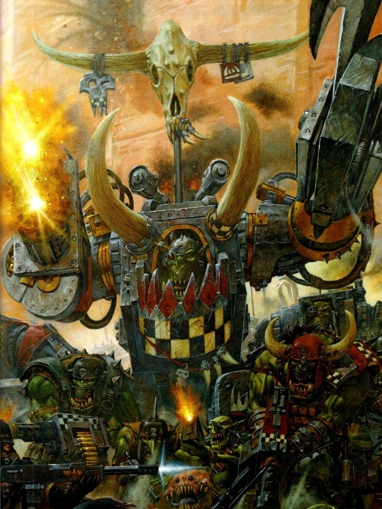

{.newpage height=8cm}

### Berserker {#berserker}

Un grand membre d’une tribu humaine avance à grands pas à travers les tempêtes de neige, enveloppé de fourrures et brandissant sa hache. Il rit en chargeant vers le groupe d’Orques qui ont osé attaquer les villages de son monde sauvage.

Un Ogryn grogne face au dernier challenger qui remet en cause son autorité, prêt à briser le cou de son adversaire à mains nues, comme il l’a fait avec ses six derniers adversaires.

La bouche écumante, un Blood Angel assène un coup de gantelet au visage de son ennemi Eldar noir, puis se retourne pour enfoncer son coude blindé dans le ventre d’un autre, lui brisant les côtes et lui fracturant les os.

Ces berserkers, aussi différents soient-ils, se caractérisent par une rage surnaturelle qui s’empare d’eux dès que l’aube de la bataille se lève. Plus qu’une simple émotion, leur colère et leur férocité sont celles d’un animal acculé, mais leur objectif est aussi clair que l’œil d’une tempête.

Pour certains, leur rage jaillit de la communion entre la technologie et la chair, utilisant la cybernétique pour réprimer toute émotion superflue afin d’alimenter leur fureur au combat. Pour d’autres, cette rage est forgée par des années de combat, de discipline et de dévouement à leur cause.

**Création Rapide**

Vous pouvez créer rapidement un berserker en suivant ces conseils. Tout d’abord, faites en sorte que la Force soit votre modificateur de caractéristique le plus élevé. Vos scores suivants les plus élevés devraient être la Constitution et la Dextérité. Ensuite, choisissez l'historique « mercenaire ».

#### Bonus de classe

En tant que Berserker, vous bénéficiez des caractéristiques de classe suivantes :

**Points de vie**

*Dés de vie* : 1d12 par niveau de Berserker

*Points de vie au niveau 1* : 12 + votre modificateur de Constitution

*Points de vie aux niveaux supérieurs* : 1d12 (ou 7) + votre modificateur de Constitution par niveau de Berserker après le niveau 1

**Compétences de départ**

Vous maîtrisez les objets suivants, en plus des compétences fournies par votre espèce ou votre historique.

*Armures* : armure légère, armure moyenne, armure lourde, boucliers

*Armes* : armes simples, armes de guerre

*Outils* : aucun

*Jets de sauvegarde* : Force, Constitution

*Compétences* : choisissez-en deux parmi Acrobatie, Athlétisme, Connaissances, Intimidation, Médecine, Nature, Perception, Perspicacité et Survie.

*Équipement de départ*

Vous commencez avec les objets suivants, auxquels s’ajoutent ceux fournis par votre historique :

- (a) une grande hache ou (b) n’importe quelle arme de combat au corps à corps
- (a) deux haches à une main ou (b) n’importe quelle arme simple ou (c) un bouclier
- (a) une cotte de mailles à écailles ou (b) une cotte de mailles
- Un paquetage d’explorateur et cinq javelots

##### Défense sans armure

Lorsque vous ne portez aucune armure, votre classe d’armure est égale à 10 + votre modificateur de Dextérité + votre modificateur de Constitution. Vous pouvez utiliser un bouclier tout en bénéficiant de cet avantage.

##### Rage

Au combat, vous vous battez avec une fureur primitive. À votre tour, vous pouvez entrer en rage en tant qu’action bonus.

Lorsque vous êtes en rage, vous bénéficiez des avantages suivants :

- Vous bénéficiez d’un avantage aux tests de Force et aux jets de sauvegarde de Force.
- Lorsque vous effectuez une attaque au corps à corps en utilisant votre Force, vous bénéficiez d’un bonus de +2 au jet de dégâts. Ce bonus augmente à mesure que vous gagnez des niveaux.
- Vous bénéficiez d’une résistance aux dégâts d’énergie et cinétiques.

Si vous êtes capable de lancer des pouvoirs, vous ne pouvez ni les lancer ni vous concentrer dessus tant que vous êtes en rage.

Votre rage dure 1 minute. Elle prend fin prématurément si vous êtes assommé ou si votre tour se termine sans que vous ayez attaqué une créature hostile depuis votre dernier tour ou subi des dégâts depuis lors. Vous pouvez également mettre fin à votre rage lors de votre tour en tant qu’action bonus.

Une fois que vous avez atteint le nombre maximal de fois où vous pouvez entrer en rage correspondant à votre niveau de berserker, vous devez effectuer un long repos avant de pouvoir entrer à nouveau en rage. Vous pouvez utiliser la rage 2 fois au niveau 1, 3 fois au niveau 3, 4 fois au niveau 6, 5 fois au niveau 12 et 6 fois au niveau 17.

*Les aptitudes du Berserker*{.table-title .wide}

| Niveau | Bonus de Maîtrise | Aptitudes | Rage | Dégâts en Rage |
| :-: | :---: | ---------------- | :----: | :----: |
| 1 | +2 | Défense sans armure, Rage | 2 | +2 |
| 2 | +2 | Attaque téméraire, Sens du danger | 2 | +2 |
| 3 | +2 | Voie du combat | 3 | +2 |
| 4 | +2 | Amélioration des caractéristiques | 3 | +2 |
| 5 | +3 | Attaque supplémentaire, Déplacement rapide | 3 | +2 |
| 6 | +3 | Amélioration de la Voie du combat | 4 | +2 |
| 7 | +3 | Instinct sauvage | 4 | +2 |
| 8 | +3 | Amélioration des caractéristiques | 4 | +2 |
| 9 | +4 | Critique brutal (1 dé) | 5 | +3 |
| 10 | +4 | Amélioration de la Voie du combat | 4 | +3 |
| 11 | +4 | Rage implacable | 4 | +3 |
| 12 | +4 | Amélioration des caractéristiques | 5 | +3 |
| 13 | +5 | Critique brutal (2 dés) | 5 | +3 |
| 14 | +5 | Amélioration de la Voie du combat | 5 | +3 |
| 15 | +5 | Rage persistante | 5 | +3 |
| 16 | +5 | Amélioration des caractéristiques | 5 | +4 |
| 17 | +6 | Critique brutale (3 dés) | 6 | +4 |
| 18 | +6 | Puissance indomptable | 6 | +4 |
| 19 | +6 | Amélioration des caractéristiques | 6 | +4 |
| 20 | +6 | Champion de la guerre | illimité | +4 |

#### Aptitudes du Berserker

##### Sens du danger

Au niveau 2, vous développez un sixième sens qui vous permet de percevoir lorsque quelque chose dans votre environnement ne va pas, ce qui vous donne un avantage pour esquiver le danger. Vous bénéficiez d’un avantage aux jets de sauvegarde de Dextérité contre les effets que vous pouvez voir, tels que les pièges et les pouvoirs. Pour bénéficier de cet avantage, vous ne devez pas être aveuglé, assourdi ou neutralisé.

##### Attaque téméraire

À partir du niveau 2, vous pouvez mettre de côté toute préoccupation défensive pour attaquer avec un acharnement farouche. Lorsque vous effectuez votre première attaque pendant votre tour, vous pouvez décider d’attaquer de manière téméraire. Cela vous confère un avantage aux jets d’attaque avec des armes de mêlée utilisant la Force pendant ce tour, mais les jets d’attaque contre vous bénéficient d’un avantage jusqu’à votre prochain tour.

##### Voies du combat

Au niveau 3, vous choisissez un chemin qui définit la nature de votre rage, tel que le Chemin de la haine. Votre choix vous confère des capacités au niveau 3, puis à nouveau aux niveaux 6, 10 et 14.

##### Amélioration des caractéristiques

Lorsque vous atteignez le niveau 4, puis à nouveau aux niveaux 8, 12, 16 et 19, vous pouvez choisir parmis les modifications suivantes :

- Augmenter de 2 points une caractéristique de votre choix
- Augmenter d’un point deux caractéristiques de votre choix
- Choisir un Don

Comme d’habitude, si vous choisissez d'augmenter vos caractéristiques, vous ne pouvez pas le faire au-delà de 20 via de cette capacité.

##### Attaque supplémentaire

À partir du niveau 5, vous pouvez attaquer deux fois au lieu d’une seule chaque fois que vous effectuez l’action « Attaque » pendant votre tour.

##### Déplacement rapide

À partir du niveau 5, votre vitesse de marche augmente de 10 pieds lorsque vous ne portez pas d’armure lourde.

##### Instinct de combat
Au niveau 7, vos instincts sont si affûtés que vous bénéficiez d’un avantage aux jets d’initiative.

De plus, si vous êtes pris par surprise au début d’un combat et que vous n’êtes pas hors de combat, vous pouvez agir normalement lors de votre premier tour, mais uniquement si vous entrez en rage avant d’effectuer toute autre action lors de ce tour.

##### Critique brutale

À partir du niveau 9, vous pouvez lancer un dé de dégâts d’arme supplémentaire pour déterminer les dégâts supplémentaires infligés lors d’un coup critique avec une attaque au corps à corps.

Ce nombre passe à deux dés supplémentaires au niveau 13, puis à trois au niveau 17.

##### Rage implacable

À partir du niveau 11, votre rage vous permet de continuer à combattre malgré des blessures graves. Si vous tombez à 0 point de vie alors que vous êtes en rage et que vous ne mourez pas sur le coup, vous pouvez effectuer un jet de sauvegarde de Constitution avec un DD de 10. En cas de réussite, vous tombez à 1 point de vie à la place.

Chaque fois que vous utilisez cette capacité après la première fois, la difficulté augmente de 5. Lorsque vous terminez un repos court ou long, la difficulté revient à 10.

##### Rage persistante

À partir du niveau 15, votre rage est si féroce qu’elle ne prend fin prématurément que si vous perdez connaissance ou si vous choisissez d’y mettre un terme.

##### Puissance indomptable

À partir du niveau 18, si le total de votre jet de Force est inférieur à votre score de Force, vous pouvez utiliser ce score à la place du total.

##### Champion de la guerre

Au niveau 20, vous incarnez la puissance de la guerre. Vos scores de Force et de Constitution augmentent de 4. Le maximum de ces scores est désormais de 26.

#### Voies de la guerre

##### La Voie de la haine

La lame la plus tranchante n'est rien comparée à la haine la plus pure. Sur cette voie, nombreux sont ceux qui ont succombé à la rage aveugle propre à une vie de guerre et de conquête.

**Fureur sans fin**

Dès que vous choisissez ce chemin au niveau 3, vous pouvez canaliser votre haine dans vos coups d’arme. Tant que vous êtes en rage, la première créature que vous touchez à chacun de vos tours avec une attaque d’arme subit des dégâts supplémentaires égaux à 1d6 + la moitié de votre niveau de berserker. Ces dégâts supplémentaires sont du même type que ceux infligés par votre arme.

**Folie furieuse**

Également au niveau 3, lorsque vous réduisez une créature à 0 point de vie pendant votre tour, vous pouvez utiliser une action bonus pour vous déplacer immédiatement jusqu’à la moitié de votre vitesse.

**Rage aveugle**

À partir du niveau 6, vous ne pouvez pas être charmé ni effrayé pendant que vous êtes en rage. Si vous êtes charmé ou effrayé lorsque vous entrez en rage, l’effet est suspendu pendant toute la durée de la rage.

**Charge furieuse**

À partir du niveau 10, vous pouvez effectuer l’action « Élan » en tant qu’action bonus pendant que vous êtes en rage.

**Représailles**

À partir du niveau 14, lorsque vous subissez des dégâts infligés par une créature située à moins de 5 pieds de vous, vous pouvez utiliser votre réaction pour effectuer une attaque au corps à corps contre cette créature.

##### Voie de l’Augmentation

Pour devenir plus puissant, tu t’appuies sur la cybernétique qui renforce ton corps. La chair est faible, et tu as eu recours au métal pour surmonter ses faiblesses.

**Cybernétique utilitaire**

Lorsque tu choisis cette voie au niveau 3, tu apprends les pouvoirs technologiques « Réparation » et « Analyse », et tu peux les lancer sans dépenser de points technologiques. Vous pouvez ainsi lancer « Analyse » un nombre de fois égal à votre modificateur de Constitution (avec un minimum d’une fois). Vous récupérez tous les usages dépensés lorsque vous effectuez un long repos.

**Armure cutanée**

Toujours au niveau 3, vous gagnez une armure cutanée capable de se durcir sous l’effet d’un stress extrême, donnant à votre peau un aspect métallique. Lorsque vous êtes en rage, vous bénéficiez d’une résistance à tous les dégâts, à l’exception des dégâts psioniques.

**Cybernétique de soutien**

Au niveau 6, vous obtenez un exosquelette mécanique pour renforcer davantage votre corps. Votre capacité de portage (y compris la charge maximale et la force de levage maximale) est doublée et vous bénéficiez d’un avantage aux tests de Force effectués pour pousser, tirer, soulever ou briser des objets.

De plus, vous pouvez choisir l’une des cybernétiques suivantes et bénéficier de ses avantages :

- *Maillage adaptatif de la main.* Vous gagnez une vitesse d’escalade et de nage égale à votre vitesse de marche.
- *Cavité de dissimulation.* Vous disposez d’une cavité de dissimulation située à un endroit de votre choix sur votre corps, par exemple sur votre bras ou votre jambe. Cette cavité est un petit compartiment à l’intérieur de votre corps capable de dissimuler entièrement les objets qui y sont placés. Une cavité de dissimulation peut être utilisée pour stocker et cacher une arme légère ou un objet de taille similaire. Il faut une action pour ranger ou retirer un objet ou une arme de votre cavité de dissimulation.
- *Optique panspectrale.* Vous pouvez voir jusqu’à 1 mile sans difficulté, capable de discerner même les moindres détails comme si vous observiez quelque chose situé à moins de 30 mètres de vous. De plus, la pénombre n’impose pas de désavantage à vos jets de Sagesse (Perception).

**Plus machine qu’homme**

À partir du niveau 10, votre cybernétique vous rend immunisé contre le poison et les maladies non amplifiées. De plus, vous ignorez les terrains difficiles non amplifiés.

**Contournement hydraulique**

Au niveau 14, vous acquérez la capacité de projeter des personnes en position couchée. Lorsque vous êtes en rage, vous pouvez utiliser une action bonus pendant votre tour pour mettre à terre une créature de taille Grande ou inférieure lorsque vous la touchez avec une attaque d’arme de mêlée.
