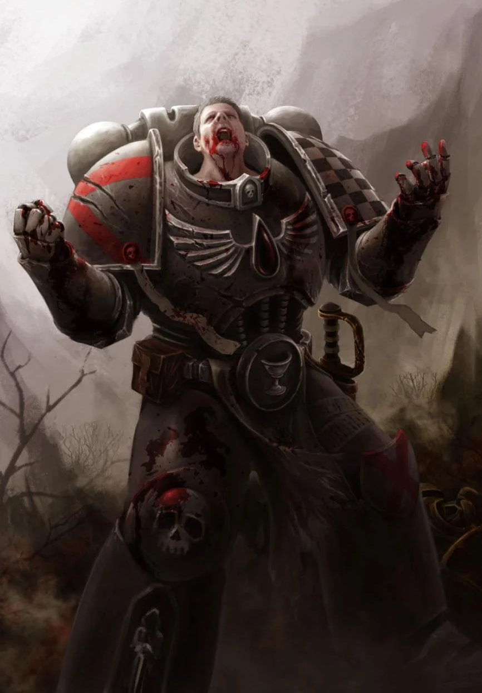

{.newpage height=8cm}

### Berserker

Un grand membre d’une tribu humaine avance à grands pas à travers les tempêtes de neige, enveloppé de fourrures et brandissant sa hache. Il rit en chargeant vers le groupe d’Orques qui ont osé attaquer les villages de son monde sauvage.

Un Ogryn grogne face au dernier challenger qui remet en cause son autorité, prêt à briser le cou de son adversaire à mains nues, comme il l’a fait avec ses six derniers adversaires.

La bouche écumante, un Blood Angel assène un coup de gantelet au visage de son ennemi Eldar noir, puis se retourne pour enfoncer son coude blindé dans le ventre d’un autre, lui brisant les côtes et lui fracturant les os.

Ces berserkers, aussi différents soient-ils, se caractérisent par une rage surnaturelle qui s’empare d’eux dès que l’aube de la bataille se lève. Plus qu’une simple émotion, leur colère et leur férocité sont celles d’un animal acculé, mais leur objectif est aussi clair que l’œil d’une tempête.

Pour certains, leur rage jaillit de la communion entre la technologie et la chair, utilisant la cybernétique pour réprimer toute émotion superflue afin d’alimenter leur fureur au combat. Pour d’autres, cette rage est forgée par des années de combat, de discipline et de dévouement à leur cause.

**Création Rapide**

Vous pouvez créer rapidement un berserker en suivant ces conseils. Tout d’abord, faites en sorte que la Force soit votre modificateur de caractéristique le plus élevé. Vos scores suivants les plus élevés devraient être la Constitution et la Dextérité. Ensuite, choisissez le parcours « mercenaire ».

##### Bonus de classe

En tant que Berserker, vous bénéficiez des caractéristiques de classe suivantes :

**Points de vie**

*Dés de vie* : 1d12 par niveau d’augmentiste

*Points de vie au niveau 1* : 12 + votre modificateur de Constitution

*Points de vie aux niveaux supérieurs* : 1d12 (ou 5) + votre modificateur de Constitution par niveau de Berserker après le niveau 1

**Compétences de départ**

Vous maîtrisez les objets suivants, en plus des compétences fournies par votre espèce ou votre historique.

*Armures* : armure légère, armure moyenne, armure lourde, boucliers

*Armes* : armes simples, armes de guerre

*Outils* : aucun

*Jets de sauvegarde* : Force, Constitution

*Compétences* : choisissez-en deux parmi Acrobatie, Athlétisme, Perspicacité, Intimidation, Connaissances, Médecine, Nature, Perception et Survie.

*Équipement de départ*

Vous commencez avec les objets suivants, auxquels s’ajoutent ceux fournis par votre historique :

- (a) une grande hache ou (b) n’importe quelle arme de combat au corps à corps
- (a) deux haches à une main ou (b) n’importe quelle arme simple ou (c) un bouclier
- (a) une cotte de mailles à écailles ou (b) une cotte de mailles
- Un sac d’explorateur et cinq javelots

*Scores caractéristiques et modificateur*{.table-title .wide}

| Niveau | Bonus de Maîtrise | Aptitudes | Rage | Dégâts en Rage |
| :-: | :---: | ---------------- | :----: | :----: |
| 1 | +2 | Défense sans armure, Rage | 2 | +2 |
| 2 | +2 | Attaque téméraire, Sens du danger | 2 | +2 |
| 3 | +2 | War path | 3 | +2 |
| 4 | +2 | Amélioration des caractéristiques | 3 | +2 |
| 5 | +3 | Attaque supplémentaire, Déplacement rapide | 3 | +2 |
| 6 | +3 | Capacité « Chemin de guerre » | 4 | +2 |
| 7 | +3 | Instinct sauvage | 4 | +2 |
| 8 | +3 | Amélioration des caractéristiques | 4 | +2 |
| 9 | +4 | Critique brutal (1 dé) | 5 | +3 |
| 10 | +4 | Capacité « Chemin de guerre » | 4 | +3 |
| 11 | +4 | Rage implacable | 4 | +3 |
| 12 | +4 | Amélioration des caractéristiques | 5 | +3 |
| 13 | +5 | Critique brutal (2 dés) | 5 | +3 |
| 14 | +5 | Caractéristique « Chemin de guerre » | 5 | +3 |
| 15 | +5 | Rage persistante | 5 | +3 |
| 16 | +5 | Amélioration des caractéristiques | 5 | +4 |
| 17 | +6 | Critique brutale (3 dés) | 6 | +4 |
| 18 | +6 | Puissance indomptable | 6 | +4 |
| 19 | +6 | Amélioration des caractéristiques | 6 | +4 |
| 20 | +6 | Champion de la guerre | illimité | +4 |

##### Aptitudes de classe

Un grand membre d’une tribu humaine avance à grands pas à travers les tempêtes de neige, enveloppé de fourrures et brandissant sa hache. Il rit en chargeant vers le groupe d’Orques qui ont osé attaquer les villages de son monde sauvage.

Un Ogryn grogne face au dernier challenger qui remet en cause son autorité, prêt à briser le cou de son adversaire à mains nues, comme il l’a fait avec ses six derniers adversaires.

La bouche écumante, un Blood Angel assène un coup de gantelet au visage de son ennemi Eldar noir, puis se retourne pour enfoncer son coude blindé dans le ventre d’un autre, lui brisant les côtes et lui fracturant les os.

*Coût des points de caractéristiques*{.table-title}

| Score | Coût |
| :----:| :--: |
| 8     | 0    |
| 9     | 1    |
| 10    | 2    |
| 11    | 3    |

| Score | Coût |
| :----:| :--: |
| 12    | 4    |
| 13    | 5    |
| 14    | 7    |
| 15    | 9    |

Ces berserkers, aussi différents soient-ils, se caractérisent par une rage surnaturelle qui s’empare d’eux dès que l’aube de la bataille se lève. Plus qu’une simple émotion, leur colère et leur férocité sont celles d’un animal acculé, mais leur objectif est aussi clair que l’œil d’une tempête.

Pour certains, leur rage jaillit de la communion entre la technologie et la chair, utilisant la cybernétique pour réprimer toute émotion superflue afin d’alimenter leur fureur au combat. Pour d’autres, cette rage est forgée par des années de combat, de discipline et de dévouement à leur cause.

*Scores caractéristiques et modificateur*{.table-title}

| Score | Modificateur |
| :----:| :----------: |
| 1     | -5           |
| 2-3   | -4           |
| 4-5   | -3           |
| 6-7   | -2           |
| 8-9   | -1           |
| 10-11 | 0            |
| 12-13 | +1           |
| 14-15 | +2           |
