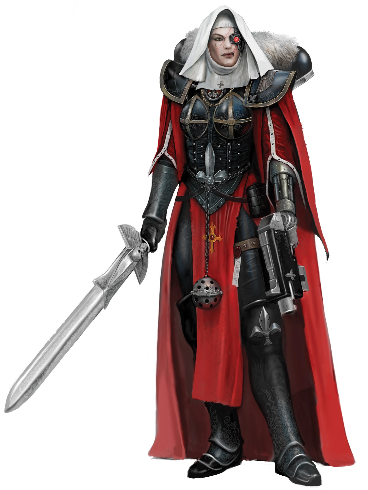

{.newpage height=8cm}

### Croisé

Au milieu des armées en guerre, quelques voix se font entendre par-dessus les tirs d’artillerie et les explosions des projectiles. Ces voix sonnent juste, inspirant ceux qui les entourent, transformant même l’homme du peuple en guerrier assoiffé de vengeance, prêt à abattre les ennemis qui les cernent. Les croisés inspirent ceux qui les entourent à accomplir des actes courageux, à se renforcer face aux hordes d’ennemis qui approchent et à infliger un châtiment juste à ceux qui osent s’opposer à leur cause. En cas d’extrême nécessité, un croisé peut même implorer son dieu ou sa divinité de lui venir en aide, faisant descendre un ange ou un démon d’une grande puissance pour le servir, ou provoquant l’apparition d’un miracle.

**Création Rapide**

Vous pouvez créer rapidement un croisé en suivant ces suggestions. Tout d’abord, faites de la Force ou de la Dextérité votre modificateur de caractéristique le plus élevé, selon que vous souhaitiez vous concentrer sur le combat au corps à corps ou à distance (ou sur les armes de finesse). Votre deuxième score le plus élevé devrait être la Constitution. Ensuite, choisissez l'historique « acolyte ».

##### Bonus de classe

En tant que Croisé, vous bénéficiez des caractéristiques de classe suivantes :

**Points de vie**

*Dés de vie* : 1d10 par niveau de Berserker

*Points de vie au niveau 1* : 10 + votre modificateur de Constitution

*Points de vie aux niveaux supérieurs* : 1d10 (ou 6) + votre modificateur de Constitution par niveau de Berserker après le niveau 1

**Compétences de départ**

Vous maîtrisez les objets suivants, en plus des compétences fournies par votre espèce ou votre historique.

*Armures* : armure légère, armure moyenne, armure lourde, boucliers

*Armes* : armes simples, armes de guerre

*Outils* : aucun

*Jets de sauvegarde* : Force, Constitution

*Compétences* : choisissez-en trois parmi Athlétisme, Acrobatie, Perspicacité, Intimidation, Connaissances, Occultisme, Représentation, Persuasion, Pilotage, Technologie et Survie.

*Équipement de départ*

Vous commencez avec les objets suivants, auxquels s’ajoutent ceux fournis par votre historique :

- (a) une armure de combat ou (b) une armure en cotte de mailles, un fusil d’assaut et 2 chargeurs
- (a) une arme martiale et un bouclier ou (b) deux armes martiales
- (a) une carabine laser et 2 cellules d’énergie ou (b) deux haches de main
- (a) un sac de donjonier ou (b) un sac d’explorateur

*Les aptitudes du Croisé*{.table-title .wide}

| Niveau | Bonus de Maîtrise | Aptitudes | Points de valeur |
| :-: | :---: | ---------------- | :----: |
| 1 | +2 | Style de combat, Frappe vengeresse | -- |
| 2 | +2 | Repos du fidèle, Vaillance | 2 |
| 3 | +2 | Serment du croisé | 3 |
| 4 | +2 | Amélioration des caractéristiques | 4 |
| 5 | +3 | Attaque supplémentaire, Vaillance (d8) | 5 |
| 6 | +3 | Cri de guerre | 6 |
| 7 | +3 | Amélioration du Serment du croisé | 7 |
| 8 | +3 | Amélioration des caractéristiques | 8 |
| 9 | +4 | Dernier combat (1 utilisation) | 9 |
| 10 | +4 | Intervention divine, Vaillance (d10) | 10 |
| 11 | +4 | Amélioration du Cri de guerre | 11 |
| 12 | +4 | Amélioration des caractéristiques | 12 |
| 13 | +5 | Dernier combat (2 utilisations) | 13 |
| 14 | +5 | Amélioration du Serment du croisé | 14 |
| 15 | +5 | Vaillance (d12) | 15 |
| 16 | +5 | Amélioration des caractéristiques | 16 |
| 17 | +6 | Dernier combat (3 utilisations), Esprit fermé | 17 |
| 18 | +6 | Devoir jusqu’à la mort | 18 |
| 19 | +6 | Amélioration des caractéristiques | 19 |
| 20 | +6 | Amélioration de l’Intervention divine | 20 |

##### Style de combat

À partir du niveau 2, vous adoptez un style de combat particulier comme spécialité. Choisissez l’une des options de style de combat énumérées ci-dessous. Vous ne pouvez pas choisir une même option de style de combat plus d’une fois, même si vous avez par la suite la possibilité de faire un nouveau choix.

- *Combat à l’aveugle.* Vous disposez d’une vision aveugle d’une portée de 3 mètres pieds. À l’intérieur de cette portée, vous pouvez voir tout ce qui ne se trouve pas derrière un abri total, même si vous êtes aveuglé ou dans l’obscurité. De plus, vous pouvez voir une créature invisible se trouvant dans cette portée, à moins que celle-ci ne parvienne à se cacher de vous.
- *Défense.* Lorsque vous portez une armure, vous bénéficiez d’un bonus de +1 à votre CA.
- *Duel.* Lorsque vous maniez une arme d’une seule main et aucune autre arme, vous bénéficiez d’un bonus de +2 aux jets de dégâts avec cette arme.
- *Combat à l’arme à deux mains.* Lorsque vous obtenez un 1 ou un 2 sur un dé de dégâts lors d’une attaque effectuée avec une arme que vous maniez à deux mains, vous pouvez relancer le dé et devez utiliser le nouveau résultat, même si celui-ci est un 1 ou un 2. L’arme doit posséder la propriété « à deux mains » ou « polyvalente » pour que vous puissiez bénéficier de cet avantage.
- *Interception.* Lorsqu’une créature que vous pouvez voir touche une cible, autre que vous, située à moins de 1,5 mètre de vous avec une attaque, vous pouvez utiliser votre réaction pour réduire les dégâts subis par la cible de 1d10 + votre bonus de compétence (avec un minimum de 0 point de dégâts). Vous devez manier un bouclier ou une arme simple ou martiale pour utiliser cette réaction.
- *Combat avec des armes de jet.* Vous pouvez dégainer une arme dotée de la propriété « de jet » dans le cadre de l’attaque que vous effectuez avec cette arme. De plus, lorsque vous touchez avec une attaque à distance utilisant une arme de jet, vous bénéficiez d’un bonus de +2 au jet de dégâts.
- *Combat à deux armes.* Lorsque vous combattez à deux armes, vous pouvez ajouter votre modificateur de capacité aux dégâts de la deuxième attaque. De plus, le fait de vous trouver à moins de 1,5 mètre d’une créature hostile ne vous impose pas de désavantage lors de vos jets d’attaque à distance avec des armes à une main.
- *Combat à mains nues.* Vos coups à mains nues peuvent infliger des dégâts contondants égaux à 1d6 + votre modificateur de Force en cas de coup réussi. Si vous ne maniez aucune arme ni aucun bouclier au moment du jet d’attaque, le d6 devient un d8. Au début de chacun de vos tours, vous pouvez infliger 1d4 dégâts contondants à une créature que vous avez immobilisée.

##### Frappe vengeresse

Vous pouvez permettre à vos alliés d’attaquer, même lorsque ce n’est pas leur tour. En tant qu’action bonus, vous pouvez autoriser une créature alliée située à moins de 60 pieds de vous et capable de vous entendre ou de vous voir à effectuer une attaque à l’arme en utilisant sa réaction.

Vous pouvez utiliser cette capacité un nombre de fois égal à votre bonus de compétence, et vous récupérez tous les usages consommés à la fin d’un repos court ou long.

##### Vaillance

À partir du niveau 2, vous pouvez inspirer les autres par des paroles enflammées ou des cris de ralliement. Votre vaillance est représentée par un certain nombre de points de vaillance. Votre niveau de croisé détermine le nombre de points dont vous disposez, comme indiqué dans la colonne « Points de vaillance » du tableau du croisé.

Vous pouvez dépenser ces points pour utiliser certaines capacités. Lorsque vous effectuez une attaque contre une créature hostile ou lorsque vous utilisez votre capacité « Frappe vengeresse », vous pouvez dépenser un point de vaillance et lancer un dé de vaillance (un d6) pour obtenir l’un des effets suivants :

- Une créature située à moins de 60 pieds de vous gagne des points de vie égaux au résultat de votre lancer de dé de vaillance.
- Lorsque vous ou une créature alliée infligez des dégâts avec une attaque à l’arme, vous pouvez faire en sorte que l’attaque inflige des dégâts supplémentaires égaux au résultat d’un jet de votre dé de vaillance.
- Vous ou une créature alliée située à moins de 60 pieds de vous bénéficiez d’un bonus à votre CA contre la prochaine attaque qui vous vise, égal au résultat d’un jet du dé de vaillance. Ce bonus au CA dure jusqu’au début de votre prochain tour.

Vous récupérez tous vos points de vaillance dépensés lorsque vous terminez un repos court ou long.

Votre dé de vaillance change lorsque vous atteignez certains niveaux dans cette classe. Il devient un d8 au niveau 5, un d10 au niveau 10 et un d12 au niveau 15.

##### Repos fidèle

Au niveau 2, vous pouvez utiliser l’art oratoire pour aider vos alliés à récupérer pendant un repos court. Si vous, ou toute créature amie capable d’entendre votre prestation, dépensez un ou plusieurs dés de vie pour regagner des points de vie à la fin d’un repos court, chacune de ces créatures regagne un nombre supplémentaire de points de vie égal au résultat d’un jet de votre dé de vaillance.

##### Serment du croisé

À partir du niveau 3, vous prononcez le serment du croisé qui vous lie au service. Ce serment est un engagement personnel que chaque croisé prononce, parfois devant un clerc ou un maître de sa foi, et qu’il interprète à sa manière en fonction de ses propres croyances, de son éthique et de ses expériences. Vous bénéficiez des avantages liés à ce serment aux niveaux 3, 7 et 14.

##### Amélioration des caractéristiques

Lorsque vous atteignez le niveau 4, puis à nouveau aux niveaux 8, 12, 16 et 19, vous pouvez choisir parmis les modifications suivantes :

- Augmenter de 2 points une caractéristique de votre choix
- Augmenter d’un point deux caractéristiques de votre choix
- Choisir un Don

Comme d’habitude, si vous choisissez d'augmenter vos caractéristiques, vous ne pouvez pas le faire au-delà de 20 via de cette capacité.

##### Attaque supplémentaire

À partir du niveau 5, vous pouvez attaquer deux fois, au lieu d’une seule, chaque fois que vous effectuez l’action « Attaque » pendant votre tour.

##### Cri de guerre

Au niveau 6, vous acquérez la capacité de neutraliser les effets influençant l’esprit, tant pour vous-même que pour vos coéquipiers. En tant qu’action bonus, vous pouvez entonner un chant, un mantra ou un discours qui dure 1 minute. Pendant ce temps, vous et toutes les créatures amies situées à moins de 9 mètres de vous bénéficiez d’un avantage aux jets de sauvegarde contre les effets de « effrayé » et de « charmé ». Une créature doit pouvoir vous entendre pour bénéficier de cet avantage. L’interprétation prend fin prématurément si vous êtes neutralisé ou réduit au silence, ou si vous y mettez volontairement un terme (aucune action requise).

Une fois que vous avez utilisé cette capacité, vous ne pouvez pas l’utiliser à nouveau avant d’avoir effectué un repos court ou long.

Au niveau 11, vous et toutes les créatures amies situées à moins de 60 pieds de vous êtes immunisés contre l’effroi et le charme lorsque vous utilisez cette capacité.

##### Dernier combat

À partir du niveau 9, votre détermination vous permet, à vous et à vos alliés, de continuer à vous battre. Lorsque vous, ou une créature alliée située à moins de 60 pieds de vous et capable de vous voir, êtes réduits à 0 point de vie sans être tués sur le coup, vous pouvez utiliser votre réaction pour faire en sorte que cette créature soit ramenée à 1 point de vie à la place ; vous ne pouvez plus utiliser cette capacité avant d’avoir effectué un long repos.

Vous pouvez utiliser cette capacité deux fois entre deux longs repos à partir du niveau 13, et trois fois entre deux longs repos à partir du niveau 17.

##### Intervention divine

À partir du niveau 10, vous pouvez faire appel à un miracle pour qu’il intervienne en votre faveur lorsque vous en avez grand besoin.

Implorer un miracle nécessite une action de votre part. Décrivez l’aide que vous sollicitez, puis lancez un dé centésimal (d100). Si vous obtenez un résultat égal ou inférieur à votre niveau de croisé, votre miracle se concrétise. Le MJ choisit la nature de l’intervention ; l’effet d’un pouvoir psychique serait approprié, tout comme l’invocation temporaire d’un démon ou d’un saint pour combattre à vos côtés. Si votre miracle se concrétise, vous ne pouvez plus utiliser cette capacité pendant 7 jours. Sinon, vous pouvez l’utiliser à nouveau après avoir effectué un long repos.

Au niveau 20, votre appel à l’intervention réussit automatiquement, sans qu’il soit nécessaire de lancer le dé.

##### Esprit fermé

À partir du niveau 17, votre esprit est déterminé à déjouer toute tromperie. Vous réussissez automatiquement vos jets de sauvegarde contre les illusions, la lecture de vos pensées et toute tentative visant à altérer votre humeur. De plus, vous êtes immunisé contre les dégâts psioniques.

##### Devoir jusqu’à la mort

Au niveau 18, vous et les créatures alliées situées à moins de 18 mètres de vous et capables de vous entendre êtes toujours sous l’effet de votre capacité « Cri de guerre ». Cet effet est suspendu si vous êtes hors de combat ou réduit au silence.

De plus, à la fin d’un long repos, vous pouvez choisir jusqu’à dix créatures situées à moins de 18 mètres de vous et capables de vous entendre, et leur adresser un discours enthousiasmant. Leurs points de vie maximums et actuels augmentent d’un montant égal à votre niveau de croisé. Cet avantage dure 8 heures, ou jusqu’à votre mort.

##### Liste des Serments

Chaque croisé prête serment, et jusqu’à présent, il a peut-être considéré son parcours comme une simple préparation à ce qui l’attend. C’est ce serment qui le lie au service de sa cause, mais de nombreux croisés ont leur propre vision de ce que signifie leur serment, et de ce qu’implique le fait de le rompre. Si un serment est rompu, un croisé peut décider de prêter un autre serment, ou de demander pénitence ou pardon à un prêtre ou à un maître de sa foi ou de sa croyance.

Votre serment de croisé vous confère des capacités aux niveaux 3, 7 et 14.

**Serment de l’apôtre**

Les apôtres sont des hommes saints de leur foi, qui cherchent à agir avec droiture pour leur juste cause. Ces apôtres étudient souvent assidûment leurs textes religieux et s’efforcent d’inculquer le fanatisme et le zèle au sein des rangs de leurs alliés. Bien que chaque serment diffère par sa rigueur et son interprétation, les principes d’un serment d’apôtre peuvent ressembler à ceci :

- *Berger du troupeau.* Comme j’étais autrefois un mouton, je suis désormais un berger, et je guide mes disciples vers l’illumination.
- *Textes sacrés.* Les textes sacrés nous révèlent la sagesse et la vérité. Il nous appartient d’en déchiffrer le sens.
- *Guerre des mots.* Pour gagner le cœur des gens, vos paroles doivent leur révéler la vérité.

*Érudit de la guerre*

À partir du niveau 3, lorsque vous choisissez ce serment, vous maîtrisez parfaitement l’art de la guerre et la philosophie. Choisissez deux des compétences suivantes : Intuition, Enquête, Connaissances, Nature et Occultisme. Vous acquérez la maîtrise de ces compétences et pouvez ajouter le double de votre bonus de maîtrise aux jets de compétence effectués lorsque vous utilisez ces compétences.

*Fanatisme*

À partir du niveau 3, vous pouvez inspirer vos alliés à se battre au-delà de leurs limites. Lorsque vous utilisez votre capacité « Frappe vengeresse », la créature alliée gagne 5 points de vie temporaires. Lorsqu’elle gagne ces points de vie temporaires, elle peut immédiatement se déplacer jusqu’à la moitié de sa vitesse, sans provoquer d’attaques d’opportunité, avant ou après avoir effectué son attaque.

Le nombre de points de vie temporaires augmente lorsque vous atteignez certains niveaux dans cette classe : il passe à 8 au niveau 5, à 11 au niveau 10 et à 14 au niveau 15.

*Mot sacré*

À partir du niveau 7, vous pouvez considérer tout jet de d20 égal ou inférieur à 9 comme un 10 lorsque vous effectuez des jets d’Intimidation, de Persuasion et de représentation.

*Invoquer un champion de la foi*

À partir du niveau 14, vous pouvez utiliser une action pour invoquer un champion surnaturel de votre foi pendant 1 minute à un emplacement inoccupé situé à moins de 30 pieds de vous. Ce champion utilise les caractéristiques indiquées ci-dessous et obéit à tous les ordres verbaux que vous lui donnez. Le champion agit selon votre initiative. Si vous êtes hors de combat ou si vous ne lui avez pas donné d’ordres, le champion vous défendra, vous et lui-même, du mieux qu’il peut.

Une fois que vous avez invoqué un champion de la foi, vous ne pouvez pas le faire à nouveau avant d’avoir effectué un long repos.

**Serment du Pénitent**

Les pénitents sont ceux qui se sont écartés du chemin de la vertu ou qui ont commis une faute quelconque. Certains pénitents savent qu’ils ne pourront jamais revenir en arrière et souhaitent vivre en marge de la société. D’autres choisissent plutôt de considérer cela comme un cheminement vers la sainteté. Beaucoup de ceux qui se soumettent au Serment du pénitent se débarrassent de leur armure et de leurs vêtements, ne portant qu’un simple linge en guise de punition. Bien que chaque serment diffère par sa rigueur et son interprétation, les principes d’un Serment du pénitent peuvent ressembler à ceci :

- "Que la faiblesse ne me définisse pas." La faiblesse m’a conduit sur cette voie, mais la force est mon absolution.
- "La rédemption exige un sacrifice." Si je veux me racheter, je dois être prêt à tout sacrifier.
- "Tous ceux qui errent ne sont pas perdus." Bien que le chemin que j’emprunte soit sinueux, je ne suis jamais perdu dans ma quête de rédemption.

*Défense sans armure*
À partir du niveau 3, lorsque vous choisissez ce serment, tant que vous ne portez pas d’armure, votre CA est de 10 + votre modificateur de Constitution + votre bonus de compétence.

*Ferveur repentante*

Toujours au niveau 3, chaque fois que vous dépensez un ou plusieurs points de vaillance, vous bénéficiez d’un avantage sur la première attaque à l’arme que vous effectuez avant la fin de votre prochain tour. Vous pouvez également permettre à une créature alliée de bénéficier d’un avantage sur son prochain jet d’attaque lorsqu’elle utilise votre capacité « Frappe vengeresse ».

*Attaques dévastatrices*

Au niveau 7, lorsque la cible de votre capacité « Frappe vengeresse » inflige des dégâts, cette cible peut infliger des dégâts supplémentaires égaux à la moitié de votre niveau de croisé + votre bonus de compétence.

*Rédempteur*

À partir du niveau 14, lorsque vous avez moins de la moitié de vos points de vie maximums, vous bénéficiez d’une résistance aux dégâts d’énergie et cinétiques.
