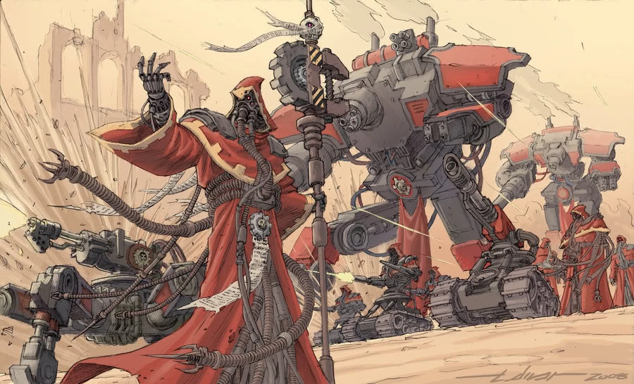

{.newpage height=8cm}

### Mécanicien

Un Mekboy orque s’avance, son corps formant un mélange tordu de métal rouillé et de peau verte, avant de lancer une bombe instable sur une horde de gardes, réduisant leurs corps en cendres. Un tecnho-prêtre lève les yeux vers les guerriers de feu Tau qui approchent et brandit rapidement une sphère. Alors qu’il tourne ses cadrans et murmure une incantation en binaire, les guerriers de feu sont submergés par le poids de la gravité, jusqu’à ce que celle-ci les écrase et les emprisonne dans leur armure comme dans des cercueils.

Les mécaniciens font de la technologie le cœur de leur pouvoir, puis en exploitent les avantages de manière unique, la maîtrisant jusqu’à accomplir des exploits surhumains grâce à ses effets.

**Création Rapide**

Vous pouvez créer rapidement un mécanicien en suivant ces suggestions. Tout d’abord, faites de l’Intelligence votre modificateur de caractéristique le plus élevé. Votre deuxième score le plus élevé devrait être la Dextérité ou la Constitution. Ensuite, choisissez le parcours « Mécanicien ».

#### Bonus de classe

En tant que Mécanicien, vous bénéficiez des caractéristiques de classe suivantes :

**Points de vie**

*Dés de vie* : 1d8 par niveau de Mécanicien

*Points de vie au niveau 1* : 8 + votre modificateur de Constitution

*Points de vie aux niveaux supérieurs* : 1d18 (ou 5) + votre modificateur de Constitution par niveau de Mécanicien après le niveau 1

**Compétences de départ**

Vous maîtrisez les objets suivants, en plus des compétences fournies par votre espèce ou votre historique.

*Armures* : armure légère, armure moyenne, boucliers

*Armes* : armes simples, armes de guerre

*Outils* : trousse de mécanicien, trousse de sécurité

*Jets de sauvegarde* : Dextérité, Intelligence

*Compétences* : choisissez-en trois parmi Acrobatie, Connaissances, Investigation, Médecine, Nature, Perspicacité, Persuasion, Pilotage, Prestidigitation, Représentation, Technologie et Tromperie.

*Équipement de départ*

Vous commencez avec les objets suivants, auxquels s’ajoutent ceux fournis par votre historique :

- (a) une rapière (b) une épée longue (c) une carabine laser et deux cellules d'énergie
- (a) un sac de diplomate ou (b) un sac de technologue
- (a) une armure en mailles ou (b) une armure de soldat
- Une dague, un pistolet laser et deux cellules d'énergie, ainsi qu'un kit de sécurité

*Les aptitudes du Mécanicien*{.table-title .wide}

| Niveau | Bonus de Maîtrise | Aptitudes | Modification cybernétique | Nombre de pouvoir technologique connu | Nombre de point de pouvoir technologique | Niveau maximal des pouvoir tech |
| :-: | :---: | ---------------- | :----: | :----: | :----: | :----: |
| 1 | +2 | Analyse critique, Lancement de sorts technologiques | -- | 9 | 4 | 1 |
| 2 | +2 | Modifications cybernétiques, Imprégner un objet (+1) | 2 | 11 | 8 | 1 |
| 3 | +2 | Expertise, École de mécanique | 2 | 13 | 12 | 2 |
| 4 | +2 | Amélioration des caractéristiques | 2 | 15 | 16 | 2 |
| 5 | +3 | Analyse critique (d8) | 2 | 17 | 20 | 3 |
| 6 | +3 | Amélioration de l’École de mécanique | 2 | 19 | 24 | 3 |
| 7 | +3 | -- | 3 | 21 | 28 | 4 |
| 8 | +3 | Amélioration des caractéristiques | 3 | 23 | 32 | 4 |
| 9 | +4 | Imprégner un objet (+2) | 3 | 25 | 36 | 5 |
| 10 | +4 | Analyse critique (d10), Expertise | 3 | 26 | 40 | 5 |
| 11 | +4 | -- | 4 | 28 | 44 | 6 |
| 12 | +4 | Amélioration des caractéristiques | 4 | 29 | 48 | 6 |
| 13 | +5 | Imprégner un objet (+3) | 4 | 31 | 52 | 7 |
| 14 | +5 | Amélioration de l’École de mécanique | 4 | 32 | 56 | 7 |
| 15 | +5 | Analyse critique (d12) | 4 | 34 | 60 | 8 |
| 16 | +5 | Amélioration des caractéristiques | 4 | 35 | 64 | 8 |
| 17 | +6 | -- | 5 | 37 | 68 | 9 |
| 18 | +6 | Infusion parfaite | 5 | 38 | 72 | 9 |
| 19 | +6 | Amélioration des caractéristiques | 5 | 39 | 76 | 9 |
| 20 | +6 | Analyse supérieure | 5 | 40 | 80 | 9 |

#### Aptitudes du Mécanicien

##### Analyse critique
Vous pouvez utiliser vos compétences tactiques pour aider vos alliés, tant sur le champ de bataille qu’en dehors. Pour ce faire, vous utilisez une action bonus pendant votre tour pour choisir une créature autre que vous-même, située à moins de 19 mètres de vous et capable de vous entendre. Cette créature gagne un dé d’Analyse critique, un d6.

Une fois au cours des 10 minutes suivantes, la créature peut lancer ce dé et ajouter le résultat obtenu à un test de capacité, un jet d’attaque ou un jet de sauvegarde qu’elle effectue. La créature peut attendre d’avoir lancé son d20 avant de décider d’utiliser le dé d’Analyse critique, mais elle doit se décider avant que le MJ ne déclare si le jet est réussi ou échoué. Une fois que le dé d’Analyse critique a été lancé, il est perdu. Une créature ne peut posséder qu’un seul dé d’Analyse critique à la fois.

Vous pouvez utiliser cette capacité un nombre de fois égal à votre modificateur d’Intelligence (au minimum une fois). Vous récupérez les utilisations épuisées lorsque vous terminez un long repos.

Votre dé d’Analyse critique change lorsque vous atteignez certains niveaux dans cette classe. Le dé devient un d8 au niveau 5, un d10 au niveau 10 et un d12 au niveau 15.

##### Formation de Traqueur

À partir du niveau 1, vous êtes difficile à cerner au combat. Vous pouvez vous déplacer jusqu’à la moitié de votre vitesse en réaction lorsqu’un ennemi termine son tour à moins de 1,5 mètres de vous. Ce déplacement ne provoque pas d’attaques d’opportunité.

De plus, choisissez l’une des compétences dans lesquelles vous êtes compétent. Vous pouvez ajouter le double de votre bonus de compétence aux jets effectués avec cette compétence.

##### Lancement de sorts technologiques

À partir du niveau 1, vous avez appris à utiliser la technologie pour lancer des pouvoirs technologiques.

*Pouvoirs technologiques connus*

Vous apprenez 9 pouvoirs technologiques de votre choix, puis d’autres à mesure que vous progressez en niveau, comme indiqué dans la colonne « Pouvoirs technologiques connus » du tableau du Mécanicien. Vous ne pouvez pas apprendre de pouvoir technologique d’un niveau supérieur à votre niveau de pouvoir maximal.

*Points de pouvoir technologiques*

Vous disposez d’un nombre de points techniques égal à votre niveau de mécanicien multiplié par 4, comme indiqué dans la colonne « Points techniques » du tableau du mécanicien. Lorsque vous lancez un pouvoir, vous dépensez un nombre de points techniques égal à 1 + le niveau du pouvoir. Vous récupérez tous les points techniques dépensés à la fin d’un long repos.

*Niveau de pouvoir maximal*

De nombreux pouvoirs technologiques peuvent être surpuissants, consommant davantage de points technologiques pour produire un effet plus important. Vous pouvez rendre ces capacités surpuissantes jusqu’à un niveau maximal, qui augmente à mesure que vous progressez en niveau, comme indiqué dans la colonne « Niveau maximal du pouvoir » du tableau du Mécanicien.

Vous ne pouvez lancer des pouvoirs technologiques de niveau 6, 7, 8 et 9 qu’une seule fois. Vous retrouvez la capacité de le faire après un long repos.

*Capacité de lancement technologique*

Votre capacité de lancement de pouvoirs technologiques est le score de capacité que vous utilisez pour lancer des pouvoirs technologiques. Votre capacité de lancement de pouvoirs technologiques est l’Intelligence. Vous utilisez ce modificateur de score de capacité chaque fois qu’un pouvoir fait référence à votre capacité de lancement de pouvoirs technologiques. De plus, vous utilisez ce modificateur de score de capacité lorsque vous déterminez le DD de jet de sauvegarde pour un pouvoir technologique que vous lancez et lorsque vous effectuez un jet d’attaque avec celui-ci.

- DD de sauvegarde technique = 8 + votre bonus de maîtrise + votre modificateur de lancement de sorts techniques
- Modificateur d’attaque technique = votre bonus de maîtrise + votre modificateur de lancement de sorts techniques

##### Modifications cybernétiques

À partir du niveau 2, vous avez appris à apporter des modifications à votre corps afin de vous améliorer grâce à la cybernétique. Au cours d’un long repos, vous pouvez vous équiper d’améliorations cybernétiques.

Vous disposez de 2 emplacements de modification, et vous en gagnez davantage à mesure que vous progressez en niveau, comme indiqué dans la colonne « Modifications cybernétiques » du tableau du Mécanicien. Au cours d’un long repos, vous pouvez installer, remplacer ou retirer un nombre de modifications égal à votre modificateur d’Intelligence (avec un minimum d’une). La liste des modifications cybernétiques figure à la fin de la description de la classe.

Certains effets de modification nécessitent des jets de sauvegarde. Lorsque vous utilisez un tel effet de cette classe, la difficulté (DC) est égale à votre DC de sauvegarde technique.

##### Imprégner un objet

À partir du niveau 2, vous gagnez la capacité d’améliorer temporairement une arme ou une armure en l’entretenant régulièrement. À la fin d’un long repos, vous pouvez toucher un objet non amélioré qui est une armure, un bouclier ou une arme simple ou martiale. Jusqu’à la fin de votre prochain repos prolongé, l’objet devient un objet amélioré, conférant un bonus de +1 à la CA s’il s’agit d’une armure ou d’un bouclier, ou un bonus de +1 aux jets d’attaque et de dégâts s’il s’agit d’une arme.

Une fois que vous avez utilisé cette capacité, vous ne pouvez pas l’utiliser à nouveau avant d’avoir terminé un repos prolongé.

Ce bonus passe à +2 au niveau 9 et à +3 au niveau 13.

##### École de mécanique

Au niveau 3, vous vous plongez dans les techniques avancées d’une école de mécanique de votre choix. Ce choix vous confère des avantages au niveau 3, puis à nouveau aux niveaux 6 et 14.

##### Expertise

Au niveau 3, choisissez deux de vos compétences. Votre bonus de compétence est doublé pour tout test de capacité que vous effectuez et qui utilise l’une des compétences choisies.

Au niveau 10, vous pouvez choisir deux autres compétences pour bénéficier de cet avantage.

##### Amélioration des caractéristiques

Lorsque vous atteignez le niveau 4, puis à nouveau aux niveaux 8, 12, 16 et 19, vous pouvez choisir parmis les modifications suivantes :

- Augmenter de 2 points une caractéristique de votre choix
- Augmenter d’un point deux caractéristiques de votre choix
- Choisir un Don

Comme d’habitude, si vous choisissez d'augmenter vos caractéristiques, vous ne pouvez pas le faire au-delà de 20 via de cette capacité.

##### Cogitateurs analytiques

À partir du niveau 5, vous récupérez tous vos usages épuisés de « Analyse critique » lorsque vous terminez un repos court ou long.

##### Infusion parfaite

Au niveau 18, les armes que vous infusez infligent un coup critique sur un jet de 19 ou 20. Sinon, si vous infusez une armure, tous les coups critiques portés contre celle-ci deviennent des coups normaux.

##### Analyse supérieure

Au niveau 20, vous pouvez utiliser un jet de votre capacité « Analyse critique » pour accorder un dé d’Analyse critique à un maximum de cinq créatures alliées situées à moins de 18 mètres de vous.

#### Les écoles de mécanique

Les mécaniciens sont formés dans des écoles spécialisées qui leur enseignent à fabriquer et à manipuler des technologies. Même si vous n’avez jamais fréquenté une telle école, vous pouvez tout de même adopter les techniques enseignées dans ce type d’établissement.

##### École d’infiltration

L’école d’infiltration confère à ses élèves des capacités de discrétion et de manipulation, formant ainsi des espions et des assassins chevronnés.

**Activer la discrétion**

À partir du niveau 3, vous pouvez utiliser votre action pour toucher une créature consentante autre que vous-même afin de lui conférer un avantage lors de ses jets de discrétion. Cet avantage dure 1 heure ou jusqu’à ce que vous utilisiez à nouveau cette capacité.

**Auto-Hologramme**

À partir du niveau 6, vous pouvez utiliser des hologrammes pour créer un double illusoire de vous-même.

En tant qu’action bonus, vous créez une illusion parfaite de vous-même qui dure 1 minute, ou jusqu’à ce que vous perdiez votre concentration (comme si vous vous concentriez sur un pouvoir). L’illusion apparaît dans un espace inoccupé que vous pouvez voir à moins de 18 mètres de vous. Lorsque vous créez cette illusion pour la première fois et en tant qu’action bonus à chacun de vos tours, vous pouvez déplacer l’illusion jusqu’à 18 mètres vers un espace que vous pouvez voir, mais elle doit rester à moins de 36 mètres de vous.

Pendant toute la durée de l’illusion, vous pouvez lancer des pouvoirs comme si vous vous trouviez dans l’espace de l’illusion, mais vous devez utiliser vos propres sens. De plus, lorsque vous et votre illusion vous trouvez tous deux à moins de 1,5 mètre d’une créature hostile capable de voir l’illusion, vous bénéficiez d’un avantage aux jets d’attaque contre cette créature, car l’illusion distrait fortement la cible.

**Polygram**

À partir du niveau 14, vous pouvez créer jusqu’à quatre duplicatas de vous-même, au lieu d’un seul, lorsque vous utilisez « Hologramme de soi ». Lorsque vous créez ces illusions pour la première fois et en tant qu’action bonus pendant votre tour, vous pouvez déplacer n’importe lequel d’entre eux jusqu’à 9 mètres pieds, dans une portée maximale de 36 mètres pieds.

De plus, si l’une de vos illusions et une créature alliée se trouvent à moins de 1,5 mètre d’une créature hostile capable de voir l’illusion, cette créature alliée bénéficie d’un avantage sur ses jets d’attaque contre la créature hostile.

**Fendre la vague**

À partir du niveau 11, vous avez appris à fendre la vague d’ennemis qui s’opposent à vous. Vous pouvez utiliser votre action pour effectuer des attaques de mêlée contre un nombre illimité de créatures situées à moins de 1,5 mètre de vous, avec un jet d’attaque distinct pour chaque cible.

Vous pouvez également utiliser votre action pour effectuer une attaque à distance contre un nombre illimité de créatures se trouvant dans un carré de 3 mètres situé dans la portée de votre arme. Vous devez effectuer un jet d’attaque distinct pour chaque cible.

##### École de chronomancie

Rares sont ceux à qui il est permis de découvrir l’école de chronomancie et tous les dangers qui se cachent dans ses innombrables livres, tomes et fiches techniques consacrés à sa nature toujours déroutante. Ceux qui s’adonnent à la technologie et à la recherche sur le temps et ses applications technologiques sont peu nombreux et se trouvent principalement parmi les insaisissables Eldars et les Nécrons immortels.

**Déplacement temporel**

À partir du niveau 3, lorsque vous choisissez cette école, vous avez appris à utiliser la technologie pour vous déplacer dans le temps. Vous pouvez ajouter votre modificateur d’Intelligence à vos jets d’initiative.

**Aperçu de l'avenir**

À partir du niveau 3, lorsque vous choisissez cette école, vous disposez de la capacité unique d'utiliser la technologie pour entrevoir l'avenir et vous y préparer. À la fin d'un long repos, lancez deux d20 et notez les résultats obtenus. Vous pouvez remplacer n’importe quel jet d’attaque, jet de sauvegarde ou test de capacité effectué par vous-même ou par une créature que vous pouvez voir par l’un de ces jets prédictifs. Vous devez choisir de le faire avant le jet, et vous ne pouvez remplacer un jet de cette manière qu’une seule fois par tour.

Chaque jet d’aperçu du futur ne peut être utilisé qu’une seule fois. À la fin d’un long repos, vous perdez tous les jets d’aperçu du futur non utilisés.

**Champ de stase**

À partir du niveau 6, en réaction à une attaque dont vous êtes la cible, vous pouvez obliger une créature de taille Grande ou inférieure qui vous attaque et que vous pouvez voir à effectuer un jet de sauvegarde de Constitution contre votre DD de sauvegarde technique. En cas d’échec, la créature est emprisonnée dans un champ d’énergie renforcée jusqu’à la fin de votre prochain tour, ou jusqu’à ce qu’elle subisse des dégâts. Tant qu’elle est ainsi emprisonnée, la créature est incapacitée et a une vitesse de 0.

Vous pouvez utiliser cette capacité un nombre de fois égal à votre bonus de compétence. Vous récupérez tous les usages dépensés à la fin d’un long repos.

**Aperçu plus clair**

À partir du niveau 14, les visions que vous percevez s’intensifient et vous donnent une image plus précise de ce qui va se passer. Vous lancez trois d20 pour votre capacité « Aperçu du futur », au lieu de deux.

#### Les Modifications cybernétiques

##### Enregistreur optique

Cette augmentation remplace au moins l’un de vos yeux.

Vous êtes immunisé contre l’état « aveuglé » et vous pouvez activer ou désactiver votre capacité à voir à tout moment. De plus, vos yeux sont équipés d’un enregistreur d’images. Vous pouvez vous remémorer parfaitement tout ce que vous avez vu au cours des 30 derniers jours.

##### Augmentations avancées du bras

Cette augmentation remplace un bras.

Lorsque vous effectuez un test de capacité, un jet d’attaque ou un jet de sauvegarde en utilisant la Force avec ce bras uniquement, votre score de Force est considéré comme étant de 15. Lorsque vous effectuez un test de capacité, un jet d’attaque ou un jet de sauvegarde en utilisant la Force avec d’autres bras en plus de celui-ci, vous prenez la moyenne entre le score de Force de ce bras et le vôtre.

Vous pouvez choisir cette modification plusieurs fois.

##### Améliorations avancées des jambes

Cette amélioration remplace les deux jambes.

Lorsque vous calculez votre bonus à la CA et aux jets de sauvegarde liés à la Dextérité, votre score de Dextérité est considéré comme étant de 15. Si votre score de Dextérité est déjà égal ou supérieur à 15, cela n’a aucun effet sur vous.

De plus, vous pouvez remplacer votre propre score par celui-ci chaque fois que vous effectuez un test de capacité ou un jet d’attaque utilisant vos jambes.

##### Œil amovible

Cette amélioration remplace un œil.

En tant qu’action, vous pouvez retirer ou replacer cet œil. Lorsqu’il est retiré, l’œil fait pousser huit petites pattes, dispose d’une vitesse de 4,5 mètres, d’une CA de 10 et d’un point de vie. S’il meurt, vous ne pouvez plus l’utiliser tant que vous n’avez pas effectué un long repos. En tant qu’action à chacun de vos tours, vous pouvez déplacer l’œil jusqu’à sa vitesse maximale tant qu’il se trouve à moins de 18 mètres de vous. Vous pouvez voir à la fois à travers l’œil détaché et votre œil restant, ou vous pouvez utiliser votre action pour ne voir qu’à travers l’un ou l’autre.

Vous pouvez choisir cette modification plusieurs fois.

##### Main-harpon

Cette amélioration remplace une main.

Vous modifiez votre main pour lui conférer la capacité de se transformer en harpon. Grâce à cette main, vous pouvez effectuer une attaque à distance avec une portée de 30/60. En cas de coup au but, elle inflige 1d6 points de dégâts cinétiques. Cette attaque peut cibler une surface, un objet ou une créature.

Une créature touchée par cette attaque est empalée par le harpon. En tant qu’action, une créature peut tenter de retirer le harpon. Retirer le harpon nécessite un jet d’Athlétisme. Tant que le harpon est planté dans la cible, vous êtes relié à celle-ci par un câble de 60 pieds.

Tant que le harpon est déployé, vous pouvez utiliser votre action bonus pour actionner le moulinet, ce qui vous permet de vous rapprocher de la cible si celle-ci est plus grande que vous. Une créature ou un objet de votre taille ou plus petit est attiré vers vous. Vous pouvez également choisir de lâcher le câble (aucune action requise).

Une fois que vous avez utilisé cette capacité, vous ne pouvez plus utiliser votre main jusqu’à ce que vous vous soyez remis et que vous l’ayez réinsérée en tant qu’action.

Vous pouvez choisir cette modification plusieurs fois.

#####  Armure sous-cutanée

Lorsque vous ne portez pas d’armure, votre CA devient égal à 13 + votre modificateur de Dextérité.

##### Bras mécadendritique

Vous créez un bras mécanique qui se fixe à votre épaule ou à la base de votre colonne vertébrale, et que vous pouvez utiliser de manière indépendante. Ce bras peut manier des armes et des boucliers, et manipuler des objets aussi bien que vous.

Vous pouvez choisir cette modification deux fois.
