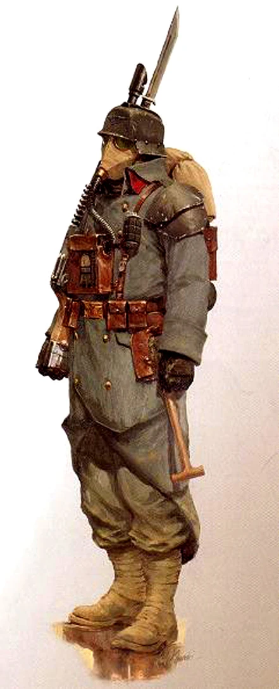

{.newpage height=8cm}

### Soldat {#soldat}

Alors que les détonations de l’artillerie martelant les tranchées se font de plus en plus pressantes, les gardes-marines poursuivent leur avancée, baïonnettes au poing, contraints à jamais d’affronter l’ennemi. Les guerriers de feu Tau déchaînent un barrage d’énergie bleue depuis leurs armes tandis qu’ils se jettent dans la mêlée contre ces étranges créatures à la peau rouge qui semblent surgir de nulle part. Les Space Marines marchent à l’unisson vers la force écrasante de milliers de Tyranides qui chargent dans leur direction.

Des Space Marines intrépides aux humbles gardes, en passant par les mercenaires, les assassins et même les guerriers tribaux rivalisant pour la suprématie face à la nature, le soldat incarne l’homme ordinaire qui se bat pour une cause.

**Création Rapide**

Vous pouvez créer rapidement un soldat en suivant ces suggestions. Tout d’abord, faites de la Force ou de la Dextérité votre modificateur de caractéristique le plus élevé, selon que vous souhaitiez vous concentrer sur le combat au corps à corps ou à distance (ou sur les armes de précision). Votre deuxième score le plus élevé devrait être la Constitution. Ensuite, choisissez le parcours « militaire ».

#### Bonus de classe

En tant que Soldat, vous bénéficiez des caractéristiques de classe suivantes :

**Points de vie**

*Dés de vie* : 1d10 par niveau de Soldat

*Points de vie au niveau 1* : 10 + votre modificateur de Constitution

*Points de vie aux niveaux supérieurs* : 1d10 (ou 6) + votre modificateur de Constitution par niveau de Soldat après le niveau 1

**Compétences de départ**

Vous maîtrisez les objets suivants, en plus des compétences fournies par votre espèce ou votre historique.

*Armures* : armure légère, armure moyenne, armure lourde, boucliers

*Armes* : armes simples, armes de guerre

*Outils* : aucun

*Jets de sauvegarde* : Force, Constitution

*Compétences* : choisissez deux compétences parmi Acrobatie, Athlétisme, Connaissances, Intimidation, Perception, Perspicacité, Pilotage et Survie.

*Équipement de départ*

Vous commencez avec les objets suivants, auxquels s’ajoutent ceux fournis par votre historique :

- (a) une armure de combat ou (b) une armure en cotte de mailles, un fusil d’assaut et deux chargeurs
- (a) une arme martiale et un bouclier ou (b) deux armes de guerre
- (a) une carabine laser et deux cellules d’énergie ou (b) deux hachettes
- (a) un paquetage d'explorateur de ruine ou (b) un paquetage d’explorateur

#### Aptitudes du Soldat

##### Style de combat

À partir du niveau 2, vous adoptez un style de combat particulier comme spécialité. Choisissez l’une des options de style de combat énumérées ci-dessous. Vous ne pouvez pas choisir une même option de style de combat plus d’une fois, même si vous avez par la suite la possibilité de faire un nouveau choix.

- *Combat à l’aveugle.* Vous disposez d’une vision aveugle d’une portée de 3 mètres pieds. À l’intérieur de cette portée, vous pouvez voir tout ce qui ne se trouve pas derrière un abri total, même si vous êtes aveuglé ou dans l’obscurité. De plus, vous pouvez voir une créature invisible se trouvant dans cette portée, à moins que celle-ci ne parvienne à se cacher de vous.
- *Défense.* Lorsque vous portez une armure, vous bénéficiez d’un bonus de +1 à votre CA.
- *Duel.* Lorsque vous maniez une arme d’une seule main et aucune autre arme, vous bénéficiez d’un bonus de +2 aux jets de dégâts avec cette arme.
- *Combat à l’arme à deux mains.* Lorsque vous obtenez un 1 ou un 2 sur un dé de dégâts lors d’une attaque effectuée avec une arme que vous maniez à deux mains, vous pouvez relancer le dé et devez utiliser le nouveau résultat, même si celui-ci est un 1 ou un 2. L’arme doit posséder la propriété « à deux mains » ou « polyvalente » pour que vous puissiez bénéficier de cet avantage.
- *Interception.* Lorsqu’une créature que vous pouvez voir touche une cible, autre que vous, située à moins de 1,5 mètre de vous avec une attaque, vous pouvez utiliser votre réaction pour réduire les dégâts subis par la cible de 1d10 + votre bonus de compétence (avec un minimum de 0 point de dégâts). Vous devez manier un bouclier ou une arme simple ou martiale pour utiliser cette réaction.
- *Combat avec des armes de jet.* Vous pouvez dégainer une arme dotée de la propriété « de jet » dans le cadre de l’attaque que vous effectuez avec cette arme. De plus, lorsque vous touchez avec une attaque à distance utilisant une arme de jet, vous bénéficiez d’un bonus de +2 au jet de dégâts.
- *Combat à deux armes.* Lorsque vous combattez à deux armes, vous pouvez ajouter votre modificateur de capacité aux dégâts de la deuxième attaque. De plus, le fait de vous trouver à moins de 1,5 mètre d’une créature hostile ne vous impose pas de désavantage lors de vos jets d’attaque à distance avec des armes à une main.
- *Combat à mains nues.* Vos coups à mains nues peuvent infliger des dégâts contondants égaux à 1d6 + votre modificateur de Force en cas de coup réussi. Si vous ne maniez aucune arme ni aucun bouclier au moment du jet d’attaque, le d6 devient un d8. Au début de chacun de vos tours, vous pouvez infliger 1d4 dégâts contondants à une créature que vous avez immobilisée.

*Les aptitudes du Soldat*{.table-title .wide}

| Niveau | Bonus de Maîtrise | Aptitudes |
| :-: | :---: | ---------------- |
| 1 | +2 | Style de combat, Second Souffle |
| 2 | +2 | Fougue (une utilisation) |
| 3 | +2 | Voie du soldat |
| 4 | +2 | Amélioration des caractéristiques |
| 5 | +3 | Attaque supplémentaire |
| 6 | +3 | Amélioration des caractéristiques |
| 7 | +3 | Amélioration de la voie du soldat |
| 8 | +3 | Amélioration des caractéristiques |
| 9 | +4 | Indomptable (une utilisation) |
| 10 | +4 | Amélioration de la voie du soldat |
| 11 | +4 | Attaque supplémentaire (2) |
| 12 | +4 | Amélioration des caractéristiques |
| 13 | +5 | Indomptable (2 utilisations) |
| 14 | +5 | Amélioration des caractéristiques |
| 15 | +5 | Amélioration de la voie du soldat |
| 16 | +5 | Amélioration des caractéristiques |
| 17 | +6 | Indomptable (3 utilisations), Fougue (2 utilisations) |
| 18 | +6 | Amélioration de la voie du soldat |
| 19 | +6 | Amélioration des caractéristiques |
| 20 | +6 | Attaque supplémentaire (3) |

##### Second Souffle

Vous disposez d’une réserve limitée d’endurance à laquelle vous pouvez puiser pour vous protéger du danger. À votre tour, vous pouvez utiliser une action bonus pour regagner un nombre de points de vie égal à 1d10 + votre niveau de soldat. Une fois que vous avez utilisé cette capacité, vous devez effectuer un repos court ou long avant de pouvoir l’utiliser à nouveau.

##### Fougue

À partir du niveau 2, vous pouvez repousser vos limites habituelles l’espace d’un instant. À votre tour, vous pouvez effectuer une action supplémentaire en plus de votre action normale et d’une éventuelle action bonus.

Une fois que vous avez utilisé cette capacité, vous devez effectuer un repos court ou long avant de pouvoir l’utiliser à nouveau. À partir du niveau 17, vous pouvez l’utiliser deux fois avant un repos, mais une seule fois par tour.

##### Voie du soldat

Au niveau 3, vous choisissez la doctrine qui façonne vos capacités en tant que soldat. L’archétype que vous choisissez vous confère des capacités au niveau 3, puis à nouveau aux niveaux 7, 10, 15 et 18.

##### Amélioration des caractéristiques

Lorsque vous atteignez le niveau 4, puis à nouveau aux niveaux 6, 8, 12, 14, 16 et 19, vous pouvez choisir parmis les modifications suivantes :

- Augmenter de 2 points une caractéristique de votre choix
- Augmenter d’un point deux caractéristiques de votre choix
- Choisir un Don

Comme d’habitude, si vous choisissez d'augmenter vos caractéristiques, vous ne pouvez pas le faire au-delà de 20 via de cette capacité.

##### Attaque supplémentaire

À partir du niveau 5, vous pouvez attaquer deux fois, au lieu d’une seule, chaque fois que vous effectuez une action d’attaque pendant votre tour.

Le nombre d’attaques passe à trois lorsque vous atteignez le niveau 11 dans cette classe, puis à quatre lorsque vous atteignez le niveau 20 dans cette classe.

##### Indomptable

À partir du niveau 9, vous pouvez relancer un jet de sauvegarde que vous avez raté. Si vous le faites, vous devez utiliser le nouveau résultat, et vous ne pouvez pas réutiliser cette capacité avant d’avoir terminé un long repos.

Vous pouvez utiliser cette capacité deux fois entre deux longs repos à partir du niveau 13, et trois fois entre deux longs repos à partir du niveau 17.

#### Les Voies du soldat

Chaque soldat suit une doctrine différente lors de son entraînement afin de s’adapter à la guerre. La doctrine militaire que vous choisissez reflète votre entraînement et les adaptations que vous avez personnellement mises en œuvre en vue de la guerre.

##### Champion

Les champions sont ceux qui défendent leur cause avec une efficacité redoutable. Des redoutables champions du Chaos à l’humble garde, ces champions apportent fureur et puissance à tous ceux aux côtés desquels ils combattent.

**Critique amélioré**

Dès que vous choisissez cet archétype au niveau 3, vos attaques à l’arme infligent un coup critique sur un jet de 19 ou 20.

**Athlète remarquable**

À partir du niveau 7, vous pouvez ajouter la moitié de votre bonus de compétence (arrondi à l’unité supérieure) à tout jet de Force, de Dextérité ou de Constitution que vous effectuez et qui n’utilise pas déjà votre bonus de compétence.

De plus, lorsque vous effectuez un saut en longueur en course, la distance que vous pouvez parcourir augmente d’un nombre de pieds égal à votre modificateur de Force.

**Style de combat supplémentaire**

Au niveau 10, vous pouvez choisir une deuxième option parmi celles proposées par la caractéristique de classe « Style de combat ».

**Critique supérieure**

À partir du niveau 15, vos attaques à l’arme infligent un coup critique sur un jet de 18 à 20.

**Survivant**

Au niveau 18, vous atteignez le summum de la résilience au combat. Au début de chacun de vos tours, vous regagnez un nombre de points de vie égal à 5 + votre modificateur de Constitution si il ne vous reste pas plus de la moitié de vos points de vie. Vous ne bénéficiez pas de cet avantage si vous avez 0 point de vie.

##### Maître de guerre

Les maîtres de bataille sont ceux qui emploient toute une gamme de manœuvres pour semer la dévastation et contrôler le champ de bataille à leur guise. Ces soldats disposent d’un outil pour chaque situation et se présentent rarement sans être préparés.

**Supériorité au combat**

Lorsque vous choisissez cet archétype au niveau 3, vous apprenez des manœuvres alimentées par des dés spéciaux appelés « dés de supériorité ».

**Manœuvres.** Vous apprenez trois manœuvres de votre choix. De nombreuses manœuvres améliorent une attaque d’une manière ou d’une autre. Vous ne pouvez utiliser qu’une seule manœuvre par attaque. Vous apprenez deux manœuvres supplémentaires de votre choix aux niveaux 7, 10 et 15. Chaque fois que vous apprenez de nouvelles manœuvres, vous pouvez également remplacer une manœuvre que vous connaissez par une autre.

**Dés de supériorité.** Vous disposez de quatre dés de supériorité, qui sont des d8. Un dé de supériorité est consommé lorsque vous l’utilisez. Vous récupérez tous vos dés de supériorité consommés à la fin d’un repos court ou long. Vous gagnez un autre dé de supériorité au niveau 7, puis un autre au niveau 15.

**Jets de sauvegarde.** Certaines de vos manœuvres exigent que votre cible effectue un jet de sauvegarde pour résister à leurs effets. La difficulté (DC) du jet de sauvegarde se calcule comme suit :

- DC de sauvegarde contre la manœuvre = 8 + votre bonus de compétence + votre modificateur de Force ou de Dextérité (au choix)

**Élève de la guerre**

Au niveau 3, vous acquérez la maîtrise d’un type d’outils d’artisan ou de gadget technologique de votre choix.

**Connaître son ennemi**
À partir du niveau 7, si vous passez au moins 1 minute à observer ou à interagir avec une autre créature en dehors d’un combat, vous pouvez obtenir certaines informations sur ses capacités par rapport aux vôtres. Le MJ vous indique si la créature est votre égale, supérieure ou inférieure en ce qui concerne deux des caractéristiques suivantes de votre choix :

- Score de Force
- Score de Dextérité
- Score de Constitution
- Classe d’armure
- Points de vie actuels
- Nombre total de niveaux de classe, le cas échéant
- Niveaux de la classe Soldat, le cas échéant

**Supériorité au combat améliorée**

Au niveau 10, vos dés de supériorité deviennent des d10. Au niveau 18, ils deviennent des d12.

**Implacable**

À partir du niveau 15, lorsque vous lancez l’initiative et qu’il ne vous reste plus aucun dé de supériorité, vous regagnez 1 dé de supériorité.

**Manœuvres du maître de bataille**

*Embuscade.* Lorsque vous effectuez un test de Dextérité (Discrétion) ou un jet d’initiative, vous pouvez dépenser un dé de supériorité et l’ajouter au jet.

*Leurre et échange.* Lorsque vous vous trouvez à moins de 1,5 mètre d’un allié pendant votre tour, vous pouvez dépenser un dé de supériorité et échanger votre place avec cet allié, à condition d’effectuer un déplacement d’au moins 1,5 mètres. Ce déplacement ne provoque pas d’attaques d’opportunité. Lancez le dé de supériorité. Jusqu’au début de votre prochain tour, l’allié bénéficie d’un bonus à sa CA égal au résultat obtenu.

*Préparation.* Lorsqu’un ennemi que vous pouvez voir se déplace à moins de 1,5 mètres de vous, vous pouvez utiliser votre réaction pour dépenser un dé de supériorité et effectuer une attaque à l’arme contre cette créature. Si l’attaque touche, ajoutez le dé de supériorité au jet de dégâts de l’attaque.

*Frappe de diversion.* Lorsque vous touchez une créature avec une attaque à l’arme, vous pouvez dépenser un dé de supériorité pour distraire la créature, offrant ainsi une ouverture à vos alliés. Vous ajoutez le dé de supériorité au jet de dégâts de l’attaque. Le prochain jet d’attaque contre la cible effectué par un attaquant autre que vous bénéficie d’un avantage si l’attaque est effectuée avant le début de votre prochain tour.

*Jeu de jambes.* Lorsque vous vous déplacez, vous pouvez dépenser un dé de supériorité : lancez le dé et ajoutez le résultat obtenu à votre CA jusqu’à ce que vous cessiez de vous déplacer.

*Attaque provocatrice.* Lorsque vous touchez une créature avec une attaque à l’arme, vous pouvez dépenser un dé de supériorité pour tenter de provoquer la cible et l’inciter à vous attaquer. Vous ajoutez le dé de supériorité au jet de dégâts de l’attaque, et la cible doit effectuer un jet de sauvegarde de Sagesse. En cas d’échec, la cible subit un désavantage sur tous ses jets d’attaque contre des cibles autres que vous jusqu’à la fin de votre prochain tour.

*Attaque de manœuvre.* Lorsque vous touchez une créature avec une attaque d’arme, vous pouvez dépenser un dé de supériorité pour manœuvrer l’un de vos compagnons vers une position plus avantageuse. Vous ajoutez le dé de supériorité au jet de dégâts de l’attaque, puis vous choisissez une créature alliée qui peut vous voir ou vous entendre. Cette créature peut utiliser sa réaction pour se déplacer jusqu’à la moitié de sa vitesse sans provoquer d’attaques d’opportunité de la part de la cible de votre attaque.

*Attaque intimidante.* Lorsque vous touchez une créature avec une attaque à l’arme, vous pouvez dépenser un dé de supériorité pour tenter d’effrayer la cible. Vous ajoutez le dé de supériorité au jet de dégâts de l’attaque, et la cible doit effectuer un jet de sauvegarde de Sagesse. En cas d’échec, elle est effrayée par vous jusqu’à la fin de votre prochain tour.

*Parade.* Lorsqu’une autre créature vous inflige des dégâts avec une attaque au corps à corps, vous pouvez utiliser votre réaction et dépenser un dé de supériorité pour réduire les dégâts du résultat obtenu sur ce dé, augmenté de votre modificateur de Dextérité.

*Attaque de précision.* Lorsque vous effectuez un jet d’attaque avec une arme contre une créature, vous pouvez dépenser un dé de supériorité pour l’ajouter au jet. Vous pouvez utiliser cette manœuvre avant ou après avoir effectué le jet d’attaque, mais avant que les effets de l’attaque ne soient appliqués.

*Attaque repoussante.* Lorsque vous touchez une créature avec une attaque d’arme, vous pouvez dépenser un dé de supériorité pour tenter de repousser la cible. Vous ajoutez le dé de supériorité au jet de dégâts de l’attaque, et si la cible est de taille grande ou inférieure, elle doit effectuer un jet de sauvegarde de Force. En cas d’échec au jet de sauvegarde, vous repoussez la cible jusqu’à 15 pieds de vous.

*Riposte.* Lorsqu’une créature rate son attaque au corps à corps contre vous, vous pouvez utiliser votre réaction et dépenser un dé de supériorité pour effectuer une attaque au corps à corps contre cette créature. Si vous touchez, vous ajoutez le dé de supériorité au jet de dégâts de l’attaque.

*Langue d’argent.* Lorsque vous effectuez un test de Tromperie ou de Persuasion, vous pouvez dépenser un dé de supériorité et ajouter ce dé au test de capacité.

*Œil avisé.* Lorsque vous effectuez un jet de Perspicacité ou d’Enquête, vous pouvez dépenser un dé de supériorité et l’ajouter au jet de capacité.
Attaque balayante. Lorsque vous touchez une créature avec une attaque au corps à corps, vous pouvez dépenser un dé de supériorité pour tenter d’infliger des dégâts à une autre créature avec la même attaque. Choisissez une autre créature située à moins de 1,5 mètre de la cible initiale et à votre portée. Si le jet d’attaque initial aurait touché la deuxième créature, celle-ci subit des dégâts égaux au résultat obtenu sur votre dé de supériorité. Les dégâts sont du même type que ceux infligés par l’attaque initiale.

*Coup technique.* Lorsque vous effectuez un jet de pilotage ou un jet technique, vous pouvez dépenser un dé de supériorité et ajouter ce dé au jet de compétence.

*Attaque de renversement.* Lorsque vous touchez une créature avec une attaque à l’arme, vous pouvez dépenser un dé de supériorité pour tenter de renverser la cible. Vous ajoutez le dé de supériorité au jet de dégâts de l’attaque, et si la cible est de taille « grande » ou inférieure, elle doit effectuer un jet de sauvegarde de Force. En cas d’échec, vous renversez la cible.
