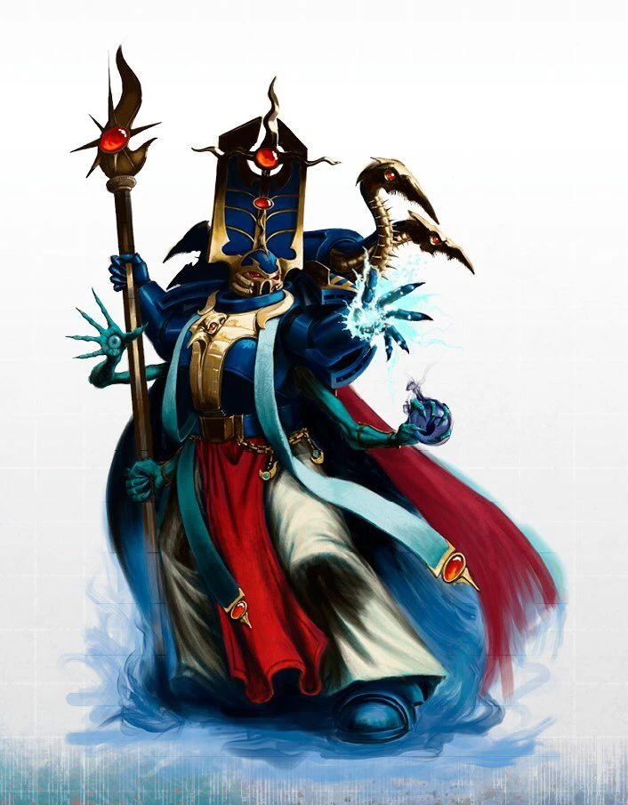

{.newpage height=8cm}

### Sorcier

L’humain corrompu lève les mains vers le ciel, invoquant une boule de feu colossale. Contemplant les gardes chétifs étendus devant lui, leurs fusils laser tremblants, il projette la boule de feu dans leur direction, ne laissant derrière lui que cendres et poussière.

Les sorciers sont des psykers, mais leurs pouvoirs issus du Warp sont amplifiés par un démon ou un autre être du Warp avec lequel ils ont conclu un pacte. Certains sorciers ont peut-être conclu des pactes avec des êtres moins malfaisants, comme de rares saints vivants, mais la grande majorité d’entre eux tirent leurs pouvoirs des démons qui veillent sur eux.

**Création Rapide**

Vous pouvez créer rapidement un sorcier en suivant ces suggestions. Tout d’abord, faites en sorte que votre score de Sagesse ou de Charisme soit le plus élevé. Votre deuxième score le plus élevé devrait être celui de Dextérité ou de Constitution. Ensuite, choisissez le passé « hérétique ».

#### Bonus de classe

En tant que Sorcier, vous bénéficiez des caractéristiques de classe suivantes :

**Points de vie**

*Dés de vie* : 1d6 par niveau de Sorcier

*Points de vie au niveau 1* : 6 + votre modificateur de Constitution

*Points de vie aux niveaux supérieurs* : 1d6 (ou 4) + votre modificateur de Constitution par niveau de Sorcier après le niveau 1

**Compétences de départ**

Vous maîtrisez les objets suivants, en plus des compétences fournies par votre espèce ou votre historique.

*Armures* : armure légère

*Armes* : armes simples

*Outils* : Aucun

*Jets de sauvegarde* : Sagesse, Charisme

*Compétences* : Choisissez deux compétences parmi les suivantes : Connaissances, Enquête, Intimidation, Nature, Occultisme, Persuasion, Représentation et Tromperie.

*Équipement de départ*

Vous commencez avec les objets suivants, auxquels s’ajoutent ceux fournis par votre historique :

- (a) une carabine laser et 2 cellules d'énergie ou (b) n'importe quelle arme simple
- (a) un sac de savant ou (b) un sac de prêtre
- une armure en mailles, n'importe quelle arme simple et deux dagues

#### Aptitudes du Sorcier

##### Lancement de sorts Psychique

Vous avez acquis la capacité de canaliser l’Immaterium pour alimenter vos pouvoirs psychiques. Reportez-vous au chapitre XX pour les règles générales relatives à l’utilisation des pouvoirs et au chapitre XX pour la liste des pouvoirs psychiques.

*Pouvoirs psychiques connus*

Vous apprenez 9 pouvoirs psychiques de votre choix, et vous en apprenez d’autres à mesure que vous progressez en niveau, comme indiqué dans la colonne « Pouvoirs psychiques connus » du tableau du Sorcier. Vous ne pouvez pas apprendre de pouvoir psychique d’un niveau supérieur à votre niveau de pouvoir maximal.

*Points de pouvoir psychique*

Vous disposez d’un nombre de points de pouvoir psychique égal à votre niveau de Sorcier multiplié par 4, comme indiqué dans la colonne « Nombre de point de pouvoir psychique » du tableau du Sorcier. Lorsque vous lancez un pouvoir, vous dépensez un nombres de point de pouvoir psychique égal à 1 + le niveau du pouvoir. Vous récupérez tous les points psioniques dépensés à la fin d’un long repos.

*Niveau de pouvoir maximal*

De nombreux pouvoirs psychiques peuvent être surpuissants, consommant davantage de points de pouvoir psychique pour produire un effet plus important. Vous pouvez rendre ces capacités surpuissantes jusqu’à un niveau maximal, qui augmente à mesure que vous progressez en niveau, comme indiqué dans la colonne « Niveau maximal du pouvoir » du tableau du Sorcier.

Vous ne pouvez lancer des pouvoirs psychiques de niveau 6, 7, 8 et 9 qu’une seule fois. Vous retrouvez la capacité de le faire après un long repos.

*Capacité de lancement psychique*

Votre capacité de lancement de pouvoirs psychiques est le score de capacité que vous utilisez pour lancer des pouvoirs psychiques. Votre capacité de lancement de pouvoirs psychiques peut être soit la Sagesse, soit le Charisme (à votre choix). Vous utilisez ce modificateur de score de capacité chaque fois qu’un pouvoir fait référence à votre capacité de lancement de pouvoirs psychiques. De plus, vous utilisez ce modificateur de score de capacité lorsque vous déterminez le DD de jet de sauvegarde d’un pouvoir psychique que vous lancez et lorsque vous effectuez un jet d’attaque avec celui-ci.

- DC de sauvegarde psychique = 8 + votre bonus de compétence + votre modificateur de lanceur de sort Psychique
- Modificateur d’attaque psychique = votre bonus de compétence + votre modificateur de lanceur de sort Psychique

*Les aptitudes du Sorcier*{.table-title .wide}

| Niveau | Bonus de Maîtrise | Aptitudes | Invocations occultes | Nombre de pouvoir psychique connu | Nombre de point de pouvoir psychique | Niveau maximal des pouvoir psychique |
| :-: | :---: | ---------------- | :----: | :----: | :----: | :----: |
| 1 | +2 | Lanceur de sort psychique, Pacte avec le Warp | -- | 9 | 4 | 1 |
| 2 | +2 | Invocations occultes | 2 | 11 | 8 | 1 |
| 3 | +2 | Familier | 2 | 13 | 12 | 2 |
| 4 | +2 | Amélioration des caractéristiques | 2 | 15 | 16 | 2 |
| 5 | +3 | -- | 3 | 17 | 20 | 3 |
| 6 | +3 | Amélioration du pacte | 3 | 19 | 24 | 3 |
| 7 | +3 | -- | 4 | 21 | 28 | 4 |
| 8 | +3 | Amélioration des caractéristiques | 4 | 23 | 32 | 4 |
| 9 | +4 | -- | 5 | 25 | 36 | 5 |
| 10 | +4 | Amélioration du pacte | 5 | 26 | 40 | 5 |
| 11 | +4 | -- | 5 | 28 | 44 | 6 |
| 12 | +4 | Amélioration des caractéristiques | 6 | 29 | 48 | 6 |
| 13 | +5 | -- | 6 | 31 | 52 | 7 |
| 14 | +5 | Amélioration du pacte | 6 | 32 | 56 | 7 |
| 15 | +5 | -- | 7 | 34 | 60 | 8 |
| 16 | +5 | Amélioration des caractéristiques | 7 | 35 | 64 | 7 |
| 17 | +6 | -- | 7 | 37 | 68 | 7 |
| 18 | +6 | Invocation du Warp | 8 | 38 | 72 | 8 |
| 19 | +6 | Amélioration des caractéristiques | 8 | 39 | 76 | 8 |
| 20 | +6 | Maître du Warp | 8 | 40 | 80 | 8 |

##### Pacte avec le Warp

Au niveau 1, vous avez conclu un pacte avec une entité du Warp de votre choix, telle que le Changeur des Voies ou le Grand Immonde. Bien que ces protecteurs soient le plus souvent des démons, votre patron peut également être un puissant Primarque-Démon, un démon mineur d’une influence considérable, un saint vivant, ou même un autre sorcier aux pouvoirs incommensurables.

Le choix de votre patron vous confère des aptitudes au niveau 1, puis de nouveau aux niveaux 6, 10 et 14.

##### Invocations occultes

Au cours de vos études sur les sciences occultes, vous avez mis au jour des invocations surnaturelles, des fragments de savoir interdit qui vous confèrent une capacité surnaturelle durable.

Au niveau 2, vous gagnez deux invocations surnaturelles de votre choix. Les options d’invocation sont détaillées à la fin de la description de la classe. Lorsque vous atteignez certains niveaux de sorcier, vous gagnez des invocations supplémentaires de votre choix.

De plus, lorsque vous gagnez un niveau dans cette classe, vous pouvez choisir l’une des invocations que vous connaissez et la remplacer par une autre invocation que vous pourriez apprendre à ce niveau. Le prérequis de niveau pour une invocation fait référence au niveau de sorcier, et non au niveau du personnage.

##### Familier

Au niveau 3, votre protecteur d’un autre monde vous accorde un familiar loyal à votre service. Vous apprenez le pouvoir psychique « Invoquer un familiar ». Ce pouvoir n’est pas comptabilisé dans le nombre de pouvoirs que vous connaissez.
Lorsque vous lancez ce pouvoir, vous pouvez choisir l’une des formes normales pour votre familier ou utiliser la forme spéciale suivante, détaillée dans la fiche de caractéristiques du familier du pacte. C’est vous qui choisissez l’apparence de cette créature. Par exemple, un sorcier du Grand Impur pourrait faire prendre à son familier la forme d’un nurgling, tandis qu’un sorcier du Changeur des Chemins pourrait avoir pour familier une horreur bleue.

#### Familier

*Démon de taille Petite, tout alignement*

**Classe d'armure** 11 + votre bonus de maîtrise

**Points de vie** 10 + votre niveau de sorcier

**Vitesse** 9 m, vol 18 m

FOR    | DEX    | CON    | INT    | SAG    | CHA
:---:  | :---:  | :---:  | :---:  | :---:  | :---:
6 (-1)| 17 (+3)| 12 (+1)| 12 (+1)| 12 (+1)| 14 (+2)

**Compétences** :  Perception +1 + Bonus de Maîtrise, Discrétion +3 + (Bonus de Maîtrise x 2)

**Résistances aux dégâts** : au froid ; aux dégâts d’énergie et cinétiques infligés par des attaques non améliorées et non bénies.

**Immunités aux dégâts** : au feu, au poison

**Immunités aux états** : épuisement, empoissonnement

**Sens** : vision dans le noir 36 m., Perception passive 11 + Bonus de Maîtrise

**Langues** : parle les langues de son invocateur

**Bonus de compétence** : égal à votre bonus

##### Traits

**Métamorphe** : le familier peut utiliser son action pour se métamorphoser en une bête ressemblant à un rat (vitesse 18 m.), un corbeau (18m., vol 36m.) ou une araignée (18m., escalade 18m.), ou pour reprendre sa forme véritable. Ses caractéristiques sont identiques sous chaque forme, à l’exception des changements de vitesse indiqués. L’équipement qu’il porte ou transporte n’est pas transformé. Il reprend sa forme véritable s’il meurt.

**Vision impie.** L’obscurité renforcée n’entrave pas la vision dans le noir du familier.

**Résistance psychique.** Le familier bénéficie d’un avantage aux jets de sauvegarde de Sagesse et de Charisme contre les pouvoirs psychiques.

**Connaissance du pacte.** Tant que le familier se trouve sur le même plan d’existence que son maître, ce dernier bénéficie d’un avantage aux tests de Sagesse (Occulte).

##### Actions

**Morsure.** Attaque à l’arme de mêlée : votre bonus d’attaque psychique pour toucher, portée de 5 pieds, une cible. Touché : 1d6+3+votre modificateur de lanceur de sort psychique de dégâts cinétiques.

**Invisibilité.** Le familier devient psychiquement invisible jusqu’à ce qu’il attaque ou que sa concentration prenne fin (comme s’il se concentrait sur un pouvoir). Tout équipement que le familier porte ou transporte avec lui est invisible.

##### Amélioration des caractéristiques

Lorsque vous atteignez le niveau 4, puis à nouveau aux niveaux 8, 12, 16 et 19, vous pouvez choisir parmis les modifications suivantes :

- Augmenter de 2 points une caractéristique de votre choix
- Augmenter d’un point deux caractéristiques de votre choix
- Choisir un Don

Comme d’habitude, si vous choisissez d'augmenter vos caractéristiques, vous ne pouvez pas le faire au-delà de 20 via de cette capacité.

##### Invocation du Warp

À partir du niveau 18, vous pouvez lancer le sort « Invocation d’un démon » sans avoir besoin de vous concentrer et sans dépenser de points de pouvoir psychique. Une fois que vous avez utilisé cette capacité, vous ne pouvez pas l’utiliser à nouveau avant d’avoir effectué un long repos.

De plus, si le résultat de votre jet de Sagesse (Occulte) est inférieur à votre score de capacité de lanceur de sort psychique, vous pouvez utiliser ce score à la place du résultat du jet.

##### Maître du Warp

Au niveau 20, lorsque vous lancez un pouvoir psychique de niveau 5 ou inférieur, vous pouvez choisir d’infliger le maximum de dégâts avec ce pouvoir, au lieu de lancer un dé.

Une fois que vous avez utilisé cette fonctionnalité, vous ne pourrez plus y avoir recours tant que vous n'aurez pas effectué un long repos.

#### Pacte avec le Warp

Les pactes avec le Warp sont la source de votre pouvoir. Vous avez reçu une part de la puissance d’une entité extrêmement puissante, et ce pouvoir se répand désormais en vous, tel une corruption latente. Vous gagnez des aptitudes liées à votre pacte avec le Warp, qui vous permettent de manifester vos pouvoirs de manière unique.

##### Le Changeur des Voies

Le Changeur des Voies, le plus souvent associé à Tzeentch, est une entité dotée d’une puissante influence psychique, qui accorde ses bienfaits sous forme de fragments de savoir interdit et de puissance psychique.

**Le Grimoire interdit**

Dès le niveau 1, lorsque vous choisissez ce protecteur, vous recevez un grimoire de connaissances interdites, dont vous déterminez l’apparence lorsque vous l’invoquez. Vous pouvez accomplir un rituel de dix minutes pour invoquer ce grimoire si vous le perdez, et toute personne autre que vous qui tenterait de le lire n’y trouverait qu’un charabia incompréhensible. Ce grimoire se transforme en cendres lorsque vous mourez. Tant que ce grimoire se trouve sur vous, vous pouvez ajouter votre modificateur d’Intelligence à vos tests d’Occultisme.

De plus, vous pouvez utiliser ce grimoire pour renforcer vos pouvoirs psychiques tant qu’il se trouve sur vous. Lorsque vous lancez un pouvoir psychique, vous pouvez choisir de le renforcer afin de le lancer à un niveau supérieur à celui auquel vous l’avez initialement lancé, et cela peut dépasser le niveau maximal auquel vous pouvez lancer ce pouvoir. L’utilisation de cette capacité ne vous oblige pas à dépenser des points de pouvoir psychique pour augmenter le niveau de puissance du sort. Vous pouvez utiliser cette capacité un nombre de fois égal à votre bonus de maîtrise, et vous récupérez tous les usages dépensés à la fin d’un long repos.

**Esprit éveillé**

Au niveau 1, vous avez acquis la capacité de communiquer par télépathie avec d’autres créatures. En tant qu’action bonus, vous pouvez établir un lien télépathique avec n’importe quelle créature que vous pouvez voir à moins de 9 mètres de vous. Tant que ce lien est établi, vous et la créature choisie pouvez communiquer par télépathie grâce à ce lien. Il n’est pas nécessaire que vous et la créature choisie compreniez la même langue pour communiquer, mais vous devez tous deux parler au moins une langue pour pouvoir échanger.

Ce lien télépathique dure jusqu’à ce que vous y mettiez fin prématurément (aucune action requise) et peut s’étendre jusqu’à une portée de 1,5 km. Le lien prend fin prématurément si vous établissez une connexion avec une autre créature ou si vous ne vous trouvez plus sur le même plan d’existence que l’autre créature.
Esprit protégé

Au niveau 6, vos pensées ne peuvent être lues par télépathie ou par tout autre moyen, sauf si vous l’autorisez. Vous bénéficiez également d’une résistance aux dégâts psioniques et d’un avantage aux jets de sauvegarde contre les effets de charme ou d’effroi.

**Réécrire le destin**

À partir du niveau 10, vous disposez de la capacité de réécrire le destin. Lorsqu’un test de capacité, un jet de sauvegarde ou un jet d’attaque est effectué à moins de 18 mètres de vous, vous pouvez choisir d’obliger la créature à relancer le résultat (aucune action requise), et vous pouvez choisir le résultat qu’elle retient.

Une fois que vous avez utilisé cette capacité, vous ne pouvez pas l’utiliser à nouveau avant d’avoir effectué un repos court ou long.

**Labyrinthe de cristal**

À partir du niveau 14, lorsque vous touchez une créature avec une attaque, vous pouvez utiliser cette capacité pour transporter instantanément la cible à travers le labyrinthe de cristal sans fin situé dans le royaume de Tzeentch. La créature disparaît et est précipitée dans un labyrinthe cauchemardesque pendant ce qui semble être des années.

À la fin de votre prochain tour, la cible revient à la case qu’elle occupait auparavant, ou à la case inoccupée la plus proche. Si la cible n’est pas un démon de Tzeentch, elle subit 10d10 points de dégâts psioniques, encore sous le choc de cette expérience horrifiante.

Une fois que vous avez utilisé cette capacité, vous ne pouvez pas l’utiliser à nouveau avant d’avoir terminé un long repos.

##### Le Grand Immonde

Le Grand Immonde de Nurgle confère à son protégé une capacité surnaturelle à survivre à des blessures presque mortelles, ainsi que des pouvoirs liés à la maladie et à la corruption.

**L’Étreinte du Grand-Père**

Dès le niveau 1, lorsque vous choisissez ce patron, vous bénéficiez de l’étreinte du père de la peste. Vous disposez d’une résistance aux dégâts de poison, vous bénéficiez d’un avantage aux jets de sauvegarde contre l’empoisonnement et vous êtes immunisé contre toutes les maladies. Vous cessez de vieillir et paraissez toujours être dans la fleur de l’âge.

De plus, votre maximum de points de vie augmente de 1 et augmente encore de 1 chaque fois que vous gagnez un niveau dans cette classe.

**Absorber la vitalité**

Toujours au niveau 1, lorsqu’une créature située à moins de 30 pieds de vous meurt, vous pouvez utiliser votre réaction pour gagner des points de vie temporaires égaux à votre niveau de sorcier + votre modificateur de lanceur de sort psychique (avec un minimum de 1).

**Défier la mort**

À partir du niveau 6, lorsque vous obtenez un résultat de 16 ou plus lors d’un jet de sauvegarde contre la mort, celui-ci est considéré comme si vous aviez obtenu un 20 sur le d20.

De plus, lorsque vous réussissez un jet de sauvegarde contre la mort, vous pouvez choisir de regagner un nombre de points de vie égal à votre niveau de sorcier + votre modificateur de lanceur de sort psychique. Une fois que vous avez regagné des points de vie grâce à cette capacité, vous ne pouvez pas les regagner à nouveau tant que vous n’avez pas effectué un long repos.

**Peau toxique**
À partir du niveau 10, votre sang suinte de toxines. Lorsque vous subissez des dégâts suite à une attaque au corps à corps, l’attaquant subit des dégâts d’acide égaux à votre modificateur de lanceur de sort psychique.

**Rempart indestructible**

À partir du niveau 14, vous pouvez choisir un type de dégâts à la fin d’un repos court ou long. Vous gagnez une résistance à ce type de dégâts jusqu’à ce que vous en choisissiez un autre avec cette capacité.

#### Invocations occultes

**Armure des Ombres**

Vous pouvez lancer le sort « Armure psychique » sur vous-même à volonté, sans dépenser de points de pouvoir psychique.

**Pas ascendant**

*Prérequis* : niveau 9

Vous pouvez lancer le sort « Lévitation » sur vous-même à volonté, sans dépenser de points de pouvoir psychique.

**Aspect de la Lune**

Vous n’avez plus besoin de dormir et ne pouvez être contraint de dormir par aucun moyen. Pour bénéficier des avantages d’un long repos, vous pouvez consacrer les 8 heures à une activité légère.

**Influence envoûtante**

Vous gagnez la maîtrise de deux des compétences suivantes : Tromperie, Intimidation, Représentation et Persuasion.

**Manteau de mouches**

*Prérequis* : niveau 5

En tant qu’action bonus, vous pouvez vous entourer d’une aura psychique qui ressemble à un essaim de mouches bourdonnantes. L’aura s’étend à 1,5 mètres de vous dans toutes les directions, mais ne traverse pas les couvertures totales. Elle dure jusqu’à ce que vous soyez mis hors de combat ou que vous la dissipiez en tant qu’action bonus.

L’aura vous confère un avantage aux jets d’Intimidation, mais un désavantage à tous les autres jets de Charisme. Toute autre créature qui commence son tour dans l’aura subit des dégâts de poison égaux à votre modificateur de Charisme (minimum de 0 point de dégâts).

Une fois que vous avez utilisé cette invocation, vous ne pouvez pas l’utiliser à nouveau avant d’avoir terminé un repos court ou long.

**Divulgation d’impureté**

Vous gagnez une résistance aux dégâts radiants.

**Vision surnaturelle**
Vous pouvez lancer « Détection de distorsion » à volonté, sans dépenser de points de pouvoir psychique.

**Les yeux du gardien des runes**

Vous pouvez lire tous les écrits.

**Vigueur démoniaque**

Vous pouvez lancer « Fausse vie » sur vous-même à volonté en tant que pouvoir de niveau 1, sans dépenser de points de pouvoir psychique.

**Regard à deux esprits**

Vous pouvez utiliser votre action pour toucher un humanoïde consentant et percevoir à travers ses sens jusqu’à la fin de votre prochain tour. Tant que la créature se trouve sur le même plan d’existence que vous, vous pouvez utiliser votre action lors des tours suivants pour maintenir cette connexion, prolongeant ainsi la durée jusqu’à la fin de votre prochain tour. Tant que vous percevez à travers les sens de l’autre créature, vous bénéficiez de tous les sens spéciaux que possède cette dernière, et vous êtes aveuglé et assourdi vis-à-vis de votre propre environnement.

**Regard fantomatique**

*Prérequis* : niveau 7

En tant qu’action, vous acquérez la capacité de voir à travers les objets solides jusqu’à une portée de 30 pieds. À l’intérieur de cette portée, vous disposez de la vision dans le noir si vous ne l’avez pas déjà. Cette vision spéciale dure 1 minute ou jusqu’à ce que votre concentration prenne fin (comme si vous vous concentriez sur un pouvoir). Pendant ce temps, vous percevez les objets sous forme d’images fantomatiques et transparentes.

Une fois que vous avez utilisé cette invocation, vous ne pouvez pas l’utiliser à nouveau avant d’avoir effectué un repos court ou long.

**Dons des profondeurs**

Vous pouvez respirer sous l’eau et vous gagnez une vitesse de nage égale à votre vitesse de marche.

Vous pouvez également lancer le sort « Respiration aquatique » à volonté, sans dépenser de points de pouvoir psychique.

**Don des Éternels**

*Prérequis* : niveau 3

Chaque fois que vous regagnez des points de vie alors que votre familier se trouve à moins de 30 mètres de vous, considérez que tous les dés lancés pour déterminer les points de vie que vous regagnez ont affiché leur valeur maximale.

**Masque aux multiples visages**

Vous pouvez lancer « Masque du trompeur » à volonté, sans dépenser de points de pouvoir psychique.

**Maître des formes innombrables**

*Prérequis* : niveau 15

Vous pouvez lancer « Altération de soi » à volonté, sans dépenser de points de pouvoir psychique.

**Visions brumeuses**

Vous pouvez lancer « Image silencieuse » à volonté, sans dépenser de points de pouvoir psychique.

**Ne faire qu’un avec les ombres**

*Prérequis* : niveau 5

Lorsque vous vous trouvez dans une zone de pénombre ou d’obscurité, vous pouvez utiliser votre action pour devenir invisible jusqu’à ce que vous vous déplaciez ou que vous effectuiez une action ou une réaction.

**Voile d’ombre**

*Prérequis* : niveau 15

Vous pouvez lancer « Invisibilité » à volonté, sans dépenser de pouvoir psychique.

**Tombe d’Ahriman**

*Prérequis* : niveau 5

En réaction lorsque vous subissez des dégâts, vous pouvez vous ensevelir dans le sable, qui se disperse à la fin de votre prochain tour. Vous gagnez 10 points de vie temporaires par niveau de sorcier, qui absorbent autant de dégâts déclencheurs que possible. Immédiatement après avoir subi les dégâts, votre vitesse est réduite à 0 et vous êtes hors de combat. Ces effets, y compris les points de vie temporaires restants, prennent fin lorsque le sable se disperse.

Une fois que vous avez utilisé cette invocation, vous ne pouvez pas l’utiliser à nouveau avant d’avoir terminé un repos court ou long.

**Vision impie**

Vous pouvez voir normalement dans l’obscurité, même si celle-ci est provoquée artificiellement, jusqu’à une distance de 36 mètres.

**Visions de royaumes lointains**

*Prérequis* : niveau 15

Vous pouvez lancer « Œil arcanique » à volonté, sans dépenser de points de pouvoir psychique.

**Voix du maître de la chaîne**

*Prérequis* : niveau 3

Vous pouvez communiquer par télépathie avec votre familier et percevoir à travers ses sens tant que vous vous trouvez sur le même plan d’existence.

De plus, lorsque vous percevez à travers les sens de votre familier, vous pouvez également parler par son intermédiaire avec votre propre voix, même si votre familier est normalement incapable de parler.

**Vision du Changeur de voies**

*Prérequis* : niveau 15

Vous pouvez voir la véritable forme de tout métamorphe ou de toute créature dissimulée par des effets ou des pouvoirs d’illusion ou de transmutation, tant que la créature se trouve à moins de 9 mètres de vous et dans votre champ de vision.

**Murmures de la tombe**

*Prérequis* : niveau 9

Vous pouvez lancer « Parler aux morts » à volonté, sans dépenser de points de pouvoir psychique.
