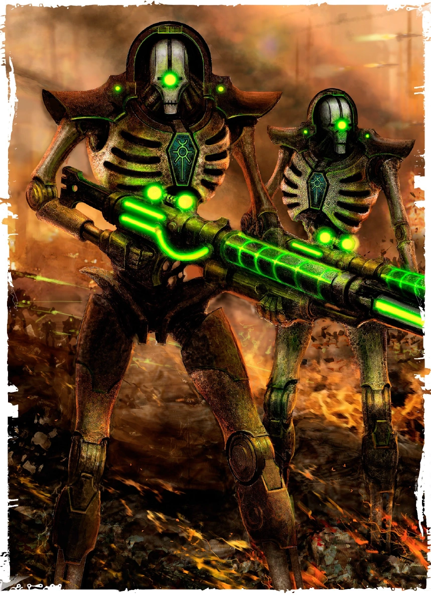

{.newpage height=8cm}

### Traqueur

Épuisé mais déterminé, un humain arpente les ruelles de la cité-ruche, à la poursuite de la proie qu’il sait être à l’origine des meurtres commis dans le bloc d’habitation. Un pistolet serré à deux mains, il s’engouffre dans la ruelle grouillant de mutants et de membres de gangs. Pivotant sur lui-même, il se transforme en un véritable ouragan de balles, terrassant ses ennemis les uns après les autres.

Après avoir été projetée par l’explosion d’un obus, une mutante retrouve son équilibre, juste à temps pour tirer deux coups de carabine sur la horde de tyranides qui s’approche. Ignorant les vagues de peur qui osent bouleverser le tumulte de son esprit, elle se raffermit, lance une salve de grenades qu’elle avait préparées et regarde les insectes géants se transformer en carcasses carbonisées.

Jetant un coup d’œil à sa tablette de données, un Technofusionné observe à travers les yeux de son crâne servo, suivant les mouvements d’une ombre parmi les toits. Il se prépare à tirer avec son fusil de précision, ses poumons artificiels ne faisant pas le moindre bruit tandis qu’il vise.

Les Traqueurs sont les premiers sur les lieux du crime, et les derniers à voir leur cible. Quels que soient le terrain, la distance ou les obstacles, un Traqueur est parfaitement adapté à la traque et à la chasse, utilisant ses pouvoirs technologiques et son armement pour mener à bien ses missions.

**Création Rapide**

Vous pouvez créer rapidement un personnage de type « Traqueur » en suivant ces conseils. Tout d’abord, faites en sorte que votre modificateur de caractéristique le plus élevé soit la Force ou la Dextérité, selon que vous souhaitiez vous concentrer sur le combat au corps à corps ou sur les armes à distance (ou les armes de finesse). Votre deuxième score le plus élevé devrait être celui de l’Intelligence. Ensuite, choisissez l'historique « mercenaire ».

#### Bonus de classe

En tant que Traqueur, vous bénéficiez des caractéristiques de classe suivantes :

**Points de vie**

*Dés de vie* : 1d10 par niveau de Traqueur

*Points de vie au niveau 1* : 10 + votre modificateur de Constitution

*Points de vie aux niveaux supérieurs* : 1d10 (ou 6) + votre modificateur de Constitution par niveau de Traqueur après le niveau 1

**Compétences de départ**

Vous maîtrisez les objets suivants, en plus des compétences fournies par votre espèce ou votre historique.

*Armures* : armure légère, armure moyenne et boucliers

*Armes* : armes simples, armes de guerre

*Outils* : aucun

*Jets de sauvegarde* : Force, Dextérité

*Compétences* : choisissez-en trois parmi Acrobatie, Athlétisme, Connaissances, Discrétion, Intuition, Investigation, Nature, Occultisme, Perception, Pilotage, Survie et Technologie.

*Équipement de départ*

Vous commencez avec les objets suivants, auxquels s’ajoutent ceux fournis par votre historique :

- (a) une armure de soldat ou (b) une armure en cotte de mailles
- (a) deux épées courtes ou (b) une arme de mêlée martiale et un bouclier
- (a) un fusil d’assaut et deux chargeurs ou (b) un fusil laser et deux piles
- Un sac d’explorateur et deux poignards

#### Aptitudes du Traqueur

##### Formation de Traqueur

À partir du niveau 1, vous êtes difficile à cerner au combat. Vous pouvez vous déplacer jusqu’à la moitié de votre vitesse en réaction lorsqu’un ennemi termine son tour à moins de 1,5 mètres de vous. Ce déplacement ne provoque pas d’attaques d’opportunité.

De plus, choisissez l’une des compétences dans lesquelles vous êtes compétent. Vous pouvez ajouter le double de votre bonus de compétence aux jets effectués avec cette compétence.

##### Verrouillage de cible

Au niveau 1, votre technologie unique vous permet de suivre vos ennemis et de porter des coups avec une précision redoutable. En tant qu’action bonus, vous pouvez activer votre verrouillage de cible et bénéficier des avantages suivants :

- Vos attaques à l’arme infligent 1d6 points de dégâts supplémentaires du même type que votre arme.
- Vous bénéficiez d’un avantage aux jets de Perception visant à détecter des créatures.
- Vos attaques ignorent la couverture partielle et les trois quarts de couverture.

Votre « verrouillage de cible » dure 1 minute. Il prend fin prématurément si vous êtes mis hors de combat, ou si vous y mettez fin prématurément en tant qu’action bonus.

Vous pouvez utiliser cette capacité deux fois, et vous pouvez l’utiliser plus souvent à des niveaux supérieurs, comme indiqué dans la colonne « Utilisations du verrouillage de cible » du tableau du Traqueur. Vous récupérez toutes les utilisations dépensées lorsque vous terminez un long repos.

Au niveau 9, ces dégâts passent à 1d8, et vous pouvez voir les créatures invisibles situées à moins de 9 mètres de vous tant que cette capacité est activée. Au niveau 17, les dégâts passent à 1d10, et vous pouvez voir à travers les illusions, les métamorphes et dans l’immaterium jusqu’à une portée de 9 mètres tant que cette capacité est activée.

*Les aptitudes du Traqueur*{.table-title .wide}

| Niveau | Bonus de Maîtrise | Aptitudes | Cible de verrouillage | Nombre de pouvoir technologiques connu | Nombre de point de lanceur de sort | Niveau maximal des pouvoir tech |
| :-: | :---: | ---------------- | :----: | :----: | :----: | :----: |
| 1 | +2 | Entraînement de Traqueur, Verrouillage de cible | 2 | -- | -- | -- |
| 2 | +2 | Style de combat, Lancement de sorts technologiques | 2 | 7 | 4 | 1 |
| 3 | +2 | Technique de Traqueur | 2 | 9 | 6 | 1 |
| 4 | +2 | Amélioration des caractéristiques | 2 | 10 | 8 | 1 |
| 5 | +3 | Attaque supplémentaire | 3 | 12 | 10 | 2 |
| 6 | +3 | Déplacement du vagabond | 3 | 13 | 12 | 2 |
| 7 | +3 | Amélioration de la Technique de Traqueur | 3 | 14 | 14 | 2 |
| 8 | +3 | Amélioration des caractéristiques | 3 | 15 | 16 | 2 |
| 9 | +4 | Amélioration du verrouillage de cible | 4 | 17 | 18 | 3 |
| 10 | +4 | Poursuite inlassable | 4 | 18 | 20 | 3 |
| 11 | +4 | Amélioration de la Technique de Traqueur | 4 | 19 | 22 | 3 |
| 12 | +4 | Amélioration des caractéristiques | 4 | 20 | 24 | 3 |
| 13 | +5 | -- | 5 | 22 | 26 | 4 |
| 14 | +5 | Cape de combat | 5 | 23 | 28 | 4 |
| 15 | +5 | Amélioration de la Technique de Traqueur | 5 | 24 | 30 | 4 |
| 16 | +5 | Amélioration des caractéristiques | 5 | 25 | 32 | 4 |
| 17 | +6 | Amélioration du verrouillage de cible | 6 | 27 | 28 | 5 |
| 18 | +6 | Verrouillage parfait | 6 | 28 | 36 | 5 |
| 19 | +6 | Amélioration des caractéristiques | 6 | 29 | 38 | 5 |
| 20 | +6 | Maître Traqueur | 6 | 30 | 40 | 5 |

##### Style de combat

À partir du niveau 2, vous adoptez un style de combat particulier comme spécialité. Choisissez l’une des options de style de combat énumérées ci-dessous. Vous ne pouvez pas choisir une même option de style de combat plus d’une fois, même si vous avez par la suite la possibilité de faire un nouveau choix.

- *Combat à l’aveugle.* Vous disposez d’une vision aveugle d’une portée de 3 mètres pieds. À l’intérieur de cette portée, vous pouvez voir tout ce qui ne se trouve pas derrière un abri total, même si vous êtes aveuglé ou dans l’obscurité. De plus, vous pouvez voir une créature invisible se trouvant dans cette portée, à moins que celle-ci ne parvienne à se cacher de vous.
- *Défense.* Lorsque vous portez une armure, vous bénéficiez d’un bonus de +1 à votre CA.
- *Duel.* Lorsque vous maniez une arme d’une seule main et aucune autre arme, vous bénéficiez d’un bonus de +2 aux jets de dégâts avec cette arme.
- *Combat à l’arme à deux mains.* Lorsque vous obtenez un 1 ou un 2 sur un dé de dégâts lors d’une attaque effectuée avec une arme que vous maniez à deux mains, vous pouvez relancer le dé et devez utiliser le nouveau résultat, même si celui-ci est un 1 ou un 2. L’arme doit posséder la propriété « à deux mains » ou « polyvalente » pour que vous puissiez bénéficier de cet avantage.
- *Interception.* Lorsqu’une créature que vous pouvez voir touche une cible, autre que vous, située à moins de 1,5 mètre de vous avec une attaque, vous pouvez utiliser votre réaction pour réduire les dégâts subis par la cible de 1d10 + votre bonus de compétence (avec un minimum de 0 point de dégâts). Vous devez manier un bouclier ou une arme simple ou martiale pour utiliser cette réaction.
- *Combat avec des armes de jet.* Vous pouvez dégainer une arme dotée de la propriété « de jet » dans le cadre de l’attaque que vous effectuez avec cette arme. De plus, lorsque vous touchez avec une attaque à distance utilisant une arme de jet, vous bénéficiez d’un bonus de +2 au jet de dégâts.
- *Combat à deux armes.* Lorsque vous combattez à deux armes, vous pouvez ajouter votre modificateur de capacité aux dégâts de la deuxième attaque. De plus, le fait de vous trouver à moins de 1,5 mètre d’une créature hostile ne vous impose pas de désavantage lors de vos jets d’attaque à distance avec des armes à une main.
- *Combat à mains nues.* Vos coups à mains nues peuvent infliger des dégâts contondants égaux à 1d6 + votre modificateur de Force en cas de coup réussi. Si vous ne maniez aucune arme ni aucun bouclier au moment du jet d’attaque, le d6 devient un d8. Au début de chacun de vos tours, vous pouvez infliger 1d4 dégâts contondants à une créature que vous avez immobilisée.

##### Lancement de sorts technologiques

Lorsque vous atteignez le niveau 2, vous avez appris à utiliser la technologie pour lancer des pouvoirs technologiques, à l’instar d’un savant.

*Pouvoirs technologiques connus*

Vous apprenez 7 pouvoirs technologiques de votre choix, puis d’autres à mesure que vous progressez en niveau, comme indiqué dans la colonne « Pouvoirs technologiques connus » du tableau du Traqueur. Vous ne pouvez pas apprendre de pouvoir technologique d’un niveau supérieur à votre niveau de pouvoir maximal.

*Points de pouvoir technologiques*

Vous disposez d’un nombre de points technologiques égal à votre niveau de Traqueur multiplié par 2, comme indiqué dans la colonne « Points technologiques » du tableau du Traqueur. Lorsque vous lancez un pouvoir, vous dépensez un nombre de points technologiques égal à 1 + le niveau du pouvoir. Vous récupérez tous les points technologiques dépensés à la fin d’un long repos.

*Niveau de pouvoir maximal*

De nombreux pouvoirs technologiques peuvent être surpuissants, consommant davantage de points technologiques pour produire un effet plus important. Vous pouvez rendre ces capacités surpuissantes jusqu’à un niveau maximal, qui augmente à mesure que vous progressez en niveau, comme indiqué dans la colonne « Niveau de pouvoir maximal » du tableau du Traqueur.

Vous ne pouvez lancer les pouvoirs technologiques de niveaux 6, 7, 8 et 9 qu’une seule fois. Vous retrouvez la capacité de le faire après un long repos.

*Capacité de lancement technologique*

Votre capacité de lancement de pouvoirs technologiques est le score de capacité que vous utilisez pour lancer des pouvoirs technologiques. Votre capacité de lancement de pouvoirs technologiques est l’Intelligence. Vous utilisez ce modificateur de score de capacité chaque fois qu’un pouvoir fait référence à votre capacité de lancement de pouvoirs technologiques. De plus, vous utilisez ce modificateur de score de capacité lorsque vous déterminez la difficulté (DC) du jet de sauvegarde pour un pouvoir technologique que vous lancez et lorsque vous effectuez un jet d’attaque avec celui-ci.

- Jet de sauvegarde technique DC = 8 + votre bonus de maîtrise + votre modificateur de lancement technique
- Modificateur d'attaque technique = votre bonus de maîtrise + votre modificateur de lancement technique

##### Technique de Traqueur

Au niveau 3 également, vous choisissez de vous spécialiser dans une technique de Traqueur spécifique, décrite en détail à la fin de la description de la classe. Ce choix vous confère des avantages au niveau 3, puis aux niveaux 7, 11 et 15.

##### Amélioration des caractéristiques

Lorsque vous atteignez le niveau 4, puis à nouveau aux niveaux 8, 12, 16 et 19, vous pouvez choisir parmis les modifications suivantes :

- Augmenter de 2 points une caractéristique de votre choix
- Augmenter d’un point deux caractéristiques de votre choix
- Choisir un Don

Comme d’habitude, si vous choisissez d'augmenter vos caractéristiques, vous ne pouvez pas le faire au-delà de 20 via de cette capacité.

##### Attaque supplémentaire

À partir du niveau 5, vous pouvez attaquer deux fois au lieu d’une seule chaque fois que vous effectuez l’action « Attaque » pendant votre tour.

##### Déplacement du vagabond

Au niveau 6, votre vitesse de marche augmente de 10, et vous gagnez une vitesse d’escalade et une vitesse de nage égales à votre vitesse de marche.

##### Poursuite inlassable

Au niveau 10, lorsque vous activez votre verrouillage de cible, vous gagnez également un nombre de points de vie temporaires égal à votre niveau de cavalier.

De plus, lorsque vous effectuez un jet de Survie, si le résultat obtenu sur le d20 est inférieur à votre niveau de cavalier, vous pouvez considérer que ce jet est égal à votre niveau de cavalier. Par exemple, si un Traqueur de niveau 13 obtient un résultat de 12 ou moins lors d’un jet de Survie, il peut considérer ce jet comme un 13, puis y ajouter d’éventuels modificateurs supplémentaires.

##### Cape de combat

Au niveau 14, vous pouvez choisir de devenir invisible lorsque vous activez le verrouillage de cible. Cette invisibilité dure jusqu’à la fin de votre verrouillage de cible. Une fois que vous avez utilisé cette capacité, vous ne pouvez pas l’utiliser à nouveau avant d’avoir effectué un repos court ou long.

##### Verrouillage parfait

Au niveau 18, le dé de dégâts de votre « verrouillage de cible » inflige le maximum de dégâts, au lieu de lancer le dé pour déterminer le montant des dégâts.

##### Maître-Traqueur

Au niveau 20, vous devenez un chasseur hors pair. Une fois par tour, vous pouvez ajouter votre modificateur d’Intelligence au jet d’attaque et au jet de dégâts d’une attaque que vous effectuez.

#### Les techniques de Traqueur

##### La Technique du chasseur

La technique du chasseur est utilisée par les Traqueurs qui souhaitent connaître les faiblesses de leur proie, tout en étant capables de se défendre contre ses attaques ou d’éliminer rapidement ses serviteurs.

**Intuition du chasseur**

Lorsque vous choisissez cette technique au niveau 3, si vous attaquez et infligez des dégâts à une créature alors que votre verrouillage de cible est actif, vous pouvez découvrir si cette créature possède des immunités, des résistances ou des vulnérabilités aux dégâts, et vous en connaissez la nature.

**Identification précise des faiblesses**

Toujours à partir du niveau 3, si une créature alliée se trouve à moins de 1,5 mètre d’une créature hostile et n’est pas hors de combat, vous bénéficiez d’un avantage lors du premier jet d’attaque que vous effectuez à votre tour contre cette créature hostile.

**Défense réflexive**

À partir du niveau 7, lorsque vous êtes touché par une attaque ou que vous échouez à un jet de sauvegarde, mais avant que les effets ne se produisent, vous pouvez utiliser votre réaction pour obtenir un bonus à votre CA ou à votre jet de sauvegarde égal à votre bonus de compétence, ce qui peut faire rater l’attaque ou réussir le jet de sauvegarde.

**Fendre la vague**

À partir du niveau 11, vous avez appris à fendre la vague d’ennemis qui s’opposent à vous. Vous pouvez utiliser votre action pour effectuer des attaques de mêlée contre un nombre illimité de créatures situées à moins de 1,5 mètre de vous, avec un jet d’attaque distinct pour chaque cible.

Vous pouvez également utiliser votre action pour effectuer une attaque à distance contre un nombre illimité de créatures se trouvant dans un carré de 3 mètres situé dans la portée de votre arme. Vous devez effectuer un jet d’attaque distinct pour chaque cible.

**Évasion**

Au niveau 15, lorsque vous êtes soumis à un effet, tel que la « tempête de glace » d’un psyker ou la « boule de feu » d’un savant, qui vous permet d’effectuer un jet de sauvegarde de Dextérité pour ne subir que la moitié des dégâts, vous ne subissez aucun dégât si vous réussissez votre jet de sauvegarde, et seulement la moitié des dégâts si vous échouez.

##### Technique de l'ombre

La technique de l'ombre repose sur la discrétion et l’exploitation des faiblesses de sa proie, jusqu’à ce qu’il trouve enfin le moment opportun pour l’abattre.

**Améliorations d’embuscade**

Au niveau 3, vous pouvez effectuer l’action « Se cacher » dans le cadre de l’action bonus que vous utilisez pour activer votre verrouillage de cible. Tant que le verrouillage de cible est actif, vous pouvez effectuer l’action « Se cacher » en tant qu’action bonus à chacun de vos tours.

**Frappe de précision**

À partir du niveau 3 également, lorsque vous infligez des dégâts à une créature avec une attaque à l’arme, vous pouvez effectuer une frappe de précision contre la cible. La créature subit l’un des effets suivants :

- Jusqu’au début de votre prochain tour, la vitesse de déplacement de la créature est de 0.
- Vous pouvez faire en sorte que le prochain jet d’attaque effectué par la créature dans la minute qui suit soit désavantagé.
- Vous pouvez faire en sorte que la créature soit désavantagée lors de son prochain jet de sauvegarde de Force, de Dextérité ou de Constitution effectué dans la minute qui suit.

Vous disposez d’un nombre de frappes de précision égal au double de votre bonus de compétence, et vous récupérez tous vos usages à la fin d’un long repos.

**Bond rapide**

Au niveau 7, tant que votre verrouillage de cible est activé, vous pouvez effectuer l’action « Bondir » en tant qu’action bonus lors de votre tour. Si vous effectuez une course de cette manière, vous ne provoquez pas d’attaques d’opportunité jusqu’au début de votre prochain tour.

**Prédire l’assaut**

Au niveau 11, lorsque vous êtes attaqué, vous pouvez lancer le dé de dégâts de votre verrouillage de cible et réduire le jet d’attaque de ce montant. Vous pouvez utiliser cette capacité une fois par tour.

**Ciblage critique**

Au niveau 15, tant que votre « ciblage » est actif, vos attaques à l'arme infligent des coups critiques si vous obtenez un résultat de 19 ou 20 au jet.
