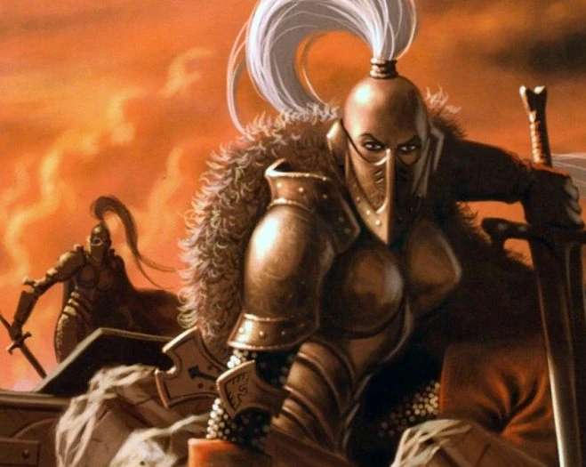

{.newpage}

### Blank {#blank}

Les « Blanks » sont des humains sans âme nés avec un pouvoir unique qui les rend résistants aux pouvoirs du Warp. Parfois appelés « parias », « nuls » ou « intouchables », ces humains possèdent le rare « gène du paria », dont la fréquence est estimée à un sur un milliard d’humains. Les personnes qui côtoient des « Blanks » ressentent une présence inquiétante émanant d’eux. De ce fait, de nombreux Blanks sont rejetés par leur société, ou meurent en bas âge après avoir été exilés.

De par leur simple existence, les Blanks constituent un véritable anathème pour le Warp, les psykers et les démons. Ainsi, dès qu’ils sont découverts, ils sont très recherchés par les inquisiteurs, la Garde Impériale ou d’autres factions militaires qui combattent les forces du Chaos ou les psykers.

Au sein de l’Imperium, certains « parias » découverts tôt sont endoctrinés pour devenir des assassins du Temple, les Culexus, où leurs capacités anti-psychiques sont affinées à l’extrême. Il existe sur Terra une petite enclave connue sous le nom des Sœurs du Silence qui accueille des « parias » féminines dans ses rangs pour lutter contre les menaces qui surgissent autour de Terra.

#### Traits des blanks

**Augmentation des caractéristiques.** Votre caractéristique de Sagesse augmente de 2, et deux autres caractéristiques de votre choix augmentent de 1.

**Âge.** Les humains atteignent l’âge adulte à la fin de l’adolescence et vivent moins d’un siècle.

**Alignement.** Les humains n’ont généralement pas d’alignement particulier. On trouve parmi eux aussi bien les meilleurs que les pires.

**Taille.** La taille et la corpulence des humains varient considérablement, allant d’à peine 1,5 mètre pieds à bien plus de 1,8 mètre. Quelle que soit votre position dans cette fourchette, votre taille est moyenne.

**Vitesse.** Votre vitesse de marche de base est de 9 mètres.

**Sans âme.** Votre état « sans âme » vous rend invisible aux pouvoirs du Warp. Vous êtes à l’abri des pouvoirs psychiques et des effets qui déterminent votre emplacement, tels que la zone divine. Vous ne pouvez pas être vu par divination psychique. Vous ne pouvez pas être possédé. Vous êtes immunisé contre les pouvoirs et effets psychiques qui permettraient de lire vos pensées ou vos émotions, tels que « Détection des pensées ».

**Anathème psychique.** Vous bénéficiez d’un avantage aux jets de sauvegarde contre les pouvoirs psychiques.

**Résistance aux warp.** Vous disposez d’une résistance aux dégâts causés par les pouvoirs et effets psychiques, ainsi qu’aux dégâts psychiques.
Lorsque vous subissez les effets d’un pouvoir ou d’un effet psychique, vous pouvez utiliser ce trait pour devenir immunisé contre tous les effets de ce pouvoir ou de cet effet. Vous pouvez utiliser ce trait un nombre de fois égal à votre bonus de compétence, et vous récupérez tous les usages dépensés à la fin d’un long repos.

**Intolérance au warp.** Vous êtes incapable de manifester des pouvoirs psychiques. Vous ne pouvez pas gagner de niveaux dans une classe dotée de la capacité « lanceur de sort psychique ».

**Langues.** Vous pouvez parler, lire et écrire le bas gothique ainsi qu’une autre langue de votre choix.
