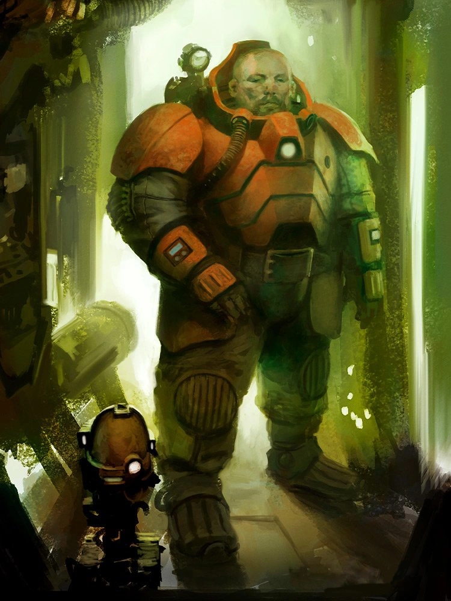

{.newpage height=8cm}

#### Cognat

Les Cognats sont des abhumains de petite taille et à la carrure trapue. Les Cognats se désignent eux-mêmes sous le nom de « Kin », et leur faction principale est connue sous le nom de « Ligues de Votann ».
Ces abhumains trapus sont réputés pour leur loyauté farouche, accordant plus d’importance à l’honneur et à leur héritage qu’à leur propre vie. Les Votann sont des superordinateurs qui clonent les Kin ; à leur mort, le fait d’être renvoyés vers ces machines est considéré comme un retour auprès de leurs ancêtres.
Certain Cognats se destines à l'exploration où le commerce avec les autres espèces, dans l'espoir de revenir un jour chez eux pour transmettre leur savoir. Il arrive que certains soit banni des leurs et s'installe auprès des autres peuples de la galaxie.

##### Traits des Cognats

Votre personnage Cognat dispose d’un ensemble de capacités innées, qui font partie intégrante de la nature des Cognats.

**Augmentation des caractéristiques.** Votre score de Constitution augmente de 2, et votre score de Force augmente de 1.

**Âge.**  Les Cognats mûrissent au même rythme que les humains, mais ils sont considérés comme jeunes jusqu’à l’âge de 50 ans. En moyenne, ils vivent environ 350 ans.

**Alignement.** La plupart des Cognats sont loyaux, croyant fermement aux bienfaits d’une société bien ordonnée. Ils ont également tendance à être bons, avec un sens aigu de l’équité et la conviction que chacun mérite de profiter des bienfaits d’un ordre juste.

**Taille.** Les Cognats mesurent entre 1,2 mètre et 1,5 mètre et pèsent en moyenne environ 75 kilogrammes. Votre taille est « Moyenne ».

**Vitesse.** Votre vitesse de marche de base est de 9 mètres. Le port d’une armure lourde ne réduit pas votre vitesse.

**Vision dans le noir.** Habitué à la vie souterraine, vous disposez d’une vision supérieure dans l’obscurité et la pénombre. Vous pouvez voir dans la pénombre jusqu’à 18 mètres autour de vous comme s’il s’agissait d’une lumière vive, et dans l’obscurité comme s’il s’agissait d’une pénombre. Vous ne pouvez pas distinguer les couleurs dans l’obscurité, seulement des nuances de gris.

**Résistance au poison.** Vous bénéficiez d’un avantage aux jets de sauvegarde contre le poison, et vous êtes résistant aux dégâts de poison.

**Entraînement au combat des Cognats.** Vous maîtrisez les armures légères, ainsi que la hache de combat, la hache à main, le marteau léger et le marteau de guerre.

**Maîtrise des outils.** Vous maîtrisez l’ensemble d’outils ou de gadgets technologiques de votre choix : outils de forgeron, matériel de brasseur, trousse de mécanicien ou outils de maçon.

**Maîtrise des armes.** Chaque fois que vous effectuez un jet d’Intelligence lié à l’origine d’une armure, d’une arme ou d’un équipement militaire, vous êtes considéré comme compétent dans cette compétence et pouvez ajouter le double de votre bonus de compétence au jet, au lieu de votre bonus de compétence normal.

**Langues.** Vous parlez, lisez et écrivez le Kin/Votann et une langue de votre choix.

