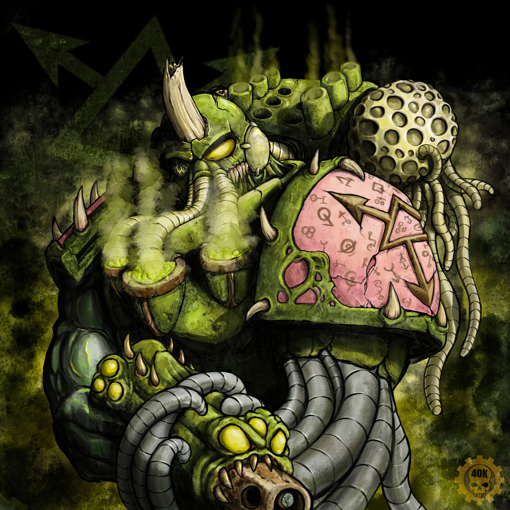

{.newpage}

### Corrompus

Les Corrompus sont le fruit du contact impie avec le Chaos lui-même. Beaucoup d’entre eux ont choisi délibérément d’être touchés par le Chaos, savourant leurs nouveaux pouvoirs. Cependant, la corruption peut également résulter d’une exposition prolongée au Warp, voire d’une union impie entre démons, créatures du Warp, hérétiques ou autres.

Les Corrompus sont issus de la lignée de n’importe quelle espèce et, au sens le plus large du terme, en conservent l’apparence. Cependant, leur héritage impie a laissé une empreinte évidente sur leur apparence. Beaucoup de Corrompus possèdent de grandes cornes, une queue, des dents pointues, des pupilles fendues, une peau décolorée et d’autres anomalies. Il n’est pas rare que les Corrompus soient tués à la naissance ou meurent très jeunes — que ce soit par une exécution miséricordieuse ou en tant que sacrifice à une puissance supérieure.

Les Corrompus subsistent en petites minorités aux marges de la civilisation. Sur les mondes féodaux et sauvages, ils peuvent être considérés comme un mauvais présage, mais on les laisse vivre en paix, de crainte que leur mort n’attire une malédiction sur la tribu qui les a mis au monde. D’autres Corrompus peuvent être repérés par un inquisiteur radical ou une bande de guerriers du Chaos, qui utilisent leurs pouvoirs à des fins précises plutôt que de les rejeter de la société.

#### Traits des Corrompus

**Augmentation des caractéristiques.** Votre score de Charisme augmente de 2.

**Âge.**   Les Corrompus peuvent généralement vivre bien plus longtemps que leur espèce d’origine, mais leur vie s’achève souvent bien avant d’atteindre cette durée.

**Alignement.** Les Corrompus n’ont peut-être pas une tendance innée vers le mal, mais beaucoup d’entre eux finissent par basculer de ce côté-là. Qu’ils soient mauvais ou non, leur nature indépendante pousse de nombreux Corrompus vers un alignement chaotique.

**Taille.** Les Corrompus ont à peu près la même taille et la même carrure que leur espèce d’origine. Votre taille est moyenne.

**Vitesse.** Votre vitesse de marche de base est de 9 mètres.

**Vision dans le noir.** Grâce à votre nature impie, vous disposez d’une vision supérieure dans l’obscurité et dans des conditions de faible luminosité. Vous pouvez voir dans une lumière tamisée jusqu’à 60 pieds autour de vous comme s’il s’agissait d’une lumière vive, et dans l’obscurité comme s’il s’agissait d’une lumière tamisée. Vous ne pouvez pas distinguer les couleurs dans l’obscurité, seulement des nuances de gris.

**Langues.** Vous parlez, lisez et écrivez le chaotique et le bas gothique.

**Marqué par le chaos.** Vous êtes marqué par le chaos, ce qui vous confère des effets uniques en fonction du dieu qui domine la corruption dans votre sang. Choisissez l’une des allégeances suivantes qui déterminent votre corruption et obtenez ses traits, énumérés ci-dessous.

#### Marqué par Khorne

Vous avez été corrompu par le dieu de la haine, du meurtre, du sang et de la guerre. Une haine éternelle envers les psykers habite votre être même.

**Augmentation des caractéristiques.** Votre score de Force augmente de 1.

**Prouesse martiale.** Vous possédez des griffes, des cornes ou d’autres mutations vous facilitant le combat à mains nues. Vos attaques à mains nues avec ces armes naturelles infligent 1d6 + votre modificateur de Force de dégâts cinétiques.

**Résistance psychique.** Vous bénéficiez d’un avantage aux jets de sauvegarde de Sagesse et de Charisme contre les pouvoirs psychiques.

#### Marqué par Nurgle

Vous avez été corrompu par le dieu de la gloutonnerie, de la maladie, de la peste et de la stagnation.

**Augmentation des caractéristiques.** Votre score de Constitution augmente de 1.

**Résistance au poison.** Vous disposez d’une résistance aux dégâts de poison et bénéficiez d’un avantage aux jets de sauvegarde pour résister à l’empoisonnement.

**Robustesse surnaturelle.** Votre maximum de points de vie augmente de 1, puis de 1 à chaque fois que vous gagnez un niveau.

#### Marqué par par Slaanesh

Vous avez été corrompu par le dieu du plaisir et de l'excès.

**Augmentation des caractéristiques.** Votre score de Dextérité augmente de 1.

**Résistance psychique.** Vous bénéficiez d'une résistance aux dégâts psychiques.

**Vitesse accrue.** Votre vitesse de marche augmente de 1,5 mètres

#### Marqué par par Tzeentch

Votre corps a été influencé par le dieu du mensonge, de la tromperie et de la trahison, ce qui vous confère les effets suivants :

**Augmentation des caractéristiques.** Votre score d’Intelligence augmente de 1.

**Esprit protégé.** Vous bénéficiez d’un avantage aux jets de sauvegarde pour résister aux effets de charme et à la lecture de vos pensées.

**Téléporté par le Warp.** En tant qu’action bonus, vous pouvez vous téléporter psychiquement jusqu’à 9 mètres vers un espace inoccupé que vous pouvez voir. Une fois que vous avez utilisé ce trait, vous ne pouvez pas le réutiliser avant d’avoir terminé un repos court ou long.

#### Marqué par le chaos indivisible

Vous avez été souillé par les pouvoirs infinis du Warp et des êtres qui y résident.

**Augmentation des caractéristiques.** Votre score de Sagesse augmente de 1.

**Résistance au feu.** Vous bénéficiez d’une résistance aux dégâts de feu.

**Bénédiction de la ruine.** Vous connaissez le sortilège « invoquer un phénomène ». Lorsque vous atteignez le niveau 3, vous pouvez lancer le pouvoir « réprimande infernale » comme un pouvoir de niveau 2 une seule fois grâce à ce trait et retrouver la capacité de le faire après avoir effectué un long repos. Lorsque vous atteignez le niveau 5, vous pouvez lancer le pouvoir « Ténèbres » une fois grâce à ce trait et retrouver la capacité de le faire à la fin d’un long repos. La Sagesse ou le Charisme (à votre choix) est votre capacité de lanceur de sort pour ces pouvoirs, qui sont pour vous des pouvoirs psychiques.
