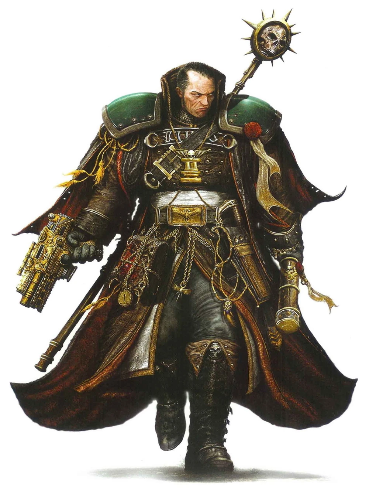

{.newpage height=8cm}

### Humains

Au cœur de l’Imperium de l’Humanité, sur la Sainte Terra, le Dieu-Empereur de l’Humanité trône sur le Trône d’Or, et ce depuis 10 000 ans. Le commun des mortels ignore ce qui se passe sur Terra et ce que fait réellement le Dieu-Empereur de l’Humanité, mais tout adepte du Credo Impérial sait que le Dieu-Empereur se contente de diriger l’ensemble de Ses vastes planètes et de Ses armées d’une main de fer depuis le Trône d’Or de Terra.

Les humains au sein de l’Imperium peuvent être très différents les uns des autres, depuis les habitants des mondes sauvages qui n’ont vu des Impériaux que lorsque ceux-ci viennent prélever leurs dîmes militaires dans les villages, jusqu’aux nobles des mondes-ruches, ces villes tentaculaires qui s’empilent les unes sur les autres pour former de puissantes flèches pouvant atteindre les nuages.

La majorité des humains de la galaxie réside au sein de l’Imperium ou à ses frontières. De ce fait, même si l’on n’est pas né dans l’espace impérial, la plupart des humains connaissent l’Imperium : ce qu’il représente, le Credo Impérial qui vénère le Dieu-Empereur, et son immense emprise qui s’étend sur des millions de planètes et d’innombrables trillions d’individus.

**Le Chaos.** Depuis l’Hérésie d’Horus et la Longue Guerre, les humains ont été attirés par les pouvoirs du Chaos, que ce soit par la soumission de leurs planètes ou parce qu’ils préfèrent se libérer de la main de fer de l’Imperium. Les humains qui combattent sous la bannière du Chaos sont souvent placés sous le commandement d’une bande de guerriers, d’un apôtre des ténèbres ou d’un apostat. Bien que les forces du Chaos soient capables de former des sociétés fonctionnelles et certaines formes de civilisation, c’est rarement le cas, car leur vocation innée envers les Puissances de la Ruine les pousse à partir vers de plus grands horizons, en quête de gloire ou de pouvoir.

**Les Tau.** Sous l’Empire Tau, les humains peuvent mener une vie sereine au sein d’une caste appelée « gue’vesa ». Dans ce système, ils sont traités à l’instar de citoyens de seconde zone, mais ne subissent pas nécessairement d’injustice. De nombreux humains sont envoyés à bord de flottes de propagande afin de rallier d’autres humains à leur cause.

#### Traits des humains

Il est difficile de généraliser à propos des humains, mais votre personnage humain présente les traits suivants.

**Âge.** Les humains atteignent l’âge adulte à la fin de l’adolescence et vivent moins d’un siècle.

**Alignement.** Les humains n’ont généralement pas d’alignement particulier. On trouve parmi eux aussi bien les meilleurs que les pires.

**Taille.** La taille et la corpulence des humains varient considérablement, allant d’à peine 1,5 mètre à bien plus de 1,80 mètre. Quelle que soit votre position dans cette fourchette, votre taille est moyenne.

**Vitesse.** Votre vitesse de marche de base est de 9 mètres.

**Monde d’origine.** Chaque humain possède un monde d’origine qui détermine les traits supplémentaires dont il bénéficie. Choisissez l’un des mondes d’origine répertoriés ci-dessous.

#### Humain d'un monde mort

Les mondes de la Mort au sein de l’Imperium sont des lieux hostiles et désolés, souvent pour diverses raisons. Sur certains, des monstres terrifiants rôdent et considèrent les humains comme des proies. Sur d’autres, l’hostilité même de l’environnement empêche les humains de survivre sans recourir à des mesures extrêmes.

**Augmentation des caractéristiques.** Votre caractéristique de Constitution augmente de 2, et votre caractéristique de Force augmente de 1.

**Vie adaptée.** Votre monde était soumis à une menace constante à laquelle vous avez été contraint de vous adapter pour survivre. Choisissez l’une des principales menaces auxquelles vous vous êtes adapté lorsque vous sélectionnez ce monde d’origine :

- *Flore hostile.* La végétation elle-même constituait un obstacle quotidien. Vous ignorez les pénalités liées au terrain difficile non amélioré. Vous bénéficiez d’un avantage aux jets de sauvegarde contre le poison, et vous disposez d’une résistance aux dégâts de poison.
- *Bêtes carnivores.* Les bêtes se nourrissant de viande vous considéraient comme une proie. Votre vitesse de marche augmente de 1,5 mètre, et les traces que vous et jusqu’à 9 compagnons laissez derrière vous lorsque vous marchez sont indéchiffrables et ne peuvent être suivies par des moyens non améliorés.
- *Climat extrême.* L’activité volcanique, les éruptions solaires, les températures négatives, voire pire, vous menaçaient au quotidien. Choisissez l’une des résistances aux dégâts suivantes en fonction de votre monde d’origine : acide, froid, feu ou foudre. Vous êtes naturellement adapté au climat de votre planète.
Dans les griffes de la mort. Vous bénéficiez d’un avantage aux jets de sauvegarde contre l’effroi. Lorsque vous êtes effrayé, vous pouvez tout de même vous déplacer vers la cible de votre peur.

**Survivant.** Vous maîtrisez la compétence Survie. De plus, vous ne subissez aucune pénalité lorsque vous tentez de vivre dans un environnement similaire à celui de votre monde d’origine.

**Langues.** Vous pouvez parler, lire et écrire le bas gothique et le tribal.

#### Humain d'un monde sauvage

Les mondes sauvages sont souvent des mondes indomptés et sauvages qui se trouvent néanmoins à l’intérieur des frontières de l’Imperium. Ces mondes sont le plus souvent exploités pour leurs ressources naturelles ou pour la robustesse de leurs habitants.

**Augmentation des caractéristiques.** Votre caractéristique de Constitution augmente de 2, et votre caractéristique de Force augmente de 1.

**Corpulence puissante.** Vous êtes considéré comme étant d’une taille supérieure lors du calcul de votre capacité de charge et du poids que vous pouvez pousser, traîner ou soulever.

**Instincts primaires.** Vous maîtrisez deux des compétences suivantes : Athlétisme, Intimidation, Perception et Survie.
Robustesse surnaturelle. Votre maximum de points de vie augmente de 1, puis de 1 à chaque fois que vous gagnez un niveau.

**Langues.** Vous pouvez parler, lire et écrire le bas gothique et le tribal.

#### Humain d'un monde féodal

Alors que de nombreux mondes de l’Imperium bénéficient d’un certain niveau de technologie, les mondes féodaux restent cantonnés à un niveau technologique rudimentaire, à peine supérieur à celui d’un mousquet standard. Ces mondes adoptent souvent des systèmes féodaux, où des rois et des monarques règnent sur leurs royaumes.

**Augmentation des caractéristiques.** Votre caractéristique de Force augmente de 2, et votre caractéristique de Constitution augmente de 1.

**Connaissances féodales.** Vous maîtrisez l’une des compétences suivantes de votre choix : Athlétisme, Nature, Connaissances ou Survie. Lorsque vous effectuez un jet avec cette compétence, vous pouvez choisir de le faire avec avantage. Vous pouvez utiliser ce trait un nombre de fois égal à votre bonus de maîtrise, et vous récupérez tous les usages dépensés à la fin d’un long repos.

**Entraînement au monde féodal.** Vous maîtrisez les armures légères, les armures moyennes, les boucliers et les épées longues.

**Endurance implacable.** Lorsque vous êtes réduit à 0 point de vie mais que vous n’êtes pas tué sur le coup, vous pouvez descendre à 1 point de vie à la place. Une fois que vous avez utilisé ce trait, vous ne pouvez pas le réutiliser avant d’avoir terminé un long repos.

**Attaques sauvages.** Lorsque vous réussissez un coup critique avec une attaque au corps à corps, vous pouvez relancer l’un des dés de dégâts de l’arme une fois supplémentaire et ajouter ce résultat aux dégâts supplémentaires du coup critique.

**Langues.** Vous pouvez parler, lire et écrire le tribal et le bas gothique .

#### Humain d'un monde forge

Les mondes-forges sont d'immenses planètes industrielles entièrement dévouées au Adeptus Mechanicus. Leurs cités-usines produisent sans relâche armes, véhicules, vaisseaux et machines destinés à soutenir l'Imperium. Les habitants y grandissent au milieu des chaînes de production, des fumées toxiques et des prières adressées à l'Omnimessie, où le travail, la discipline et la dévotion à la machine rythment chaque instant de leur existence.

**Augmentation des caractéristiques.** Votre score d’Intelligence augmente de 2 et votre score de Constitution augmente de 1.

**Résistance technologique.** Vous bénéficiez d’un avantage aux jets de sauvegarde de Dextérité et d’Intelligence contre les pouvoirs technologiques.

**Talent technique.** Choisissez un gadget technologique de votre choix. Vous maîtrisez ce gadget technologique et, lorsque vous effectuez un test en utilisant ce gadget, vous pouvez lancer 1d4 et ajouter le résultat au total.

**Élu de l’Omnissiah.** Vous connaissez le pouvoir technologique « Désactiver un dispositif », et au niveau 3, vous apprenez le pouvoir technologique « Piratage avancé ». Vous pouvez lancer chacun de ces pouvoirs une fois, et vous retrouvez la capacité de le faire à la fin d’un long repos. L’Intelligence est votre caractéristique de lancement de pouvoirs technologiques pour ces pouvoirs.

**Langues.** Vous pouvez parler, lire et écrire le binaire et le bas gothique.

#### Humain d'un monde forteresse

Les mondes consacrés à la formation de la prochaine génération de soldats de l’Imperium sont appelés « mondes-forteresses ». Ces planètes versent leur tribut à l’Imperium presque exclusivement sous forme de soldats qu’elles forment, souvent dès l’enfance, afin qu’ils rejoignent l’Astra Militarum lorsqu’ils atteignent l’âge requis.

**Augmentation des caractéristiques.** Votre caractéristique de Dextérité augmente de 2, et votre caractéristique de Constitution augmente de 1.

**Né pour tirer.** Lorsque vous réussissez un coup critique avec une attaque à distance, vous pouvez relancer une fois l’un des dés de dégâts de l’arme et ajouter ce résultat aux dégâts supplémentaires du coup critique.

**Se mettre à couvert.** Il ne vous faut que 1,5 mètres de déplacement pour vous relever après vous être couché.
Entraînement sur un monde-forteresse. Vous maîtrisez les fusils laser, les pistolets laser, les pistolets, les carabines et les armures légères.

**Retraite tactique.** À votre tour, vous pouvez effectuer l’action « Désengagement » en tant qu’action bonus.

**Langues.** Vous pouvez parler, lire et écrire le bas gothique et les codes impériaux.

#### Humain d'un monde ruche

Votre monde d'origine était un monde-ruche, abritant des milliards d'êtres humains vivant dans des villes tentaculaires, dont les tours semblaient effleurer le ciel. Ces villes offrent l'un des niveaux de vie les plus élevés dans les plus hautes flèches de la ruche, et l'une des conditions de vie les plus précaires dans les bidonvilles des ruche inférieures.

**Augmentation des caractéristiques.** Votre score de Dextérité augmente de 2, et votre score de Charisme augmente de 1.
Compétences propres au monde-ruche. Vous maîtrisez un jeu de jeu de votre choix, ainsi que le pistolet laser, le pistolet, le pistolet laser court et le pistolet court.

**Habitant de la ruche.** Vous ignorez le terrain difficile causé par les foules.

**Camouflage urbain.** Vous bénéficiez d’un avantage lors des jets de Discrétion effectués pour vous cacher dans des environnements urbains, tels que les villes, les ruelles, les égouts, les foules et à l’intérieur des bâtiments.

**Langues.** Vous pouvez parler, lire et écrire le bas gothique  et le langage des bas-fonds.

#### Humain d'un monde impérial

Votre monde d’origine faisait partie des millions de mondes unis sous la bannière impériale. La plupart des mondes impériaux entrent dans cette catégorie, qui est la plus vaste parmi celles que l’on trouve au sein de l’Imperium. Ces mondes disposent généralement d’un niveau technologique stable permettant d’améliorer la vie des civils, notamment grâce à l’électricité et à l’automobile.

**Augmentation des caractéristiques.** Chacune de vos caractéristiques augmente de 1.

**Maîtrise de compétences.** Vous maîtrisez deux compétences, outils, instruments de musique ou gadgets technologiques de votre choix.

**Langues.** Vous pouvez parler, lire et écrire le bas gothique  ainsi que deux autres langues de votre choix.

#### Humain d'un monde sanctuaire

Les mondes sanctuaires comptent parmi les plus pieux et les plus sacrés de l’Imperium. Généralement situés le long des routes de pèlerinage, ces mondes sanctuaires abritent souvent des reliques sacrées, des statues ou les lieux de sépulture de saints tombés au service du Dieu-Empereur.

**Augmentation des caractéristiques.** Votre caractéristique de Sagesse augmente de 2 et votre caractéristique de Charisme augmente de 1.

**Bénédiction de l’Empereur.** Lorsque vous, ou une créature alliée située à moins de 9 mètres de vous et que vous pouvez voir, échouez à un jet d’attaque, à un test de capacité ou à un jet de sauvegarde, vous pouvez lancer un d4 et ajouter son résultat au résultat obtenu. Vous pouvez utiliser cette capacité un nombre de fois égal à votre bonus de compétence, et vous récupérez tous les usages dépensés à la fin d’un long repos.

**Esprit résilient.** Vous bénéficiez d’un avantage aux jets de sauvegarde pour résister aux effets de l’envoûtement et de la peur.
Langues. Vous pouvez parler, lire et écrire le bas gothique et le haut gothique.

#### Humain d'un monde en guerre

Les mondes en guerre sont ceux qui sont en conflit depuis si longtemps que leur raison d’être initiale a été perdue. Ces mondes sont constamment ravagés par la guerre, qui s’étend parfois sur des décennies, voire des siècles, et ceux qui y naissent voient souvent le jour sur les lignes de front.

**Augmentation des caractéristiques.** Deux caractéristiques différentes de votre choix augmentent de 1.

**Compétences.** Vous gagnez la maîtrise d’une compétence de votre choix.

**Talent.** Vous gagnez un talent de votre choix.

**Langues.** Vous pouvez parler, lire et écrire le bas gothique et une langue supplémentaire de votre choix.
