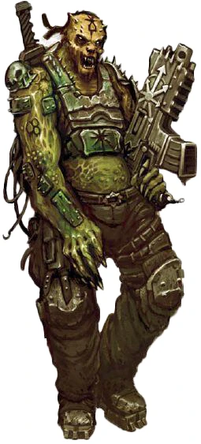

{.newpage height=8cm}

### Mutant

Les véritables mutants sont mis au ban de l’Imperium, pour le meilleur ou pour le pire. Les mutants présentent des anomalies génétiques dues à leur héritage ou à une exposition au Warp, et les mutants avancés sont souvent abattus à vue au sein de l’Imperium. La plupart des mutants présentant des mutations mineures, telles qu’une oreille ou un doigt supplémentaire, parviennent à vivre relativement en paix, ou ont recours à la chirurgie pour corriger leurs anomalies. Cependant, si la chirurgie n’est pas accessible, ou si l’influence de l’Église est omniprésente, les mutants sont contraints de vivre dans la clandestinité ou en marge de la société.

Bien que les mutants soient le plus souvent des humains, n’importe quelle espèce peut devenir mutante en cas d’exposition suffisante au Warp, y compris les espèces principalement composées de métal et de machines.

#### Traits des mutants

**Augmentation des caractéristiques.** Votre Constitution augmente de 2, et une autre caractéristique de votre choix augmente de 1.

**Âge.** En raison de leur nature mutante, les mutants peuvent vivre jusqu’à plusieurs centaines d’années de plus que les humains ordinaires, mais meurent souvent avant d’atteindre cet âge à la suite d’actes de violence.

**Alignement.** De nombreux mutants s’alignent sur les facettes les plus chaotiques de la société, car ils sont rejetés en raison de leur nature.

**Taille.** La taille des mutants peut varier considérablement, allant d’un nain de 1,20 mètre à un géant de 2 mètres. Leur poids peut varier de 50 à 150 kilogrammes. Votre taille est Moyenne.

**Vitesse.** Votre vitesse de marche est de 9 mètres.

**Vision dans le noir.** Vous pouvez voir dans la pénombre jusqu’à 18 mètres autour de vous comme s’il s’agissait d’une lumière vive, et dans l’obscurité comme s’il s’agissait d’une pénombre. Vous ne pouvez pas distinguer les couleurs dans l’obscurité, seulement des nuances de gris.

**Amélioration mutante.** Votre corps a été modifié pour intégrer certaines caractéristiques. Vous choisissez une amélioration dès maintenant et une seconde au niveau 5. Au niveau 1, choisissez parmi les options suivantes :

*Planeur de manta.* Vos ailes peuvent ralentir votre chute et vous permettre de planer. Lorsque vous tombez et que vous n’êtes pas hors de combat, vous pouvez soustraire jusqu’à 30 mètres de la hauteur de chute lors du calcul des dégâts de chute, et vous pouvez vous déplacer horizontalement jusqu’à 2 mètres pour chaque mètre de descente.

*Grimpeur agile.* Vous disposez d’une vitesse d’escalade égale à votre vitesse de marche.

*Adaptation sous-marine.* Vous pouvez respirer aussi bien dans l’air que dans l’eau, et votre vitesse de nage est égale à votre vitesse de marche.

Au niveau 5, choisissez l’une des options suivantes, ou l’une des options que vous n’avez pas choisies au niveau 1 :

*Appendices de préhension.* Deux appendices spéciaux poussent le long de vos bras. Choisissez s’il s’agit de deux griffes ou de deux tentacules. Chacun de ces appendices est une arme naturelle que vous pouvez utiliser pour effectuer des attaques à mains nues. Si vous touchez votre cible, celle-ci subit des dégâts cinétiques égaux à 1d6 + votre modificateur de Force, au lieu des dégâts cinétiques normaux pour une attaque à mains nues. Immédiatement après avoir touché votre cible, vous pouvez tenter de la maîtriser en tant qu’action bonus. Ces appendices ne peuvent manipuler aucun objet avec précision et ne peuvent pas manier d’armes, d’objets améliorés ou d’autres équipements spécialisés.

*Carapace.* Votre peau est recouverte par endroits d’une épaisse carapace. Vous bénéficiez d’un bonus de +1 à votre CA lorsque vous ne portez pas d’armure lourde.

**Jet d’acide.** Lorsque vous effectuez l’action « Attaque », vous pouvez remplacer l’une de vos attaques par un jet d’acide provenant de glandes situées dans votre bouche, visant une créature ou un objet que vous pouvez voir à moins de 9 mètres de vous. La cible subit 2d10 points de dégâts d’acide, à moins qu’elle ne réussisse un jet de sauvegarde de Dextérité contre un DD égal à 8 + votre modificateur de Constitution + votre bonus de compétence. Ces dégâts augmentent de 1d10 lorsque vous atteignez le niveau 11 (3d10) et le niveau 17 (4d10).

**Langues.** Vous pouvez parler, lire et écrire le bas gothique, ainsi que, au choix, le chaos, l’hérétique ou le langage des bas-fonds.
