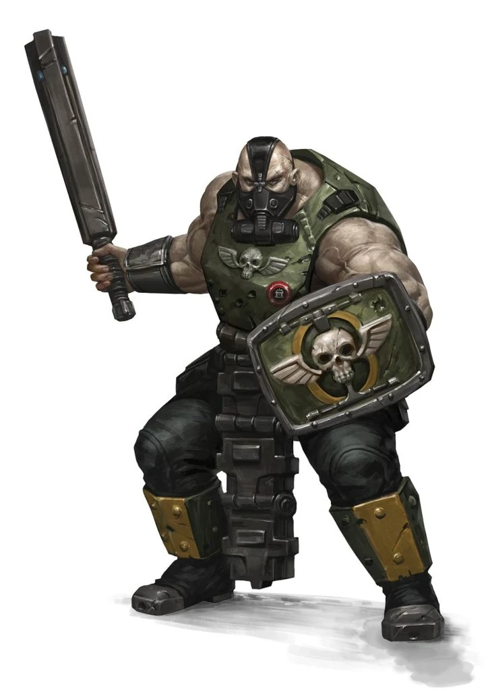

{.newpage height=8cm}

### Ogryn

Les Ogryn sont des abhumains massifs, d’une loyauté à toute épreuve, mais stupides. Ils sont couverts de bosses et de protubérances disgracieuses, et se traînent avec des corps massifs et encombrants. Ils sont considérés comme d’excellents combattants de première ligne au sein de la Garde Impériale, sont très doués pour suivre les ordres, mais ont à peine deux cellules cérébrales à se frotter l’une contre l’autre.

Les Ogryn sont généralement victimes de discrimination au sein de l’Imperium, mais leurs contributions à la Garde Impériale leur permettent de rester dans les limites des mutations acceptables. Leur immense puissance de combat et leur nature docile leur permettent d’adopter la culture militaire avec une relative facilité.

#### Traits des Ogryns

Votre personnage ogryn possède certains traits hérités de son ascendance abhumaine.

**Augmentation des caractéristiques.** Votre score de Constitution augmente de 2, et votre score de Force augmente de 1.

**Âge.** Les ogryns atteignent leur maturité plus rapidement que les humains, devenant adultes vers l’âge de 14 ans. Ils vieillissent nettement plus vite et vivent rarement au-delà de 75 ans.

**Alignement.** Les Ogryn sont des abhumains qui font généralement l’objet de discriminations, mais qui sont connus pour être d’une loyauté sans faille et fidèles à leurs amis. Ils ont une forte tendance à adopter des alignements ordonnés.

**Taille.** Les Ogryn sont légèrement plus grands et plus massifs que les humains, et leur taille varie de 6 pieds à bien plus de 1,8 mètre. Votre taille est Moyenne.

**Vitesse.** Votre vitesse de marche de base est de 9 mètres.

**Système de binôme.** Si vous pouvez voir une créature alliée à moins de 9 mètres de vous qui n’est pas hors de combat, vous ne pouvez pas être effrayé.

**Loyauté des Ogryn.** Si une créature alliée inconsciente située à moins de 1,5 mètre de vous est touchée par une attaque et que vous pouvez voir l’attaquant, vous pouvez utiliser votre réaction pour vous substituer à elle comme cible de l’attaque.

**Corpulence puissante.** Vous comptez comme une taille au-dessus de la vôtre pour déterminer votre capacité de charge et le poids que vous pouvez pousser, traîner ou soulever.

**Endurance implacable.** Lorsque vous êtes réduit à 0 point de vie mais que vous n’êtes pas tué sur le coup, vous pouvez descendre à 1 point de vie à la place. Vous ne pouvez pas réutiliser ce trait avant d’avoir terminé un long repos.

**Langues.** Vous pouvez parler, lire et écrire le bas gothique, ainsi que, au choix, les codes impériaux ou une langue tribal
