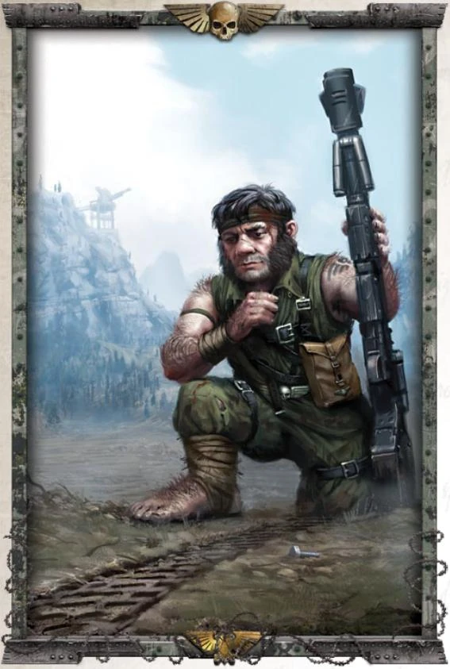

{.newpage height=8cm}

### Ratling

Les Ratlings sont une espèce d’abhumains mesurant entre trois et quatre pieds de haut. En tant qu’abhumains, ils font généralement l’objet de discriminations, mais ils sont très appréciés en tant que tireurs d’élite au sein de la Garde Impériale. Les Ratlings figurent sur la liste des mutations acceptables établie par l’Imperium.

En tant que Ratling, vous pouvez facilement passer inaperçu, voire utiliser d’autres personnes comme couverture. Au sein de la Garde Impériale, les Ratlings sont employés comme tireurs d’élite. De nombreux ratlings mènent une vie de petite délinquance, tirant parti de leur petite taille pour se faufiler agilement au milieu des dangers et s’échapper rapidement.

#### Traits des Ratling

Votre personnage ratling possède certains traits hérités de son ascendance abhumaine.

**Augmentation des caractéristiques.** Votre score de Dextérité augmente de 2 et votre score de Sagesse augmente de 1.

**Âge.** Un ratling atteint l’âge adulte à 20 ans et vit généralement jusqu’au milieu de son deuxième siècle.

**Alignement.** La plupart des ratlings sont victimes de discrimination en raison de leur statut de non-humains, ce qui les pousse à adopter une vision chaotique de la vie. Les ratlings enrôlés de force dans la Garde impériale ont davantage tendance à être loyaux envers l’autorité.

**Taille.** Les ratlings mesurent en moyenne environ 3 pieds et pèsent environ 40 livres. Votre taille est Petite.

**Vitesse.** Votre vitesse de marche de base est de 9 mètres.

**Chance.** Lorsque vous obtenez un 1 sur un d20 lors d’un jet d’attaque, d’un test de capacité ou d’un jet de sauvegarde, vous pouvez relancer le dé et devez utiliser le nouveau résultat.

**Agilité des Ratlings.** Vous pouvez vous déplacer à travers l’espace occupé par toute créature dont la taille est supérieure à la vôtre.

**Entraînement de ratling.** Vous maîtrisez la rapière, l’épée courte, le cimeterre et le pistolet laser.

**Discrétion naturelle.** Vous pouvez tenter de vous cacher même lorsque vous n’êtes masqué que par une créature dont la taille est supérieure d’au moins un niveau à la vôtre.

**Langues.** Vous pouvez parler, lire et écrire le bas gothique, ainsi que, au choix, les codes impériaux ou le langage des bas-fonds.
