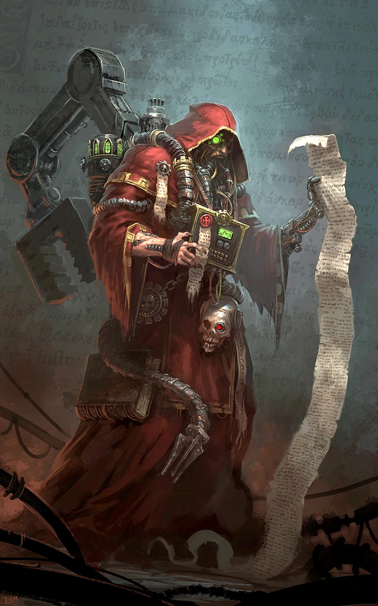

{.newpage height=7cm}

### Technofusionné

L’union du métal et de la chair donne naissance aux Technofusionnés : des humanoïdes qui ont remplacé une partie importante de leur constitution organique par des éléments cybernétiques. Que ce soit par une étrange fétichisation du métal ou pour se rapprocher de leur conception du Dieu-Machine, ces créatures sont davantage composées de rouages et de mécanismes, entremêlés à leurs organes et à leur peau, que des parties organiques avec lesquelles elles sont nées.

N’importe quelle espèce humanoïde peut devenir un Technofusionné, mais ce sont le plus souvent les humains adeptes du Culte du Dieu-Machine et les orques mutilés par d’innombrables combats qui finissent par le devenir.

#### Traits des Technofusionnés

**Augmentation des caractéristiques.** Votre caractéristique de Constitution augmente de 2, et une caractéristique de votre choix augmente de 1.

**Âge.**  Les Technofusionnés sont issus d’une autre espèce, mais leur espérance de vie naturelle est généralement prolongée grâce à la cybernétique. Les Technofusionnés fortement modifiés peuvent vivre jusqu’à plusieurs centaines d’années de plus que leur espérance de vie naturelle.

**Alignement.** Les Technofusionnés sont orientés vers les alignements propres à leur espèce d’origine. Les membres du Culte du Dieu-Machine sont orientés vers des alignements ordonnés, tandis que ceux qui recherchent l’amélioration cybernétique dans le but de se libérer des contraintes de la chair peuvent pencher vers des alignements chaotiques.

**Taille.** Les Technofusionnés ont la même taille et la même stature que leur espèce d’origine, avec un surpoids de 5 à 150 kilogrammes dû à leurs améliorations cybernétiques. Votre taille est moyenne.

**Vitesse.** Votre vitesse de marche de base est de 9 mètres.

**Résilience artificielle.** Vous avez été conçu pour posséder une force de caractère remarquable, qui se traduit par les avantages suivants :

- Vous bénéficiez d’un avantage aux jets de sauvegarde contre l’empoisonnement, et vous êtes résistant aux dégâts de poison.
- Vous êtes immunisé contre les maladies non amplifiées.
- Vous n’avez pas besoin de dormir, et vous ne pouvez pas être endormi.

**Repos automatique.** Lorsque vous prenez un long repos, vous devez passer au moins six heures dans un état inactif et immobile, plutôt que de dormir. Dans cet état, vous semblez inerte, mais cela ne vous rend pas inconscient, et vous pouvez voir et entendre normalement.

**Protection intégrée.** Votre corps dispose de couches défensives intégrées, qui peuvent être renforcées par une armure :

- Vous bénéficiez d’un bonus de +1 à votre classe d’armure.
- Vous ne pouvez revêtir que des armures pour lesquelles vous possédez une maîtrise. Pour revêtir une armure, vous devez l’intégrer à votre corps en l’espace d’une heure, pendant laquelle vous restez en contact avec celle-ci. Pour retirer une armure, vous devez passer une heure à l’enlever. Vous pouvez vous reposer pendant que vous enfilez ou retirez votre armure de cette manière.
- Tant que vous êtes en vie, votre armure ne peut pas être retirée de votre corps contre votre volonté.
Conception spécialisée. Vous gagnez une maîtrise de compétence et une maîtrise d’un outil ou d’un gadget technologique de votre choix.

**Langues.** Vous pouvez parler, lire et écrire le binaire et le bas gothique.
