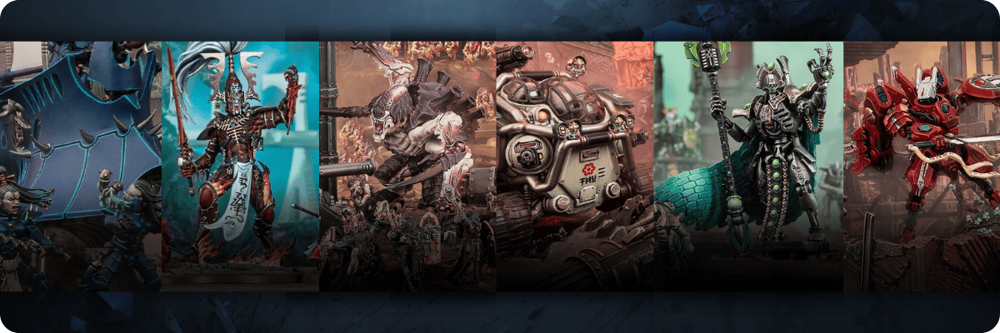

## Espèces : Les Xenos {#xenos}

{.wide}

À travers la galaxie, d'innombrables espèces extraterrestres ont fait connaître leur existence. Beaucoup d'entre elles ont été contraintes de s'unir au sein d'une faction plus vaste pour survivre, ou de mener une vie nomade à bord de vaisseaux spatiaux pour subvenir à leurs besoins. Quelle qu'en soit la raison, les espèces présentées dans ce chapitre regroupent des xénos et des sous-espèces humaines hors du commun que l'on peut rencontrer dans la galaxie.

!!! warning "Utilisez des espèces Xenos"

    Consultez votre Maître du jeu avant d'incarner l'une de ces espèces xénos, car leur présence dans une histoire peut radicalement changer ou modifier l'environnement de jeu.
