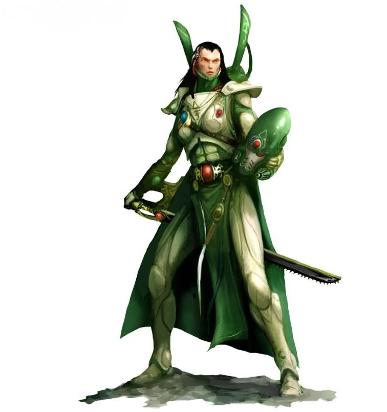

{.newpage height=8cm}

### Aeldari

Les Aeldari tirent une grande fierté du fait qu’ils existaient déjà depuis des milliers d’années avant l’avènement de l’humanité, et qu’ils ont également bâti l’un des empires les plus durables que la galaxie ait jamais connus. Au cours de la période où leur espèce régnait, ils ont réussi à isoler une partie du Warp, connue sous le nom de « Webway », pour leur usage exclusif.

La chute de l’empire eldar fut annoncée par la naissance du dieu du Chaos Slaanesh, dans un lieu désormais connu sous le nom d’Œil de la Terreur. Sa naissance fut le fruit de la soif combinée des Aeldari pour les drogues, le plaisir et l’euphorie, une soif si intense qu’elle finit par polluer le Warp et donner naissance à ce nouveau dieu du Chaos, qui ne tarda pas à dévorer autant de ses créateurs que possible.

#### Traits des Aeldari

Votre personnage Aeldari dispose d’un ensemble de capacités commune ainsi que certaine lié à son origine.

**Augmentation des caractéristiques.** Votre score de Dextérité augmente de 2 et votre score d’Intelligence augmente de 1.

**Âge.** Bien que les Aeldari atteignent leur maturité physique à peu près au même âge que les humains, leur conception de l’âge adulte va au-delà de la croissance physique pour englober l’expérience du monde. Un Aeldari atteint généralement l’âge adulte vers 100 ans et peut vivre jusqu’à 750 ans.

**Alignement.** Les Aeldari aiment la liberté, la diversité et l’expression de soi ; ils penchent donc vers les aspects les plus doux du chaos. Ils accordent une grande importance à leur liberté et à leur culture, et sont le plus souvent bons. Les Drukhari font exception : ils sont plus souvent mauvais que neutres ou bons.

**Taille.** Les Aeldari mesurent entre moins de 1,5 mètre et 1,8 mètre et ont une silhouette élancée. Votre taille est moyenne.

**Vitesse.** Votre vitesse de marche de base est de 9 mètres .

**Vision dans le noir.** Habitués aux forêts crépusculaires et au ciel nocturne, vous disposez d’une vision supérieure dans l’obscurité et la pénombre. Vous pouvez voir dans une lumière tamisée à moins de 60 pieds de vous comme s’il s’agissait d’une lumière vive, et dans l’obscurité comme s’il s’agissait d’une lumière tamisée. Vous ne pouvez pas distinguer les couleurs dans l’obscurité, seulement des nuances de gris.

**Sens aiguisés.** Vous maîtrisez la compétence Perception.

**Langues.** Vous pouvez parler, lire et écrire l’aeldari et le bas gothique.

**Branche d'origine.** En tant Aeldari vous êtes le fruit de la séparation de votre peuple suite à la naissance de Slaanesh. Choisissez votre branche d'appartenance et obtenez ses traits, énumérés ci-dessous.

#### Asuryani

Après la chute de l’Empire Aeldari et la naissance de Slaanesh, connue sous le nom de Sai’lanthresh (Celle-qui-a-soif), les Aeldari des Mondes-Vaisseaux construisirent des vaisseaux géants, de la taille d’un continent.

**Augmentation de caractéristique.** Votre score d’Intelligence augmente de 1 supplémentaire.

**Patrimoine artistique.** Vous maîtrisez un instrument de musique et un ensemble d’outils d’artisanat de votre choix.

**Esprit clair.** Vous bénéficiez d’une résistance aux dégâts psioniques et d’un avantage aux jets de sauvegarde contre les effets de charme.

**Agilité surnaturelle.** Vos réflexes et votre agilité vous permettent de vous déplacer avec une accélération fulgurante. Lorsque vous vous déplacez pendant votre tour au combat, vous pouvez doubler votre vitesse jusqu’à la fin du tour. Une fois que vous avez utilisé ce trait, vous ne pouvez pas l’utiliser à nouveau tant que vous ne vous êtes pas déplacé de 0 pieds lors d’un de vos tours.

**Langue supplémentaire.** Vous pouvez parler, lire une autre langue de votre choix.

#### Exodite

Vos ancêtres ont fui avant l’effondrement du grand empire eldar et se sont installés sur des mondes vierges, où ils ont bâti de nouvelles vies et cultures.

**Augmentation ds caractéristique.** Votre score de Sagesse augmente de 1 supplémentaire.

**Langage des bêtes.** Vous pouvez communiquer des idées simples avec les bêtes à l’aide de sons et de gestes.

**Masque de la nature sauvage.** Vous pouvez tenter de vous cacher même lorsque vous n’êtes que légèrement dissimulé par le feuillage, une pluie battante, la neige, la brume ou d’autres phénomènes naturels.

**Agilité surnaturelle.** Vos réflexes et votre agilité vous permettent de vous déplacer avec une accélération fulgurante. Lorsque vous vous déplacez pendant votre tour au combat, vous pouvez doubler votre vitesse jusqu’à la fin du tour. Une fois que vous avez utilisé ce trait, vous ne pouvez pas l’utiliser à nouveau tant que vous ne vous êtes pas déplacé de 0 pieds lors d’un de vos tours.

**Langue supplémentaire.** Vous pouvez parler, lire et écrire le tribal.

#### Drukhari

Après la naissance de Slaanesh, les Drukhari se sont réfugiés dans le Webway. Pour apaiser sa soif incessante d’âmes Aeldari, les Drukhari ont torturé des prisonniers et des esclaves pendant des années, sombrant toujours davantage dans l’hédonisme qui a donné naissance à leur plus grand ennemi. Les Drukhari comptent parmi les xénos les plus indignes de confiance de la galaxie ; ils ne cessent de se trahir et de se mentir les uns aux autres afin d’acquérir pouvoir et réputation.

**Augmentation de caractéristique**. Votre score de Charisme augmente de 1 supplémentaire.

**Ruse drukhari.** Lorsque vous effectuez un jet d’attaque, un test de capacité ou un jet de sauvegarde, vous pouvez appliquer la ruse drukhari à la situation, ce qui vous permet de lancer 1d6 et d’ajouter le résultat à votre jet. Une fois que vous avez utilisé cette capacité, vous ne pouvez pas l’utiliser à nouveau avant d’avoir effectué un repos court ou long.
La ruse drukhari peut consister à insulter votre ennemi, à le détourner subtilement de son objectif par des formules ou le langage corporel, ou encore à lui jeter du sable que vous avez dans votre poche.

**Compétences drukhari.** Vous maîtrisez le kit de l’empoisonneur et le kit du tortionnaire.

**Agilité surnaturelle.** Vos réflexes et votre agilité vous permettent de vous déplacer avec une accélération fulgurante. Lorsque vous vous déplacez pendant votre tour au combat, vous pouvez doubler votre vitesse jusqu’à la fin du tour. Une fois que vous avez utilisé ce trait, vous ne pouvez plus l’utiliser tant que vous ne vous êtes pas déplacé de 0 pieds lors d’un de vos tours.

**Langue supplémentaire.** Vous pouvez parler, lire et écrire la langue des bas-fonds.
