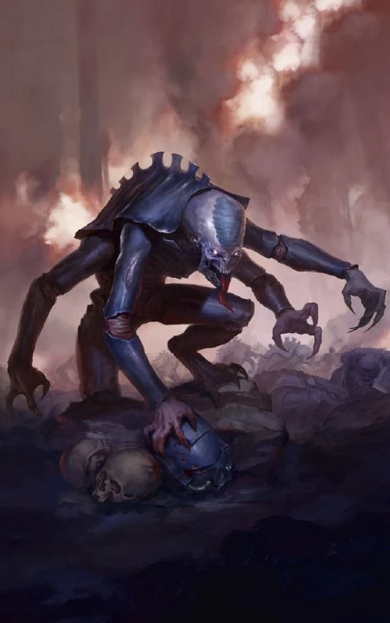

{.newpage height=8cm}

#### Genestealer

Les Genestealers infestent les colonies et les villes appartenant à d’autres créatures, les repeuplant avec leurs propres peuples et tentant d’y établir un Culte des Genestealers, pour finalement amener une flotte-ruche tyranide sur la planète afin de la dévorer dans son intégralité.

Les Acolytes Genestealers sont le résultat de générations d’implantations génétiques chez des humanoïdes, donnant naissance à un hybride genestealer-humain qui ressemble à un humain, mais présente des différences notables, telles que plusieurs bras, davantage de rangées de dents, une posture voûtée et d’autres traits semblables à ceux d’un mutant.

##### Traits des Genestealers

**Âge.** Les acolytes Genestealer atteignent la maturité à peu près au même âge que les humains et ont une espérance de vie similaire.

**Alignement.** Les Genestealer servent leurs flottes-ruches et obéissent à leurs supérieurs hiérarchiques, ce qui les fait pencher vers des alignements ordonnés.

**Taille.** Les acolytes Genestealer ont la même taille que les humains ordinaires, mais ont généralement le dos voûté. Votre taille est moyenne.

**Vitesse.** Votre vitesse de marche de base est de 10 mètres. Votre vitesse d’escalade est égale à votre vitesse de marche.

**Vision dans le noir.** Vous pouvez voir dans la pénombre jusqu’à 18 mètres autour de vous comme s’il s’agissait d’une lumière vive, et dans l’obscurité comme s’il s’agissait d’une pénombre. Vous ne pouvez pas distinguer les couleurs dans l’obscurité, seulement des nuances de gris.

**Esprit collectif.** Vous êtes relié psychiquement à un esprit collectif lorsque vous vous trouvez à proximité d’autres tyranides. Tant que vous êtes relié de cette manière, vous pouvez communiquer psychiquement par télépathie avec n’importe quel autre tyranide situé à moins de 18 mètres de vous.

**Physiologie tyranide.** Vous bénéficiez d’un avantage aux jets de sauvegarde contre les effets de charme, d’effroi, d’empoisonnement ou d’endormissement.

**Langues.** Vous pouvez parler, lire et écrire le bas gothique.

**Génération.** En fonction du nombre de génération qui vous sépare du patriarche, vous obtenez des traits spécifique. Choisissez en une parmis les deux disponibles :

##### Acolytes Genestealer

Les acolytes Genestealer comptent parmi les toutes premières générations à émerger lors de la naissance d’un culte Genestealer. Ressemblant à la fois à des tyranides et à des humanoïdes, ces créatures possèdent généralement plusieurs bras et sont le plus souvent élevées pour la violence et l’agressivité.

**Augmentation des caractéristiques.** Votre caractéristique de Force augmente de 2, votre caractéristique de Constitution augmente de 1.

**Griffe de Genestealer.** Vous disposez d’un appendice supplémentaire ressemblant à un bras muni d’une griffe. Cette griffe est une arme naturelle que vous pouvez utiliser pour effectuer des attaques à mains nues ; elle inflige 1d6 + votre modificateur de Force de dégâts cinétiques en cas de coup réussi. Immédiatement après avoir touché une cible avec vos griffes, vous pouvez tenter de la saisir en tant qu’action bonus. Cette griffe ne peut manipuler aucun objet avec précision et ne peut pas manier d’armes, activer d’objets améliorés ni utiliser d’autres équipements spécialisés.

##### Néophytes Genestealers

Les néophytes sont le fruit de plusieurs générations de Genestealers s’étant reproduits avec leur espèce hôte. Ils sont pratiquement impossibles à distinguer des humains normaux, à l’exception peut-être de quelques anomalies physiques qui pourraient les trahir si on les examine de plus près. Les néophytes font preuve d’une intelligence supérieure à celle de leurs homologues et sont capables de s’immiscer dans la politique et les affaires publiques.

**Augmentation des caractéristiques.** Votre score de Charisme augmente de 2, et votre score d’Intelligence augmente de 1.

**Élevage spécialisé.** Vous avez été élevé pour être supérieur aux humains ordinaires. Choisissez une compétence, un outil ou un gadget technologique. Lorsque vous effectuez un test de capacité utilisant cette compétence, vous pouvez lancer un d4 et ajouter son résultat au total.

**Langue supplémentaire.** Vous pouvez parler, lire et écrire une langue de votre choix en plus.
