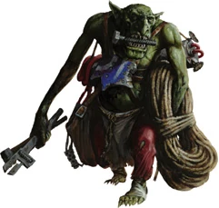

{.newpage}

### Gretchin

Les Gretchin constituent une sous-espèce plus petite des Orques ; ils sont considérés comme une espèce inférieure par rapport aux Orques en raison de leur manque de force et de leurs performances médiocres au combat. Les Orques utilisent généralement les Gretchin comme boucliers humains, pour déminer les terrains, et parfois même comme rations d’urgence.

Les Gretchins adhèrent à la culture orque : la guerre et le WAAAGH ! coulent toujours à flots dans leurs veines. Malgré cela, la plupart des Gretchins doivent être contraints au combat par d’autres Orques afin de s’assurer qu’ils restent sur le champ de bataille. Pratiquement tous les Gretchins travaillent comme esclaves pour les Orques ou pour une autre figure d’autorité.

Lorsque vous créez un Gretchin, réfléchissez à ce que sont ses expériences avec les Orques. Est-il traité comme un être inférieur, comme la plupart des Gretchins ? Avez-vous vu vos compagnons Gretchins servir de chair à canon pour déminer des champs de mines et faire le bouclier face aux balles ? Si vous avez quitté la culture orque, était-ce en quête de pouvoir, ou pour trouver un endroit où vous ne risqueriez pas de mourir ?

#### Traits des Gretchins

**Augmentation des caractéristiques.** Votre caractéristique de Dextérité augmente de 2, et votre caractéristique de Constitution augmente de 1.

**Âge.**  Les gretchins atteignent leur maturité vers l’âge de 3 ans. On ignore quelle est la durée de vie d’un gretchin, car la plupart meurent prématurément.

**Alignement.** En tant que gretchin, vous êtes influencé par la société orque et le chaos de la guerre qu’elle engendre, ce qui vous rend enclin au chaos.

**Taille.** Les gretchins mesurent entre 90 centimères et 1,2 mètre et pèsent entre 10 et 30 kilogrammes. Votre taille est Petite.

**Vitesse.** Votre vitesse de marche de base est de 10 mètres.

**Vision dans le noir.** Habitué à la vie souterraine, vous disposez d’une vision supérieure dans l’obscurité et la pénombre. Vous pouvez voir dans la pénombre jusqu’à 18 mètres autour de vous comme s’il s’agissait d’une lumière vive, et dans l’obscurité comme s’il s’agissait d’une pénombre. Vous ne pouvez pas distinguer les couleurs dans l’obscurité, seulement des nuances de gris.

**La fureur des petits.** Lorsque vous infligez des dégâts à une créature par une attaque ou un pouvoir et que la taille de cette créature est supérieure à la vôtre, vous pouvez faire en sorte que l’attaque ou le pouvoir inflige des dégâts supplémentaires à la créature. Ces dégâts supplémentaires sont égaux à votre niveau. Vous pouvez utiliser cette capacité un nombre de fois égal à votre bonus de maîtrise, et vous récupérez tous les usages dépensés à la fin d’un long repos.

**Régénération.** Lorsque vous êtes estropié ou mutilé par une arme qui n’inflige pas de dégâts de feu, vous êtes capable de remplacer le membre manquant en le recousant au moyen d’une intervention chirurgicale bâclée, ou en le régénérant sur une période d’une semaine.

**Évasion agile.** Vous pouvez effectuer l’action « Se dégager » ou « Se cacher » en tant qu’action bonus à chacun de vos tours.

**Langues.** Vous parlez, lisez et écrivez l'ork et une langue au choix.
