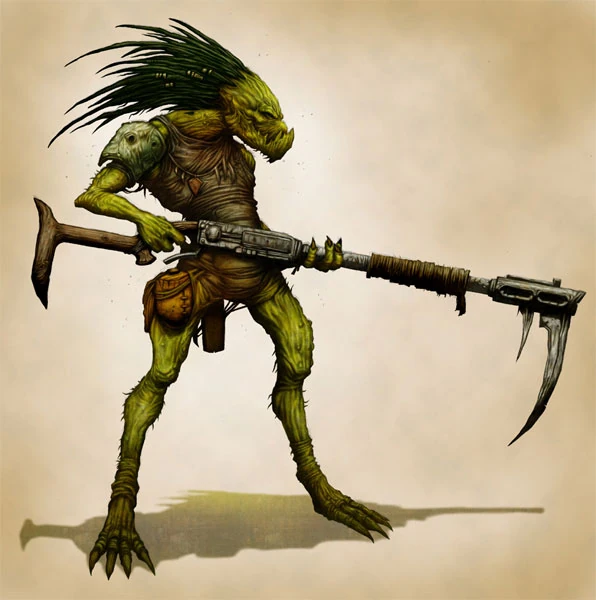

{.newpage}

### Kroot

Les Kroot sont des créatures humanoïdes qui possèdent généralement un bec, deux bras et deux jambes. Le terme « généralement » est utilisé en raison de la capacité innée des Kroot à se nourrir de la chair d’une créature, ce qui finit par induire des mutations génétiques similaires aux traits de cette dernière.

Après plusieurs générations passées à se nourrir d’un type spécifique de créature, les Kroot sont capables de développer des traits ressemblant à ceux de cette proie. Ces traits permettent à certains groupes de Kroot de développer un potentiel psychique, une force immense ou de se doter d’un intellect plus puissant.

Les Kroot sont dirigés par des « façonneurs », qui sont des membres de la tribu chargés de désigner le type de proie que les Kroot doivent privilégier par rapport aux autres. Ce « shaper » est souvent le plus âgé, le plus sage ou peut-être le plus fort de sa tribu.

Les Kroot ont été découverts par l’Empire Tau et ont uni leurs forces à celui-ci pour servir d’unités auxiliaires. On trouve également des Kroot parcourant la galaxie en tant que mercenaires, marchands et chasseurs de primes.

#### Traits des Kroot

**Augmentation des caractéristiques.** Votre caractéristique de Force augmente de 2, et votre caractéristique de Dextérité augmente de 1.

**Âge.**  Les Kroot atteignent leur maturité vers l’âge de 14 ans et peuvent vivre jusqu’à 80 ans.

**Alignement.** Les Kroot ont tendance à adopter des alignements neutres ; leur société et leur culture s’articulent autour de la survie et du renforcement maximal de leurs capacités.

**Taille.** Les Kroot peuvent mesurer entre 1,8 mètre et 2 mètres de haut et peser entre 80 et 120 kilogrammes à l’apogée de leur vie. Votre taille est moyenne.

**Vitesse.** Votre vitesse de marche de base est de 10 mètres.

**Vision dans le noir.** Vous pouvez voir dans la pénombre jusqu’à 18 mètres autour de vous comme s’il s’agissait d’une lumière vive, et dans l’obscurité comme s’il s’agissait d’une pénombre. Vous ne pouvez pas distinguer les couleurs dans l’obscurité, seulement des nuances de gris.

**Bec.** Votre bec est une arme naturelle que vous pouvez utiliser pour porter des coups à mains nues. Votre bec inflige 1d6 + votre modificateur de Force de dégâts cinétiques.

**Instincts kroots.** Vous maîtrisez l’une des compétences suivantes de votre choix : Athlétisme, Nature, Perception ou Survie.

**Absorption de force.** Vous pouvez dévorer des créatures pour absorber leur force. Lors d’un repos court, vous pouvez dévorer le corps d’une créature dont la chair, les muscles ou toute autre matière organique sont digestibles. Lorsque vous dévorez une créature de cette manière, vous pouvez choisir d’acquérir un trait, comme indiqué dans le tableau des traits acquis ci-dessous. Pour qu’une créature vous confère un trait après que vous l’avez consommée, celle-ci doit remplir les conditions préalables associées à ce trait.

Par exemple, pour acquérir le trait « Constitution puissante », vous devez consommer une créature de taille Grande ou supérieure, ou une créature qui possède déjà le trait « Constitution puissante ». Vous ne pouvez bénéficier des avantages que d’un seul trait à la fois.

**Langues.** Vous pouvez parler, lire et écrire le tau, le tribal, le bas gothique.

#### Absorption de force {.newpage}

*Traits gagnés et conditions*{.table-title .wide}

| Trait gagné | Condition requise |
| ---- | ---- |
| **Corpulence imposante.** Vous êtes considéré comme étant d’une taille supérieure lors du calcul de votre capacité de charge et du poids que vous pouvez pousser, traîner ou soulever. | La créature dévorée est de taille Grande ou supérieure, ou possède le trait « Constitution puissante ».|
| **Potentiel psychique.** Vous apprenez un pouvoir psychique utilisable à volonté. Votre modificateur de psycasting pour ce pouvoir correspond à votre score de Sagesse ou de Charisme (au choix).|La créature dévorée peut lancer au moins un pouvoir psychique.|
| **Hyper-sens.** Vous gagnez la vision aveugle ou le sens des vibrations dans un rayon de 3 mètres. Si vous possédez déjà la vision aveugle ou le sens des vibrations, leur rayon augmente de 1,5 mètre.| La créature dévorée possède la vision aveugle ou le sens des vibrations. |
| **Courage.** Vous bénéficiez d’un avantage aux jets de sauvegarde contre l’effroi.|La créature dévorée est immunisée contre l’effroi, ou bénéficie d’un avantage aux jets de sauvegarde pour résister à l’effroi.|
| **Amphibie.** Vous bénéficiez d’une vitesse de nage égale à votre vitesse de marche, et vous pouvez respirer normalement sous l’eau.|La créature dévorée peut respirer normalement sous l’eau ou possède une vitesse de nage.|
| **Régénération.** Lorsque vous êtes estropié ou mutilé par une arme qui n’inflige pas de dégâts de feu, vous êtes capable de remplacer le membre manquant en le recousant au moyen d’une intervention chirurgicale bâclée, ou en le régénérant sur une période d’une semaine.| La créature dévorée a la capacité de régénérer normalement ses membres perdus, ou peut régénérer des points de vie au début de chaque tour.|
| **Planeur.** Vous développez des appendices semblables à des ailes qui vous permettent de planer. Lorsque vous tombez et que vous n’êtes pas hors de combat, vous pouvez soustraire jusqu’à 30 mètres de votre hauteur de chute lors du calcul de vos dégâts de chute et vous pouvez vous déplacer horizontalement de 2 mètres pour chaque mètre de chute.| La créature dévorée a la capacité de planer, ou possède une vitesse de vol conférée par des ailes ou des appendices capables de voler.|
