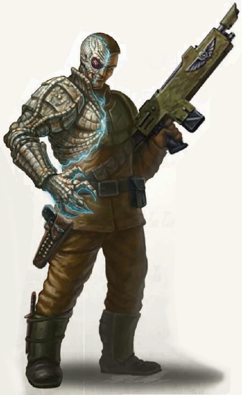

{.newpage}

### Lacrymole

Le lacrymole est une curiosité parmi les espèces présentes dans la galaxie. Il se présente sous la forme d’un humanoïde typique, de stature, de taille et de poids moyens, à une différence près : son apparence physique évolue et change constamment, passant par une myriade de couleurs, jusqu’à ce qu’il décide d’imiter l’apparence d’une autre espèce humanoïde. C’est pourquoi le lacrymole vit le plus souvent au sein d’autres civilisations, telles que l’Imperium, où il peut prospérer dans le secret.

Les lacrymoles possèdent des dents semblables à celles des vampires et sont capables de se nourrir du sang d’autres créatures pour subsister. Parmi toutes les espèces considérées comme intolérables dans la plupart des sociétés, le lacrymole est l’une des créatures les plus haïes, les plus traquées et les plus méprisées de toute la galaxie.

#### Traits des Lacrymoles

**Augmentation des caractéristiques.** Votre caractéristique de Charisme augmente de 2. De plus, une caractéristique de votre choix augmente de 1.

**Âge.** Les lacrymoles atteignent leur maturité plus rapidement que les humains, mais ont une espérance de vie similaire : généralement un siècle ou moins.

**Alignement.** Les lacrymoles ont tendance à pencher vers l’alignement maléfique, car beaucoup d’entre eux sont égoïstes et se contentent de se nourrir et de tuer pour survivre.

**Taille.** Vous avez à peu près la même taille et le même poids que les humains. Votre taille est moyenne.

**Vitesse.** Votre vitesse de marche de base est de 9 mètres.

**Morsure.** Vos dents de vampire sont des armes naturelles. Votre morsure inflige 1d6 + votre modificateur de Force en dégâts cinétiques.

**Métamorphe.** En tant qu’action, vous pouvez changer d’apparence et de voix. Vous déterminez les détails de ces changements, notamment votre couleur de peau, la longueur de vos cheveux et votre sexe. Vous pouvez également ajuster votre taille et votre poids, mais pas au point de changer de taille. Vous pouvez prendre l’apparence d’un membre d’une autre espèce, bien qu’aucune de vos caractéristiques de jeu ne change. Vous ne pouvez pas reproduire l’apparence d’une créature que vous n’avez jamais vue, et vous devez adopter une forme présentant la même disposition de base des membres que la vôtre. Vos vêtements et votre équipement ne sont pas modifiés par ce trait.
Vous conservez cette nouvelle forme jusqu’à ce que vous utilisiez une action pour reprendre votre véritable apparence ou jusqu’à votre mort.

**Instincts de lacrymole.** Vous gagnez la maîtrise de deux des compétences suivantes de votre choix : Tromperie, Perspicacité, Intimidation et Persuasion.

**Langues.** Vous pouvez parler, lire et écrire le bas gothique, et deux langue de votre choix.
