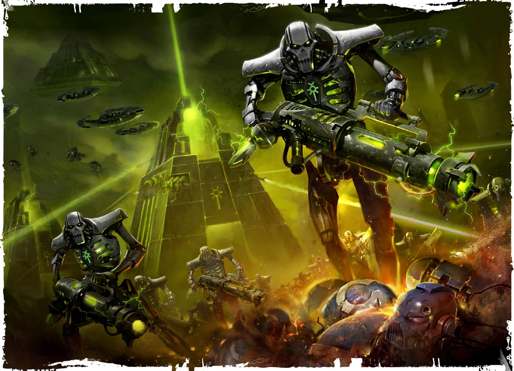

{.newpage}

### Necron

Au plus profond des Mondes-Tombeaux, dans des mondes tombés depuis longtemps dans l’oubli, les Nécrons attendent. Fabriqués à partir de métaux ultra-sophistiqués et dépouillés de la majeure partie de leur intelligence, de leur raisonnement et de leur capacité de réflexion, les Nécrons sont des robots déterminés à détruire toutes les formes de vie présentes dans la galaxie. Rares sont les Nécrons dotés d’une intelligence leur permettant d’avoir des pensées complexes, de raisonner et de communiquer.

!!! warning "Note pour le Maitre du Jeu"
    Les Nécrons sont des créatures artificielles et ne peuvent être soignés par la plupart des méthodes de soins standard.

    De ce fait, il est important que vos joueurs sachent qu’ils risquent d’être fortement désavantagés par rapport aux autres membres de leur groupe en raison du manque de soins à leur disposition.

#### Traits des Nécrons

**Augmentation des caractéristiques.** Votre caractéristique de Constitution augmente de 2, et une autre caractéristique de votre choix augmente de 1.

**Âge.** Les Nécrons vivent depuis des milliers d’années et peuvent vivre encore des milliers d’années.

**Alignement.** Les Nécrons sont loyaux envers leur hiérarchie.

**Taille.** Les Nécrons mesurent en moyenne environ 1,8 mètre et pèsent environ 200 kilogrammes. Votre taille est Moyenne.

**Vitesse.** Votre vitesse de marche de base est de 7 mètres.

**Construct.** Votre type de créature est « construct ». Vous n’avez pas besoin de dormir, de manger ni de boire. Vous êtes immunisé contre les effets de la chaleur extrême, du froid extrême, des radiations et du vide ambiant. Vous êtes immunisé contre les maladies non amplifiées, les dégâts de poison, l’état « empoisonné » et l’épuisement, et vous ne pouvez pas être endormi.

**Vision dans le noir.** Vous pouvez voir dans la pénombre jusqu’à 18 mètres autour de vous comme s’il s’agissait d’une lumière vive, et dans l’obscurité comme s’il s’agissait d’une pénombre. Vous ne pouvez pas distinguer les couleurs dans l’obscurité, seulement des nuances de gris.

**Armure nécronique.** Votre corps est recouvert de nécroderme, ce qui vous confère une CA de base de 17 (votre modificateur de Dextérité n’affecte pas ce chiffre). Le port d’une armure ne fait pas descendre votre CA en dessous de cette valeur. Si vous utilisez un bouclier, vous pouvez appliquer le bonus du bouclier comme d’habitude. De plus, hors combat vous récupérez 1 Point de vie par heure.

**Insomnie.** Lorsque vous prenez un long repos, vous devez passer au moins quatre heures dans un état inactif et immobile, plutôt que de dormir. Dans cet état, vous semblez inerte, mais cela ne vous rend pas inconscient, et vous pouvez voir et entendre normalement.

**Monde-tombeau.** À votre mort, vous êtes réincarné dans votre monde-tombeau d’origine au bout d’un nombre de jours égal à votre niveau.

**Intolérance au Warp.** Vous êtes incapable de manifester des pouvoirs psychiques. Vous ne pouvez pas gagner de niveaux dans une classe dotée de la capacité « psycasting ».

**Langues.** Vous pouvez parler, lire et écrire le bas gothique et le nécron.
