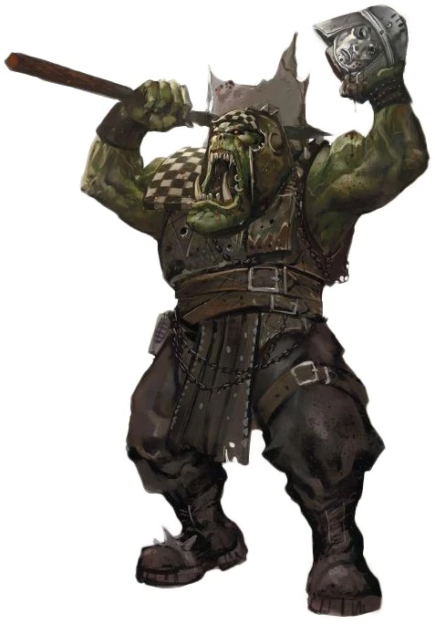

{.newpage}

#### Ork

Les Orks sont violents. Les Orks sont nombreux. Ils emploient souvent des conventions de dénomination rudimentaires, comme le fait d’appeler les plus petits « boyz » et « gitz ». Le phénomène connu sous le nom de « champ gestalt » fait que les choses se réalisent si un nombre suffisant d’Orks y croit. C’est pourquoi de nombreux véhicules orks sont rouges : parce que les choses rouges vont plus vite.

Les Orks sont des créatures fongiques qui se reproduisent à l’aide de spores, même s’ils n’en ont pas conscience. Ces spores se répandent passivement tout au long de la vie d’un Ork, et se propagent encore davantage à sa mort. Le feu est l’un des seuls moyens d’empêcher les Orks de se reproduire.

Il existe différentes catégories d’Orks : les « knobs » sont de grands Orks qui mènent de petits groupes au combat. Les « Warbosses » sont des Orks qui ont acquis une certaine intelligence et sont capables de mener des masses au combat et de coordonner des stratégies. Les « Techboyz » savent manier la technologie et parviennent d’une manière ou d’une autre à la faire fonctionner, tandis que les « weirdboyz » sont des psykers qui doivent se faire retirer le sommet du crâne, sans quoi leur cerveau deviendrait trop gros pour y tenir. La société ork s’articule principalement autour de klanz et de tribus à la manière des barbares, avec les warbosses au sommet de la hiérarchie, les seigneurs de guerre à la tête de petites bandes de guerre, et les « knobs » à la tête de petits groupes de « boyz » orks.

##### Traits des Orks

**Augmentation des caractéristiques.** Votre caractéristique de Constitution augmente de 2, et votre caractéristique de Force augmente de 1.

**Âge.** Les Orks sont connus pour vivre soit peu de temps, soit très longtemps. Lorsqu’ils meurent jeunes, c’est à cause de la guerre. Lorsqu’ils vivent longtemps, c’est parce que la guerre les rend suffisamment forts pour vivre plus longtemps. Aucun Ork n’est jamais mort de vieillesse, et la plupart atteignent leur maturité à l’âge de quelques mois.

**Alignement.** Les Orks se soucient peu de l’autorité et vivent dans une société violente régie par les plus forts. Ils penchent fortement vers les alignements chaotiques.

**Taille.** Un Ork peut mesurer entre 1,8 mètre et 2,1 mètres et peser entre 100 et 150 kilogrammes. Votre taille est Moyenne.

**Vitesse.** Votre vitesse de marche de base est de 9 mètres.

**Corpulence imposante.** Vous comptez comme une taille au-dessus de la vôtre pour déterminer votre capacité de charge et le poids que vous pouvez pousser, traîner ou soulever.

**Régénération.** En raison de leur nature fongique, les Orks sont capables de régénérer les membres et les parties du corps perdus au fil du temps. Lorsqu’il est estropié ou mutilé par une arme qui n’inflige pas de dégâts de feu, un Ork peut remplacer le membre manquant en le recousant à la suite d’une opération chirurgicale bâclée, ou en le régénérant en l’espace d’une semaine.

**WAAAGH !.** En tant qu’action bonus, vous pouvez vous déplacer jusqu’à votre vitesse de déplacement vers une créature hostile que vous pouvez voir ou entendre. Vous devez terminer ce déplacement plus près de l’ennemi que vous ne l’étiez au départ.

**Couleurs.** Les Orks peuvent se peindre de différentes couleurs pour obtenir divers effets. À la fin d’un long repos, vous pouvez choisir une couleur pour vous peindre, afin de bénéficier de l’un des effets suivants. Vous ne pouvez porter qu’une seule couleur à la fois :

- *Rouge.* Le rouge est la couleur la plus rapide. Vous ignorez les pénalités de déplacement liées au terrain difficile non renforcé.
- *Vert.* Le vert est la couleur la plus puissante. Vous gagnez la maîtrise en Athlétisme et en Intimidation.
- *Noir.* Le noir est la couleur la plus résistante. Tant que vous ne portez pas d’armure lourde, votre CA est augmenté de 1.
- *Camouflage.* Le camouflage est la couleur la plus difficile à voir. Vous connaissez le pouvoir psychique « Invisibilité » et vous pouvez le lancer, en ne ciblant que vous-même. Vous pouvez choisir la Sagesse ou le Charisme comme capacité de lancement de sort pour ce pouvoir. Une fois que vous avez utilisé ce trait, vous ne pouvez plus l’utiliser avant d’avoir effectué un long repos.
- *Bandes jaunes et noires.* Vous bénéficiez d’un avantage aux tests de Tromperie visant à convaincre d’autres Orks que vous êtes bel et bien un Space Marine des Iron Warriors.

**Langues.** Vous pouvez parler, lire et écrire l'ork et le bas gothique.
