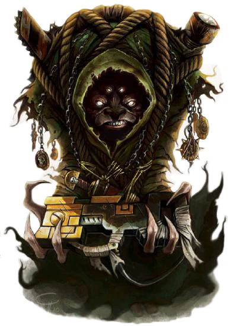

{.newpage}

### Stryxis

Les Stryx sont connus dans toute la galaxie pour être des marchands et des colporteurs sans scrupules. Généralement vêtus d’une robe marron, ces humanoïdes ne se distinguent que par leurs visages ressemblant à ceux de carlins ; ils semblent asexués aux yeux de l’observateur, avec leurs membres dégingandés et leurs quatre petits yeux brillants. Les Stryxis sont connus pour vendre leurs marchandises aux Impériaux, aux Tau, au Chaos et à quiconque est prêt à les acheter, à l’exception des Eldars, envers lesquels ils nourrissent une rancune tenace pour des raisons inconnues.

Les Stryxis sont réputés pour être des escrocs et des intrigants, et ne semblent se soucier de rien d’autre que de faire du profit. De nombreux Stryxis mènent une vie de nomades et de vagabonds, et sont considérés par les Impériaux comme des marchands indécis, car leur façon d’évaluer les marchandises est très différente de celle de la plupart des espèces intelligentes. Les Stryxis aiment amasser du butin, quelle que soit sa valeur, et tentent de le revendre au prix qu’ils jugent bon.

#### Traits des Stryxis

**Augmentation des caractéristiques.** Votre Charisme augmente de 2 et votre Intelligence de 1.

**Âge.** Les Stryxis atteignent leur maturité très jeunes, à l’âge de 10 ans. Ils peuvent vivre pendant des siècles et leur âge de décès n’est pas connu.

**Alignement.**  Les Stryxis ont une forte tendance vers les alignements chaotiques et préfèrent s’associer à quiconque est prêt à tolérer leur compagnie. Ils n’ont aucune tendance vers le bien ni vers le mal.

**Taille.** Vous êtes plus petit que la plupart des humanoïdes, mesurant entre 1,2 mètre à 1,5 mètre de haut. Vous pesez entre 40 et 60 kilogrammes. Votre taille est moyenne.

**Vitesse.** Votre vitesse de marche de base est de 9 mètres.

**Vision dans le noir.** Vous pouvez voir dans la pénombre jusqu’à 18 mètres autour de vous comme s’il s’agissait d’une lumière vive, et dans l’obscurité comme s’il s’agissait d’une pénombre. Vous ne pouvez pas distinguer les couleurs dans l’obscurité, seulement des nuances de gris.

**Résistance au poison.** Vous bénéficiez d’un avantage aux jets de sauvegarde contre le poison, et vous êtes résistant aux dégâts de poison.

**Sens de Stryx.** Vous bénéficiez d’un avantage aux tests d’Investigation et de Perspicacité.

**Maîtrise des outils.** Vous maîtrisez deux outils ou gadgets technologiques de votre choix.

**Outils du métier.** Vous connaissez le pouvoir « Analyser la technologie » et pouvez le lancer comme un pouvoir technologique de niveau 1, en utilisant votre score d’Intelligence comme modificateur de lancement technologique. Vous pouvez lancer ce pouvoir un nombre de fois égal à votre bonus de maîtrise. Vous récupérez tous les usages dépensés de ce pouvoir à la fin d’un long repos.

**Langues.** Vous pouvez parler, lire et écrire le bas gothique, le jargon des marchands et une langue de votre choix.
