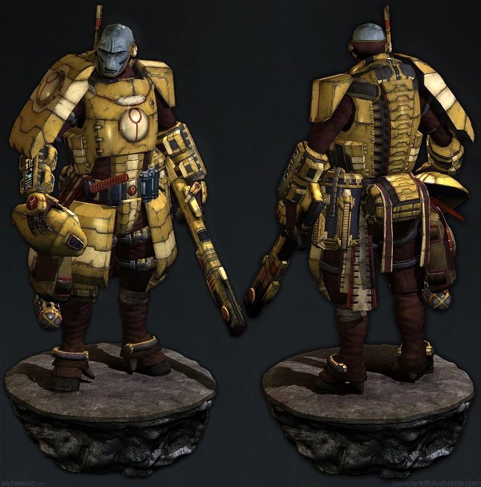

{.newpage}

### T'au

Les T'au sont une espèce intelligente, jeune, humanoïde et technologiquement avancée, qui se bat pour étendre son idéal du « Bien Suprême » à toutes les espèces intelligentes de la galaxie. Les T'au se présentent comme une espèce pacifique dans la mesure du possible, mais peuvent conquérir une planète lorsque leurs tentatives de paix sont rejetées.

La société T'au est dirigée par une caste secrète connue sous le nom d’Éthérés, qui parvient sans peine à s’imposer le respect des T'au. Cela a conduit les adversaires des T'au à se demander si la caste des Éthérés ne cachait pas un secret derrière ses capacités de leadership.

La société T'au est divisée en plusieurs castes, chacune étant génétiquement adaptée à une fonction spécifique afin de servir au mieux les intérêts de la société.

#### Traits des T'au

**Âge.** Les T'au ont une espérance de vie à peu près équivalente à celle des humains.

**Alignement.** Les T'au ont une forte tendance à adopter des alignements « ordonné » lorsqu’ils servent le Bien Suprême.

**Taille.** Les T'au mesurent environ 1,5 mètre de haut, les plus grands atteignant à peine moins de 1,8 mètre, et pèsent entre 50 et 90 kilogrammes. Votre taille est « moyenne ».

**Vitesse.** Votre vitesse de marche est de 9 mètres.

**Résistance psychique.** Vous bénéficiez d’un avantage aux jets de sauvegarde de Sagesse et de Charisme contre les pouvoirs psychiques.

**Intolérance au Warp.** Vous êtes incapable de manifester des pouvoirs psychiques. Vous ne pouvez pas gagner de niveaux dans une classe dotée de la capacité de lanceur de sort.

**Langues.** Vous pouvez parler, lire et écrire le T'au et le bas gothique.

**Caste d'origine.** Du fait de votre naissance, vous appartenez à l'une des castes de l'empire T'au. Choisissez-en une parmis celles disponibles.

#### La caste de l’Air

En tant que membre de la caste de l’Air, vous êtes doué pour piloter des véhicules et pouvez ainsi remplir le rôle de pilote dont les T'au ont besoin.

**Augmentation des caractéristiques.** Votre score de Dextérité augmente de 2 et votre score d’Intelligence augmente de 1.

**Pilote.** Vous maîtrisez la compétence Pilotage.

**Mouvement sans entrave.** Vous ignorez les pénalités de mouvement liées aux terrains difficiles non améliorés.

**Résistance au froid.** Vous résistez aux dégâts de froid. De plus, vous êtes naturellement adapté aux hautes altitudes.

#### La caste de la Terre

Vous possédez une robustesse naturelle et êtes capable de porter de lourdes charges sans difficulté.

**Augmentation des caractéristiques.** Votre score de Constitution augmente de 2 et votre score d’Intelligence augmente de 1.

**Résistance à l’acide.** Votre peau est plus résistante que celle de la plupart des gens. Vous êtes résistant aux dégâts d’acide.

**Corpulence imposante.** Vous comptez pour une taille supérieure lors du calcul de votre capacité de charge et du poids que vous pouvez pousser, traîner ou soulever.

**Artisan expert.** Vous pouvez reproduire les œuvres artisanales d’autres créatures. Vous bénéficiez d’un avantage lors de tous les jets effectués pour produire des répliques d’objets existants, tels que des meubles, des emblèmes héraldiques et des armes, à condition de disposer d’un modèle ainsi que des matériaux et outils nécessaires.

#### La caste du Feu

Vous avez été élevé pour la guerre et êtes devenu résistant aux feux qu’elle engendre.

**Augmentation des caractéristiques.** Votre score de Dextérité augmente de 2 et votre score de Force augmente de 1.

**Entraînement T'au.** Vous maîtrisez deux armes de votre choix ainsi que le port d’une armure légère.

**Résistance au feu.** Vous bénéficiez d’une résistance aux dégâts de feu.

**Précision T'au.** Attaquer à longue portée ne vous impose pas de désavantage lors de vos jets d’attaque avec une arme à distance.

#### La caste de l’Eau

Vous êtes adapté à la vie aquatique et êtes un négociateur et un orateur né.

**Augmentation des caractéristiques.** Votre score de Charisme augmente de 2 et votre score d’Intelligence augmente de 1.

**Amphibie.** Vous pouvez respirer aussi bien dans l’air que dans l’eau.

**Nager.** Vous avez une vitesse de nage de 9 mètres et vous êtes naturellement acclimaté aux environnements sous-marins profonds, comme décrit au chapitre 5 du Guide du Maître du Donjon.

**Entraînement de la caste de l’Eau.** Vous maîtrisez deux des compétences suivantes de votre choix : Perspicacité, Intimidation, Art de la scène et Persuasion.

**Processus diplomatique.** Lorsque vous interagissez avec une créature, par exemple lors d’un troc ou d’une négociation, vous pouvez choisir d’effectuer des tests de compétence de Charisme (Persuasion) et de Sagesse (Perspicacité) avec avantage pendant dix minutes (aucune action requise). Une fois que vous avez utilisé ce trait, vous ne pouvez plus l’utiliser avant d’avoir effectué un long repos.

**Langue supplémentaire.** Vous apprenez une langue supplémentaire de votre choix.
