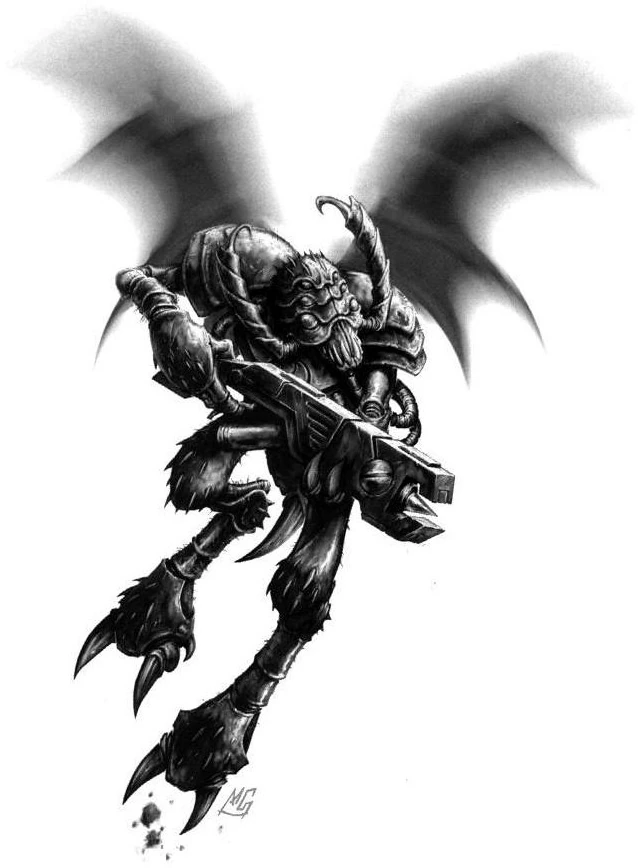

{.newpage}

#### Vespide

L'espèce des Vespides est composée d'humanoïdes recouverts d'une substance semblable à de la chitine et dotés d'ailes qui en font un atout précieux sur le champ de bataille. Combattant aux côtés des Tau au sein d'unités auxiliaires, de reconnaissance et d'escarmouche, les Vespides constituent l'un des principaux atouts permettant aux Tau d'affronter les Space Marines au combat, grâce à leur habileté à contourner l'ennemi et à leur grande mobilité. Les Impériaux appellent les Vespides les « ailes-aiguilles ». Les Vespides possèdent trois yeux sur la tête, et leur bouche est constituée d’un ensemble de mandibules et de protubérances acérées comme des lames de rasoir. Les Vespides forment des groupes appelés « souches » et sont très recherchés en tant que mercenaires et au sein de l’armée Tau.

##### Traits des Vespides

**Augmentation des caractéristiques.**  Votre caractéristique de Dextérité augmente de 2, et votre caractéristique de Sagesse augmente de 1.

**Âge.** Les Vespids atteignent rapidement la maturité, devenant adultes vers l’âge de 5 ans. Ils peuvent vivre jusqu’à plus de 60 ans.

**Alignement.**  Les Vespids sont des citoyens de l’Empire Tau, ce qui les prédispose à des alignements ordonnés.

**Taille.** Les Vespids sont légèrement plus grands que les humains standard, mesurant un peu plus de 1,8 mètre. Leur exosquelette chitineux leur permet de peser moins lourd que les humains standard, soit environ 40 à 80 kilogrammes. Votre taille est Moyenne.

**Vitesse.** Votre vitesse de marche de base est de 7 mètres.

**Morsure.** Vous disposez d’une gueule munie de crocs qui peut servir d’arme naturelle. Votre morsure inflige 1d6 + votre modificateur de Force en dégâts cinétiques.

**Vol.** Vous disposez d’une vitesse de vol de 15 mètres. Pour utiliser cette vitesse, vous ne devez pas porter d’armure moyenne ou lourde.

**Armure naturelle.** Votre armure chitineuse protège votre corps. Lorsque vous ne portez pas d’armure, votre CA est de 12 + votre modificateur de Dextérité. Vous pouvez utiliser votre armure naturelle pour déterminer votre CA si l’armure que vous portez vous confère un CA inférieur. Les avantages d’un bouclier s’appliquent normalement lorsque vous utilisez votre armure naturelle.

**Langues.** Vous pouvez parler, lire et écrire le bas gothique bas, le tau et le vespid.
