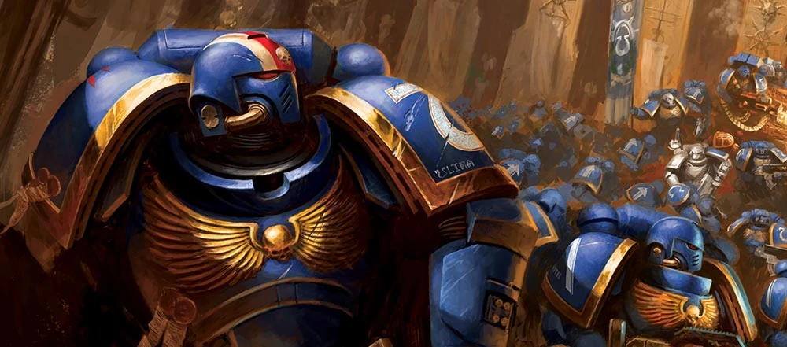

## Les Space Marines {#space-marines}

{.wide  height=4cm}

Les Space Marines, ou Adeptus Astartes, sont des guerriers transhumains créés par l'Empereur pour défendre l'Humanité. Recrutés dès leur plus jeune âge, ils subissent de profondes modifications génétiques et chirurgicales qui font d'eux des combattants d'une force, d'une endurance et d'une longévité bien supérieures à celles d'un humain ordinaire.

Chaque Space Marine appartient à un Chapitre, une Légion ou une autre confrérie guerrière possédant ses propres traditions et doctrines. Si la plupart servent fidèlement l'Imperium, ou ont rejoint les forces du Chaos. Malgré leurs différences, tous ont une existence entièrement consacrée à la guerre.

Avant de devenir des frères de bataille à part entière, les aspirants servent comme Scouts, achevant leur transformation et leur entraînement.

!!! note "du Scout au Frère de Bataille"

    Dans ce supplément, les Scouts Space Marines représentent cette période de formation et sont conçus pour être joués dès les premiers niveaux, tandis que les Space Marines représentent des Astartes pleinement accomplis, adaptés à des campagnes de plus haut niveau.

    Si il est prévu de faire commencer un personnage "SpaceMarine" au niveau 1, il est recommandé de :

    - **Commencer** le personnage en tant que **Scout Marine** comme un personnage classique, et le conserver **jusqu'à niveau 4**.
    - **Lors du passage au niveau 5**, pour marquer l'entré du novice dans la confrérie des frères de bataille, de **refaire une fiche de SpaceMarine niveau 5**.

!!! warning "Equilibrage"

    Les Space Marines **ne sont PAS équilibrés** et sont intentionnellement **conçus pour être plus puissants** que les personnages classiques.

    Seuls les Scout Marines sont destinés à être joués aux côtés des autres espèces.

