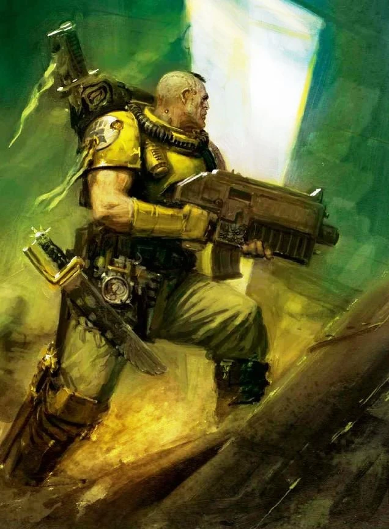

{.newpage height=8cm}

### Scout Space Marine

Les Space Marines sont des guerriers surhumains, fruits d’expériences biologiques et génétiques de haut vol. Ceux qui viennent d’entamer leur parcours pour devenir ces titans surhumains doivent d’abord commencer leur vie en tant que Scout Marine, après s’être déjà vu implanter de nouveaux organes qui leur confèrent une constitution plus résistante et plus robuste.

!!! note "Au sujet des Scout Space Marines"

    **Équilibrage.** Les Scout Marines sont conçus pour être équilibrés vis-a-vis des autres espèces de ce livre de règle.

    **Niveau.** Si il est prévu de faire commencer un personnage "SpaceMarine" au niveau 1, il est recommandé de :

    - **Commencer** le personnage en tant que **Scout Marine** comme un personnage classique, et le conserver **jusqu'à niveau 4**.
    - **Lors du passage au niveau 5**, pour marquer l'entré du novice dans la confrérie des frères de bataille, de **refaire une fiche de SpaceMarine niveau 5**.

#### Traits des Scouts

**Augmentation des caractéristiques.** Votre score de Force augmente de 2, et votre score de Constitution augmente de 1.
Et ils ne connaîtront pas la peur. Vous bénéficiez d’un avantage aux jets de sauvegarde contre l’effroi.

**Âge.** Les Space Marines, selon leur chapitre, peuvent achever leur formation d’éclaireur entre 18 et 50 ans. Les Space Marines peuvent vivre jusqu’à plusieurs milliers d’années, mais beaucoup récoltent les fruits de leur devoir bien avant cela.

**Alignement.** La plupart des Space Marines sont loyaux et croient fermement en une forme de hiérarchie, qu’elle soit au service du Chaos ou de l’Empereur de l’Humanité.

**Taille.** Les Scout SpaceMarines mesurent entre 2 et 2,5 mètres de haut, les plus exceptionnels pouvant atteindre 2,8 mètres ou plus. Leur poids moyen est d’environ 100 kilogramme livres. Votre taille est Moyenne.

**Vitesse.** Votre vitesse de marche de base est de 9 mètres.

**Vision dans le noir.** Vous pouvez voir dans la pénombre jusqu’à 60 pieds autour de vous comme s’il s’agissait d’une lumière vive, et dans l’obscurité comme s’il s’agissait d’une pénombre. Vous ne pouvez pas distinguer les couleurs dans l’obscurité, seulement des nuances de gris.

**Biologie surhumaines.** Vos implants vous confèrent une endurance surhumaine, vous offrant les avantages suivants :

- Vous pouvez résister deux fois plus longtemps aux effets du manque de sommeil, de la déshydratation, de la famine et des températures extrêmes (chaleur ou froid) de l’environnement avant de subir des pénalités.
- Vous bénéficiez d’une résistance aux dégâts de poison et d’un avantage aux jets de sauvegarde contre l’empoisonnement et contre les maladies non amplifiées.

**Athlétisme.** Vous maîtrisez la compétence Athlétisme.

**Corpulence puissante.** Vous êtes considéré comme étant d’une taille supérieure lors du calcul de votre capacité de charge et du poids que vous pouvez pousser, traîner ou soulever.

**Formation d’éclaireur.** Vous maîtrisez les armures légères, les armures moyennes, les boucliers et deux armes de votre choix. Vos attaques à mains nues infligent 1d4 + votre modificateur de Force en dégâts cinétiques.

**Langues.** Vous parlez, lisez et écrivez le bas gothique et le haut gothique.
