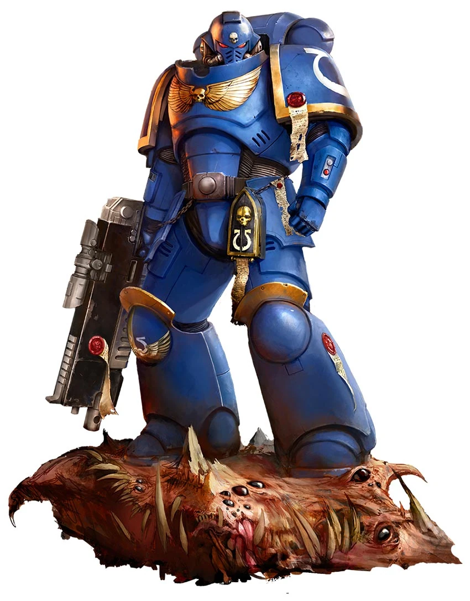

{.newpage height=8cm}

### Space Marine

Les Space Marines, ou Adeptus Astartes, sont des guerriers transhumains créés par l'Empereur de l'Humanité pour défendre l'Imperium contre ses innombrables ennemis. Recrutés dès leur plus jeune âge parmi les populations les plus résistantes de la galaxie, ils subissent une série de modifications génétiques et chirurgicales qui les transforment en combattants d'une puissance, d'une endurance et d'une longévité largement supérieures à celles d'un humain ordinaire.

Chaque Space Marine appartient à un Chapitre, une confrérie guerrière possédant ses propres traditions, doctrines et spécialisations militaires. Bien que tous partagent un héritage commun issu des Primarques, certains privilégient les assauts frontaux, d'autres excellent dans les sièges, les opérations furtives ou les campagnes de longue durée. Leur entraînement impitoyable et leur foi inébranlable font d'eux les soldats les plus redoutés de l'Imperium.

Tous les Space Marines ne demeurent cependant pas fidèles à l'Empereur. Lors de l'Hérésie d'Horus, plusieurs Légions trahirent l'Imperium et se vouèrent aux Dieux du Chaos. Ces Space Marines du Chaos errent depuis dix millénaires dans les profondeurs du Warp ou aux confins de la galaxie, menant une guerre éternelle contre leurs anciens frères. D'autres renégats, sans pour autant servir les Puissances de la Ruine, suivent leur propre voie, rejetant l'autorité impériale tout en conservant les capacités extraordinaires propres aux Astartes.

Qu'ils soient de loyaux défenseurs de l'Humanité, champions des Dieux Sombres ou guerriers renégats poursuivant leurs propres desseins, les Space Marines incarnent l'apogée de l'art de la guerre. Là où un soldat ordinaire verrait une bataille désespérée, un Astartes n'aperçoit qu'une mission à accomplir.

!!! warning "Au sujet des SpaceMarines"

    Les Space Marines ne sont pas créés de la même manière que les espèces classiques. Au lieu de choisir un historique, vous choisissirez un chapitre/légion d'origine et un role tactique.

    **Équilibrage.** Les Space Marines **ne sont PAS équilibrés** selon les règles standard de création de groupe et sont intentionnellement conçus pour être plus puissants que les personnages classiques. Les Scout Marines sont destinés à être joués aux côtés des espèces classiques.

    **Différence de puissance.** Votre Maitre-du-Jeu doit garder à l’esprit que les Space Marines sont conçus pour être plus puissants que les races classiques et doit s’organiser en conséquence.

    **Niveau.** Il est recommandé que, si un Space Marine fait partie de votre campagne en tant que personnage de joueur utilisant ces règles, il soit au moins de niveau 5 afin de refléter sa force et son entraînement. Si il est prévu de faire commencer le personnage niveau 1, il est recommandé de commencer le personnage via le "Scout Marine" jusqu'à niveau 4.
    Lors du passage au niveau 5, il est recommandé de refaire une fiche personnage complète en Space Marine directement niveau 5.

    **Caractéristiques améliorées.** Si vous utilisez la grille standard pour déterminer vos caractéristiques, il est recommandé d’utiliser plutôt les valeurs suivantes : 17, 15, 14, 13, 12, 10.

#### Traits des Space Marines

Tous les Space Marines possèdent les mêmes caractéristiques de base, issues de leurs modifications génétiques et de leur entraînement initial. Chaque Space Marine présente les caractéristiques suivantes :

**Augmentation des caractéristiques.**  Votre score de Force augmente de 2 et votre score de Constitution augmente de 1.

**Âge.** Selon leur chapitre, les Space Marines peuvent achever leur formation d’éclaireur entre 18 et 50 ans. Ils peuvent vivre jusqu’à plusieurs milliers d’années, mais beaucoup récoltent les fruits de leur devoir bien avant d’atteindre cet âge.

**Alignement.** La plupart des Space Marines sont loyaux et croient fermement en une forme de hiérarchie, qu’elle soit au service du Chaos ou de l’Empereur de l’Humanité.

**Taille.** Les Scout SpaceMarines mesurent entre 2 et 2,5 mètres de haut, les plus exceptionnels pouvant atteindre 2,8 mètres ou plus. Leur poids moyen est d’environ 100 kilogramme. Votre taille est Moyenne.

**Vitesse.** Votre vitesse de marche de base est de 9 mètres.

**Et ils ne connaîtront pas la peur.** Vous êtes immunisé contre l’état « effrayé ».

**Vision dans le noir.** Vous pouvez voir dans la pénombre, dans un rayon de 18 mètres pieds autour de vous, comme s’il s’agissait d’une lumière vive, et dans l’obscurité totale comme s’il s’agissait d’une pénombre. Vous ne pouvez pas distinguer les couleurs dans l’obscurité, seulement des nuances de gris.

**Biologie surhumaines.** Vos implants vous confèrent une endurance surhumaine, vous offrant les avantages suivants :

-  Vous pouvez résister deux fois plus longtemps aux effets de la privation de sommeil, de la déshydratation, de la famine, ainsi qu’à la chaleur et au froid extrêmes de l’environnement avant de subir des pénalités.
- Vous bénéficiez d’une résistance aux dégâts de poison et d’un avantage aux jets de sauvegarde contre l’empoisonnement et contre les maladies non amplifiées.

**Athlétisme.** Vous maîtrisez la compétence Athlétisme.

**Corpulence puissante.** Vous êtes considéré comme étant d’une taille supérieure lors du calcul de votre capacité de charge et du poids que vous pouvez pousser, traîner ou soulever.

**Formation d’éclaireur.** Vous maîtrisez les armures légères, les armures moyennes, les boucliers et deux armes de votre choix. Vos attaques à mains nues infligent 1d4 + votre modificateur de Force en dégâts cinétiques.

**Langues.** Vous parlez, lisez et écrivez le bas gothique et le haut gothique.

**Origine.** En tant qu'être transformé, vous avez tout oublié de votre vie passée. De ce fait, vous ne choisissez pas d'historique. A la place vous choisissez votre origine (Chapitre, Légion, bande de guerre, ...) et un rôle tactique.
