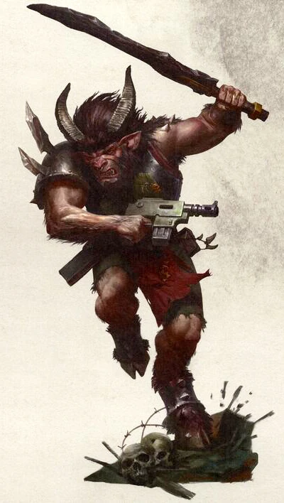

/newline

#### Homme-bête {.newpage}

Dans le foyer de bien des mères en deuil, un enfant est venu au monde dans un état bien pire que la mort. Des cornes tordues s’enroulent autour de la bouche de la chèvre qui appelle sa mère. Un homme-bête vient de naître. Au sein de l’Imperium, ces abominations répugnantes sont considérées, au mieux, comme tolérables. Au pire, la famille qui a donné naissance à une telle créature fait l’objet d’une enquête menée par les forces de police locales, voire par l’Inquisition elle-même.
Quelle qu’en soit la raison, les hommes-bêtes sont généralement mis au travail de l’une des deux manières suivantes, s’ils ont la chance d’être épargnés : soit envoyés dans une mine oubliée, où ils trimeront comme des esclaves jusqu’à la fin de leur misérable existence, soit enrôlés dans les rangs de la Garde Impériale — au moins, dans la mort, ils pourront être validés aux yeux de l’Empereur, si jamais Celui-ci se montre miséricordieux envers une créature aussi misérable.
De nombreux mondes sauvages, mondes féodaux et colonies pénitentiaires ont recours aux hommes-bêtes, car leur force physique brute trouve des applications sur ces planètes reculées prêtes à fermer les yeux sur une telle difformité. Malgré ces difformités, la plupart des hommes-bêtes se montreraient remarquablement loyaux envers ceux qui les traitent bien.
Pourtant, de nombreux hommes-bêtes sont tombés entre les griffes du Chaos, se délectant des dons des Dieux Sombres.

##### Traits des hommes-bêtes

**Augmentation recommandée des caractéristiques.** Votre caractéristique de Force augmente de 2, et votre caractéristique de Constitution augmente de 1.

**Alignement.**Les hommes-bêtes ont tendance à adopter des alignements chaotiques et ne penchent ni vers le bien ni vers le mal. Si un homme-bête est créé par la souillure du Warp, il peut être plus enclin à une disposition maléfique.

**Taille.** Les hommes-bêtes mesurent en moyenne plus de 1,8 mètre et ont une carrure trapue. Votre taille est Moyenne.

**Vitesse.** Votre vitesse de marche de base est de 9 mètres.

**Coup de tête.** Vous pouvez utiliser votre tête et vos cornes comme armes naturelles pour effectuer des attaques à mains nues. Si vous touchez votre adversaire, vous infligez des dégâts cinétiques égaux à 1d6 + votre modificateur de Force.

**Charge aux cornes.** Après vous être déplacé d’au moins 6 mètres pieds en ligne droite pendant votre tour, vous pouvez effectuer une attaque de mêlée avec vos armes naturelles en tant qu’action bonus.

**Coups martelants.** Immédiatement après avoir touché une créature avec une attaque au corps à corps dans le cadre de l’action d’attaque de votre tour, vous pouvez utiliser une action bonus pour tenter de bousculer cette cible avec votre tête ou vos cornes. La cible ne doit pas être de plus d’une taille supérieure à la vôtre et doit se trouver à moins de 1,5 mètre de vous. À moins qu’elle ne réussisse un jet de sauvegarde de Force contre un DD égal à 8 + votre bonus de compétence + votre modificateur de Force, vous la repoussez jusqu’à 10 pieds de vous.

**Instincts bestiaux.** Vous possédez une compétence dans l’une des disciplines suivantes de votre choix : Athlétisme, Intimidation, Perception ou Survie.

**Langues.** Vous pouvez parler, lire et écrire le gothique bas, ainsi qu’une des langues suivantes : le chaos, l’hérétique, les codes impériaux ou le tribal

