### Chapitres / Légions

Chaque Space Marine a une histoire complexe liée à son chapitre, à sa légion ou à sa bande de guerre, ainsi qu’une relation compliquée avec son primarque. On parle simplement de son « origine », mais celle-ci peut aller du statut de membre d’une flotte d’assaut en croisade à travers la galaxie à celui d’un groupe hétéroclite de pirates.

Sélectionnez votre origine en fonction de votre passé ou de la provenance présumée de votre graine génétique d’origine. Si votre passé ou votre primarque est inconnu, une option " Origine Inconnue " est prévue à cet effet.

Dans tout les cas, après avoir choisie l’une des origines ci-dessous, ajoutez ses traits à votre fiche de personnage et tout équipement de départ à votre inventaire.

#### L'Alpha Légion

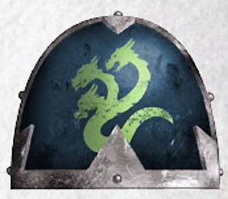{height=3cm}

Alpharius et Omegon, les primarques jumeaux connus sous le nom d’Hydra, se sont spécialisés dans la furtivité et la ruse pour venir à bout de tous leurs ennemis.

**Augmentation du score de capacité.** Votre score de Charisme augmente de 1.

**Entraînement Alpha.** Vous pouvez choisir deux des compétences suivantes pour acquérir une maîtrise : Enquête, Intimidation, Perspicacité, Représentation et Tromperie De plus, si vous maîtrisez déjà l’une de ces compétences, vous pouvez choisir d’acquérir une expertise dans celle-ci, ce qui vous permet d’ajouter le double de votre bonus de maîtrise aux jets de compétence que vous effectuez avec cette compétence.

**Déguisement fraternel.** En l’espace de 10 minutes, vous pouvez remodeler votre armure pour qu’elle ressemble à s’y méprendre à une autre armure que vous avez déjà vue.

**Maîtrises supplémentaires.** Vous maîtrisez le kit de déguisement et le kit de falsification.

**Langues supplémentaires.** Vous pouvez parler, lire et écrire deux langues de votre choix.

**Équipement de départ supplémentaire.** Un kit de déguisement et un kit de falsification, un symbole sacré (aquila) ou un symbole impie (n’importe quel dieu du chaos), ainsi qu’un message crypté rédigé par l’un de vos frères d’armes.

#### La Légion Noire / Black Legion

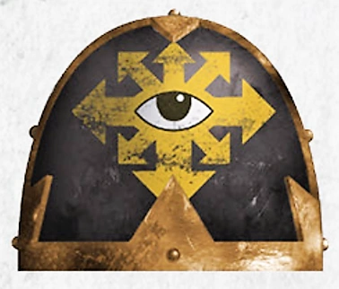{height=3cm}

La légion qu’Horus avait autrefois fondée est devenue la Légion Noire après l’hérésie. La Légion Noire est un phare pour les puissances du Chaos Indivisible et compte parmi ses rangs certaines des plus grandes bandes de guerriers de la galaxie.

**Augmentation d’un score de capacité.** Un score de capacité de votre choix augmente de 1.

**Malédiction du maître de guerre.** Lorsque vous voyez un jet d’attaque, un jet de sauvegarde ou un test de capacité effectué à moins de 60 pieds de vous, vous pouvez changer le résultat du d20 pour qu’il devienne un 1. Une fois que vous avez utilisé cette capacité, vous ne pouvez plus l’utiliser avant d’avoir effectué un long repos.

**Résistances impies.** Vous bénéficiez d’une résistance aux dégâts radiants et nécrotiques.

**Langues supplémentaires.** Vous pouvez parler, lire et écrire le chaos et l’hérétique.

**Équipement de départ supplémentaire.** Un symbole impie (chaos indivis), un insigne heraldique pris à une autre légion, et un bibelot provenant de votre ancienne légion, de votre ancien chapitre ou de votre ancienne bande de guerre.

#### Les Blood Angels

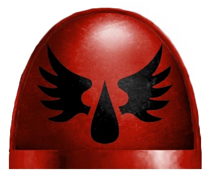{height=3cm}

Sanguinius, en proie à des accès de rage noire, trouva la mort lors d’un combat final contre l’archi-traître Horus. Sa légion a hérité de ce défaut et est en proie à des accès de rage et de folie ; lorsqu’elle atteint son paroxysme, elle revit les derniers instants de son primarque.

**Augmentation de caractéristique.** Votre score de Charisme augmente de 1.

**Fureur angélique.** Vous pouvez choisir d’ignorer le désavantage lors d’un jet d’attaque effectué avec une arme de mêlée. Vous pouvez utiliser ce trait un nombre de fois égal à votre bonus de compétence, et vous récupérez tous les usages dépensés à la fin d’un long repos.

**Art.** Vous gagnez la maîtrise d’un outil d’artisan ou d’un instrument de musique de votre choix.

**Langue supplémentaire.** Vous pouvez parler, lire et écrire les codes impériaux.

**Équipement de départ supplémentaire.** Un symbole sacré (aquila), un parchemin d’honneur détaillant l’une de vos victoires, un insigne représentant le symbole de votre Chapitre, ainsi qu’un outil d’artisan ou un instrument de musique dont vous maîtrisez l’utilisation.

#### Les Dark Angels

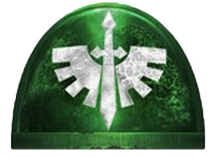{height=3cm}

Les Dark Angels sont considérés comme l’un des chapitres de Space Marines les plus puissants et les plus secrets. Leur primarque est Lion El'Jonson.

**Augmentation de caractéristique.** Votre score de Sagesse augmente de 1.

**Forteresse mentale.** Vous bénéficiez d’un avantage lors des jets de sauvegarde pour résister au charme et à la possession. Vous êtes immunisé contre la lecture de vos pensées, notamment par le pouvoir « Détection des pensées ». Les créatures ont un désavantage lors des tests de Perspicacité effectués à votre encontre.

**Résistance psychique.** Vous disposez d’une résistance aux dégâts psioniques.

**Langue supplémentaire.** Vous pouvez parler, lire et écrire les codes impériaux.

**Équipement de départ supplémentaire.** Un sceau de pureté, une tenue aux couleurs de votre chapitre et un symbole sacré (aquila).

#### La Death Guard

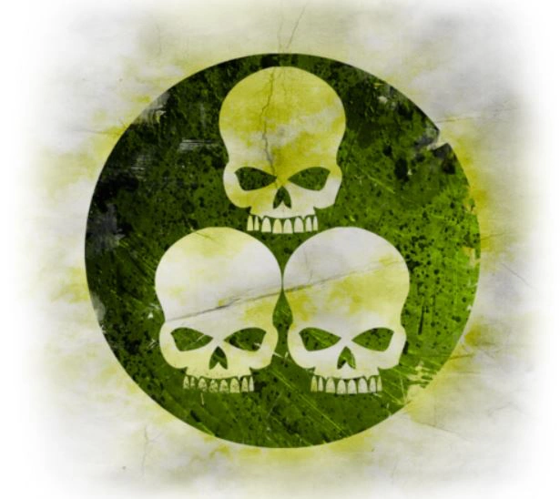{height=3cm}

Les membres de la Death Guard sont les fils de Mortarion et ont succombé à l’influence de Nurgle pendant l’Hérésie d’Horus.

**Augmentation des caractéristiques.** Votre caractéristique de Constitution augmente de 1.

**Immunité à la peste.** Vous êtes immunisé contre les dégâts de poison, l’état « empoisonné » et toutes les maladies. Vous pouvez toutefois être porteur de maladies malgré votre immunité.

**Robustesse surnaturelle.** Votre nombre maximal de points de vie augmente de 1, et il augmente de 1 à chaque fois que vous gagnez un niveau.

**Langue supplémentaire.** Vous pouvez parler, lire et écrire le Chaos.

**Équipement de départ supplémentaire.** Un symbole impie (Nurgle), un masque à gaz pouvant être intégré au casque de votre armure énergétique, une petite fiole contenant un virus ou une peste.

#### Les Emperor’s Children

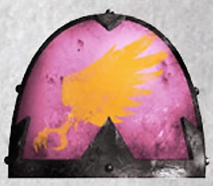{height=3cm}

Les Emperor’s Children se sont voués à Slaanesh et aspirent à la perfection sous tous ses aspects.

**Augmentation d’un score de caractéristique.** Votre score de Charisme augmente de 1.

**Quête de la perfection.** Choisissez une compétence dont le modificateur de caractéristique est l’Intelligence, la Sagesse ou le Charisme. Vous bénéficiez d’un avantage pour tous les jets effectués avec cette compétence.

**Compétences supplémentaires.** Vous maîtrisez l’utilisation du matériel de peintre.

**Langue supplémentaire.** Vous pouvez parler, lire et écrire le Chaos.

**Équipement de départ supplémentaire.** Un symbole impie (Slaanesh), du matériel de peintre et un esclave.

#### Les Imperial Fists

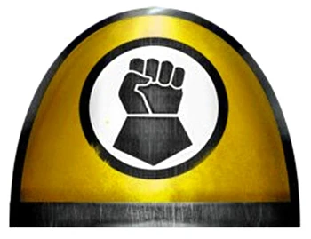{height=3cm}

Dorn, le prétorien de Terra, est réputé pour sa robustesse, sa détermination et son expertise en matière de guerre défensive. Ses fils suivent son exemple et servent fidèlement l’Empereur.

**Augmentation des caractéristiques.** Votre score de Constitution augmente de 1.

**Défenseur de Terra.** Vous et les créatures alliées situées à moins de 9 mètres de vous bénéficiez d’un bonus supplémentaire de +1 à la CA lorsque vous êtes à demi-couverture ou aux trois quarts de couverture. Ce bonus à la CA s’applique même si l’attaquant ignore la demi-couverture et les trois quarts de couverture. Ce trait ne fonctionne pas si vous êtes hors de combat.

**Désigner une couverture.** En tant qu’action, vous pouvez désigner un carré de 3 mètres comme couverture. Pendant 1 minute, vous et toutes les créatures alliées présentes dans cette zone bénéficiez d’une demi-couverture, et les créatures hostiles considèrent cette zone comme un terrain difficile. Une fois que vous avez utilisé ce trait, vous ne pouvez pas l’utiliser à nouveau avant d’avoir effectué un repos court ou long.

**Langue supplémentaire.** Vous pouvez parler, lire et écrire les codes impériaux.

**Équipement de départ supplémentaire.** Un symbole sacré (aquila), un morceau de fortification brisée récupéré lors d’une bataille précédente et une carte rudimentaire des plans de bataille d’une ancienne zone de guerre.

#### Les Iron Hands

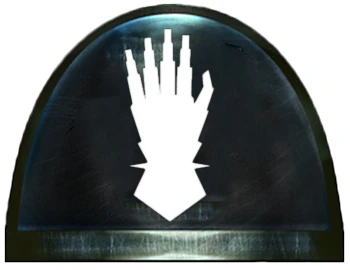{height=3cm}

Bouleversés par la mort de leur primarque, Ferrus Manus, les Iron Hands se sont consacrés à remplacer leur chair par des implants cybernétiques.

**Augmentation des caractéristiques.** Votre score d’Intelligence augmente de 1.

**La chair fragile.** Vous disposez d’un emplacement d’harmonisation supplémentaire pouvant être utilisé pour un implant cybernétique de rareté « peu commune » ou inférieure.

**Maîtrise des gadgets technologiques.** Vous maîtrisez deux gadgets technologiques de votre choix.

**Langue supplémentaire.** Vous pouvez parler, lire et écrire les codes impériaux.

**Équipement de départ supplémentaire.** Deux gadgets technologiques de votre choix, un implant cybernétique de rareté « peu commune » ou inférieure (déjà implanté), un symbole sacré (aquila).

#### Les Iron Warriors

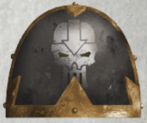{height=3cm}

Les Iron Warriors sont les rivaux des Imperial Fists de Dorn et sont passés maîtres dans l’art de la guerre de siège.

**Augmentation de caractéristique.** Votre score de Force augmente de 1.

**Guerre de siège.** Vos attaques ignorent la couverture « demi » et « trois quarts ». De plus, les créatures hostiles subissent un désavantage lors de leurs jets de sauvegarde contre vos grenades.

**Briseur de siège.** Vous infligez le double de dégâts aux objets et aux structures. Cela s’applique également lorsque vous posez des explosifs, car vous savez mieux que quiconque repérer les faiblesses structurelles.

**Langue supplémentaire.** Vous pouvez parler, lire et écrire l’hérétique.

**Équipement de départ supplémentaire.** Un symbole impie (Chaos Undivided), un trophée de guerre (tel qu’un casque ou une arme brisée) et une grenade krak.

#### Les Night Lords

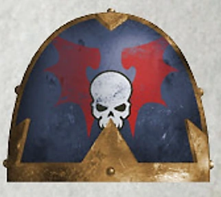{height=3cm}

La terreur est l’arme principale des Seigneurs de la Nuit, qui recourent à des tactiques de guérilla pour démoraliser et, à terme, soumettre quiconque s’oppose à eux.

**Augmentation de caractéristique.** Votre score de Dextérité augmente de 1.

**Entraînement à l’embuscade.** Le port d’une armure ne vous impose pas de désavantage lors de vos jets de Discrétion.

**Terreur du hanté.** En tant qu’action bonus, vous pouvez forcer les créatures de votre choix situées à moins de 10 pieds de vous à effectuer un jet de sauvegarde de Sagesse, dont la difficulté est égale à 8 + votre bonus de maîtrise + votre modificateur de Constitution. En cas d’échec, la créature est effrayée jusqu’à la fin de votre prochain tour. Une fois que vous avez utilisé cette capacité, vous ne pouvez pas l’utiliser à nouveau avant d’avoir effectué un repos court ou long.

**Maîtrises supplémentaires.** Vous maîtrisez le kit du tortionnaire.

**Langue supplémentaire.** Vous pouvez parler, lire et écrire l’hérétique.

**Équipement de départ supplémentaire.** Un symbole impie (Chaos Undivided), un souvenir d’une proie qui s’est échappée (comme une poignée de cheveux, une main coupée ou un pistolet laser cassé), une photo de la famille d’une victime passée et un kit de tortionnaire.

#### La Raven Guard

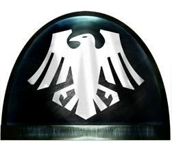{height=3cm}

Entraînés à la furtivité et aux embuscades, les Raven Guard, menés par Corvus Corax, étaient réputés pour leurs marines d’assaut et leurs tactiques de choc.

**Augmentation de caractéristique.** Votre score de Dextérité augmente de 1.

**Entraînement aux embuscades.** L’armure ne vous impose pas de désavantage lors de vos jets de Furtivité.

**Attaque sournoise.** Si vous surprenez une créature et que vous la touchez avec une attaque lors de votre premier tour de combat, cette attaque lui inflige 2d6 points de dégâts supplémentaires. Vous ne pouvez utiliser ce trait qu’une seule fois par combat.

**Langue supplémentaire.** Vous pouvez parler, lire et écrire les codes impériaux.

**Équipement de départ supplémentaire.** Un symbole sacré (aquila), un fragment décoratif de crâne ou de griffe de corbeau, et un bibelot provenant d’une victime précédente.

#### Les Salamandres

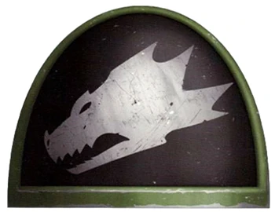{height=3cm}

Le primarque Vulkan a été découvert sur un monde féodal ; sa peau noire et cendrée le protégeait des flammes.

**Augmentation des caractéristiques.** Votre score de Constitution augmente de 1.

**Bénédiction de Vulkan.** Vous maîtrisez le pouvoir technologique « Améliorer une arme ». Vous pouvez lancer ce pouvoir technologique une fois, et vous retrouvez la capacité de le lancer à nouveau après avoir effectué un long repos.

**Résistance au feu.** Vous bénéficiez d’une résistance aux dégâts de feu. Vous êtes naturellement adapté aux climats chauds, comme décrit au chapitre 5 du Guide du Maître du Donjon.

**Compétence supplémentaire.** Vous maîtrisez l’utilisation des outils de forgeron.

**Langue supplémentaire.** Vous pouvez parler, lire et écrire les codes impériaux.

**Équipement de départ supplémentaire.** Un symbole sacré (aquila), une robe du Culte de Prométhée, un ensemble d’outils de forgeron et un souvenir de votre famille (tel qu’une photo, un pendentif ou un objet commémoratif).

#### Les Space Wolves

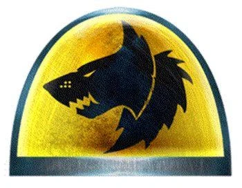{height=3cm}

Réputés pour leur fierté, leur fureur et leur robustesse, les Space Wolves font preuve d’une résistance aux températures extrêmes sans pareille parmi les autres Marines de leur genre.

**Augmentation d’un score de caractéristique.** Votre score de Force augmente de 1.

**Résistance au froid.** Vous bénéficiez d’une résistance aux dégâts de froid. Vous êtes naturellement adapté aux climats froids.

**Malédiction du Wulfen.** En tant qu’action bonus, vous pouvez puiser dans votre nature animale pour devenir sauvage et primitif. Pendant 1 minute, vous gagnez des points de vie temporaires égaux à votre niveau + votre modificateur de Constitution. Une fois que vous avez utilisé ce trait, vous ne pouvez pas l’utiliser à nouveau avant d’avoir effectué un repos court ou long.

**Compétence supplémentaire.** Vous maîtrisez l’utilisation du matériel de brasseur.

**Langue supplémentaire.** Vous pouvez parler, lire et écrire le tribal.

**Équipement de départ supplémentaire.** Du matériel de brasseur, ainsi qu’un bibelot provenant d’une proie, tel qu’un collier de dents, et une peau décorative drapée sur votre armure.

#### Les Thousand Sons

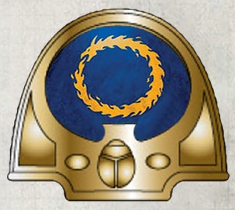{height=3cm}

Les Thousand Sons sont les fils de Magnus le Rouge, l’un des psioniques les plus puissants que l’on ait jamais connus, et ont hérité d’une fraction de son immense pouvoir.

**Augmentation de caractéristique.** Votre score d’Intelligence augmente de 1.

**Esprit protégé.** Vous bénéficiez d’un avantage aux jets de sauvegarde de Sagesse et de Charisme contre les pouvoirs psioniques.

**Potentiel psychique.** Vous maîtrisez un pouvoir psychique à volonté de votre choix.

**Langue supplémentaire.** Vous pouvez parler, lire et écrire le Chaos.

**Équipement de départ supplémentaire.** Un symbole impie (Tzeentch), un tome contenant des notes sur vos études, une petite fiole de poussière et un sablier.

#### Les Ultramarines

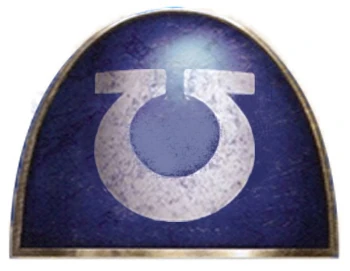{height=3cm}

Sous les ordres de Guilliman, les Ultramarines font preuve d’une grande expertise logistique et tactique.

**Augmentation des caractéristiques.** Votre score d’Intelligence augmente de 1.

**Conforme au Codex.** Vous pouvez ajouter le double de votre bonus de compétence aux tests d’Intelligence lorsque vous essayez de vous remémorer des tactiques, des stratégies, des batailles passées et des guerres menées.

**Supériorité d'Ultramar.** Lorsque vous effectuez un jet d’attaque, vous pouvez choisir de lancer un 1d6 et de l’ajouter au résultat. Si le résultat total est égal ou supérieur à 20 et que la cible est touchée, l’attaque est un coup critique. Une fois que vous avez utilisé ce trait, vous ne pouvez plus l’utiliser avant d’avoir effectué un repos court ou long.

**Langue supplémentaire.** Vous pouvez parler, lire et écrire les codes impériaux.

**Équipement de départ supplémentaire.** Un exemplaire du Codex Astartes, un symbole sacré (aquila) et un ensemble de sceaux décoratifs pouvant être apposés sur votre armure.

#### Les Word Bearers

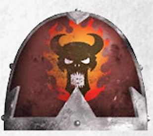{height=3cm}

Sous le commandement du primarque Lorgar, les Word Bearers vénéraient à l’origine l’Empereur de l’Humanité comme un dieu. Après que l’Empereur eut réprimandé Lorgar devant sa propre légion, les Word Bearers suivirent Lorgar dans le culte du Chaos Indivisible.

**Augmentation de caractéristique.** Votre score de Sagesse augmente de 1.

**Dévotion inébranlable.** Vous bénéficiez d’un avantage sur tous vos jets de sauvegarde de Sagesse.

**Compétence supplémentaire.** Vous maîtrisez l’utilisation du matériel de calligraphe.

**Langue supplémentaire.** Vous pouvez parler, lire et écrire le Chaos.

**Équipement de départ supplémentaire.** Matériel de calligraphe, un livre de proverbes impies, un symbole impie (Chaos Indivisible) et des écritures runiques pouvant être apposées sur votre armure et vos armes.

#### Les White Scars

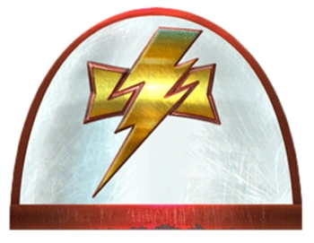{height=3cm}

Les White Scars sont réputés pour leurs stratégies de combat rapides et fulgurantes, qui leur permettent de submerger l’ennemi avant même qu’il n’ait le temps de réagir.

**Augmentation du score de capacité.** Votre score de Sagesse augmente de 1.

**Charge du Khan.** Si vous vous déplacez d’au moins 6 mètres et que *vous touchez une créature avec une attaque au corps à corps au cours du même tour, le premier jet de dégâts que vous effectuez ce tour-là inflige 5 points de dégâts supplémentaires du même type.

Vous pouvez également forcer la créature à effectuer un jet de sauvegarde de Force, dont la difficulté est égale à 8 + votre bonus de compétence + votre modificateur de Force. En cas d’échec, la créature peut être renversée ou repoussée jusqu’à 10 pieds.

**Compétences supplémentaires.** Vous êtes compétent en véhicules (terrestres).

**Langue supplémentaire.** Vous pouvez parler, lire et écrire le tribal.

**Équipement de départ supplémentaire.** Une peau d’animal tué pouvant être portée par-dessus votre armure, des trophées tels que des dents, des peaux ou des griffes d’animaux, un symbole sacré (aquila) et des parchemins relatant vos combats et victoires passés.

#### Les World Eaters

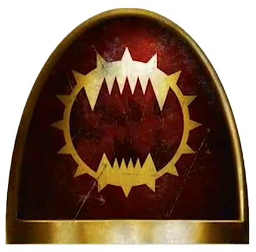{height=3cm}

Angron, équipé de prothèses cybernétiques cruelles appelées « Butcher’s Nails », a implanté ces mêmes prothèses au reste de sa légion, les plongeant dans la folie, la rage et la soif de sang. Angron a fini par succomber à Khorne dans sa folie, suivi de près par sa légion.

**Augmentation des caractéristiques.** Votre score de Force augmente de 1.

**Attaques sauvages.** Lorsque vous réussissez un coup critique avec une attaque à l’arme de mêlée, vous pouvez relancer une fois l’un des dés de dégâts de l’arme et ajouter ce résultat aux dégâts supplémentaires du coup critique.

**Langue supplémentaire.** Vous pouvez parler, lire et écrire le Chaos.

**Équipement de départ supplémentaire.** Un jeu de « Butcher’s Nails » (déjà implantés), un symbole impie de Khorne et un jeu de chaînes enroulées autour de votre armure énergétique ou de vos armes.

#### Origine Inconnue

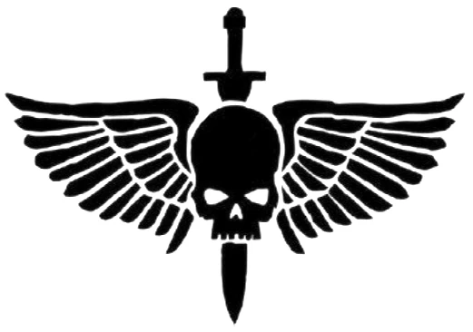{height=3cm}

Votre légion ou votre primarque est inconnu. Peut-être étiez-vous un renégat qui a décidé de se retourner contre votre légion ou votre chapitre, ou peut-être que l’ensemble de votre chapitre ignore tout simplement qui est son primarque. Quelle qu’en soit la raison, vous bénéficiez des traits suivants :

**Talent supplémentaire.** Vous gagnez un talent de votre choix.

**Maîtrise d’un outil.** Vous maîtrisez un ensemble d’outils, un gadget technologique ou un instrument de musique de votre choix.

**Langue supplémentaire.** Vous pouvez parler, lire et écrire une langue de votre choix.

**Équipement de départ supplémentaire.** Un ensemble d’outils, un gadget technologique ou un instrument de musique dont vous maîtrisez l’utilisation, un insigne de votre légion ou de votre chapitre, ainsi qu’un symbole sacré (aquila) ou un symbole impie (n’importe quel dieu du Chaos).
