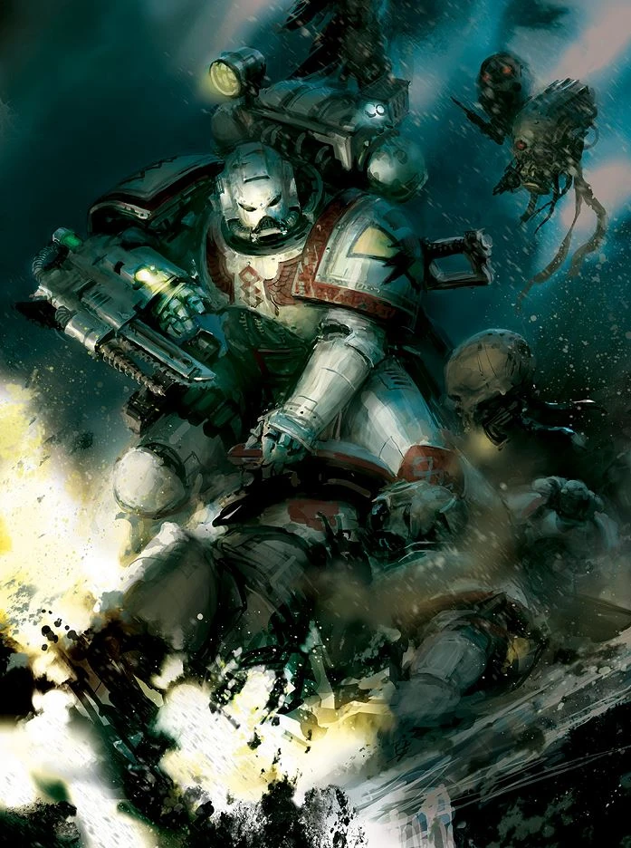
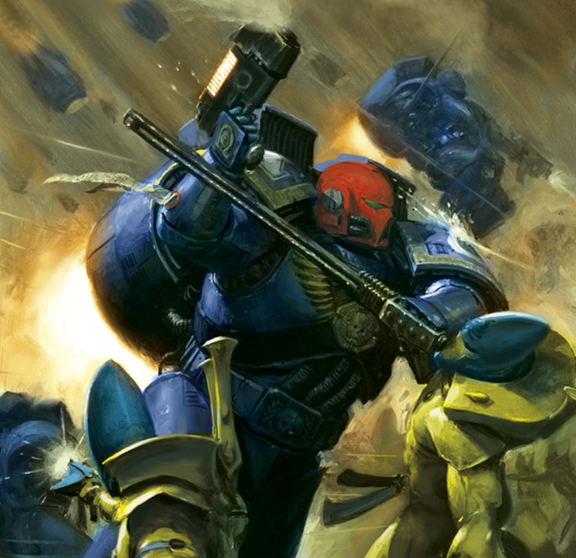
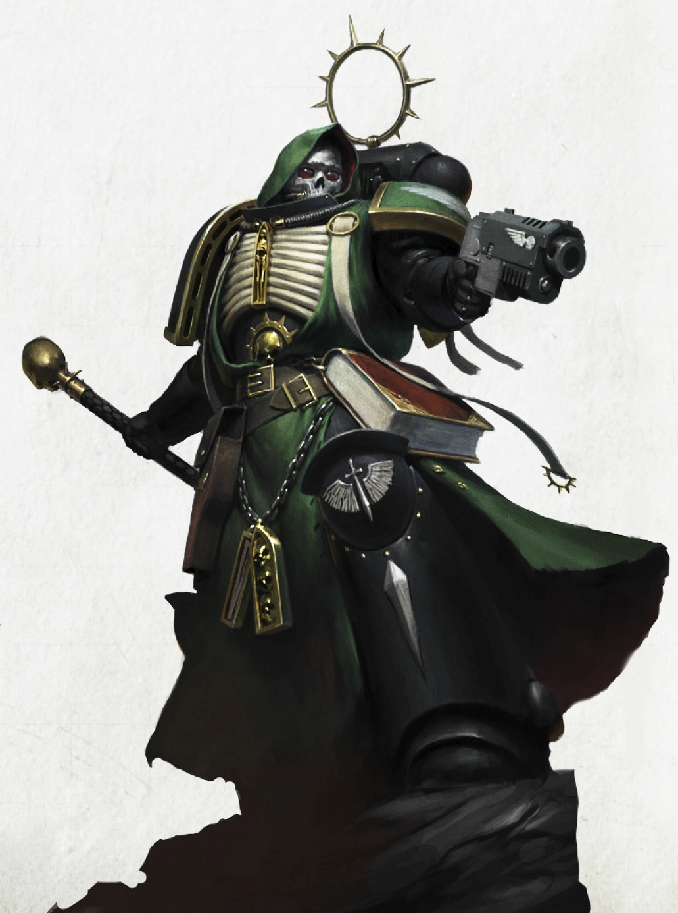
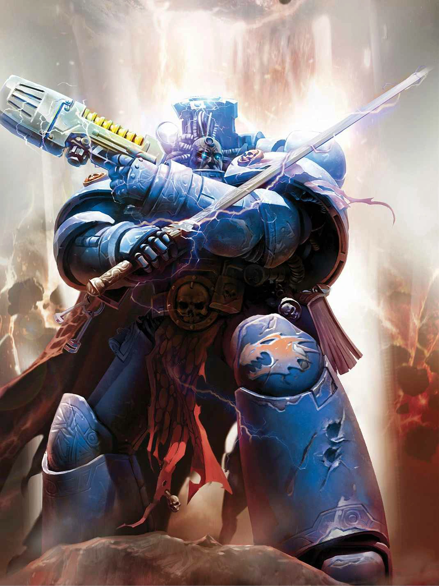
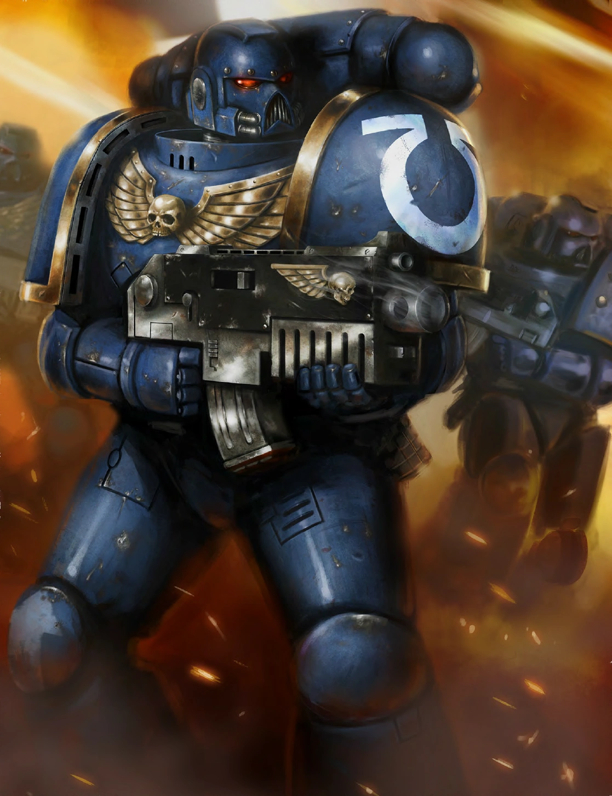
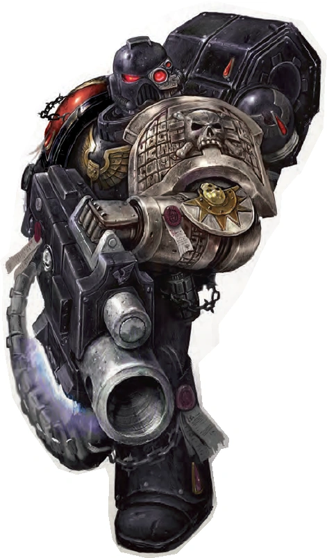
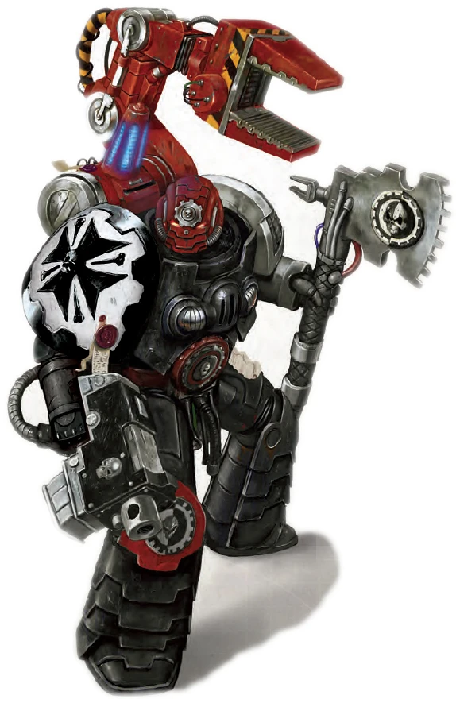

### Roles opérationnels

Bien que chaque Space Marine soit capable d’assumer pratiquement n’importe quel rôle nécessaire au combat, chacun est formé pour se spécialiser dans une mission spécifique afin de contribuer au mieux à l’effort de guerre. Au lieu de choisir un parcours, vous choisissez un rôle qui vous est attribué. De plus, vous commencez avec l’équipement prévu pour votre rôle plutôt qu’avec celui correspondant à votre classe de départ.

!!! note "Équipement des frères de bataille"

    Le guerrier de l'Adeptus Astartes ne se définit pas uniquement par sa force, mais également par les instruments sacrés qui lui sont confiés. Chaque arme est un héritage, chaque pièce d'armure un reliquaire de gloire, chaque sceau de pureté le témoignage des serments prononcés devant l'Empereur. Ces artefacts ont traversé les âges, survécu à d'innombrables campagnes et portent encore les cicatrices des guerres dont les annales impériales ont depuis longtemps oublié le nom.

Pour reflèter le caractère particulier de ces équipement, deux règles typographiques sont à bien comprendre :

- Si un objet comporte un nom entre parenthèses, cela indique les caractéristiques d’arme associées à cet objet. Par exemple, l’équipement de l’apothicaire comprend un narthecium (épée courte), ce qui signifie que cet objet peut utiliser les caractéristiques de l’épée courte au combat.
- Si l'objet est écris en *italique* c'est qu'il est considéré comme particulièrement rare et possède des effets spécifiques. Pour les connaître précisément il sera nécessaire de vous rendre à la section "*Équipement Avancé*" dans le supplément pour le Maître du jeu.

Choisissez l’un des rôles suivants :

#### Apothicaire

{height=6cm}

Afin de servir au mieux vos frères d’armes, vous veillez à leur santé physique et vous vous assurez qu’ils puissent se remettre le plus rapidement possible, tant au cœur des combats qu’après les missions. Vous êtes chargé de veiller à la santé de vos frères et, s’ils viennent à perdre la vie au combat, de récupérer leur précieuse graine génétique afin de créer de nouveaux frères d’armes pour compenser les pertes.

En tant qu’apothicaire, vous bénéficiez des avantages suivants, en lieu et place des avantages habituels liés à votre parcours :

**Compétences** : choisissez-en deux parmi Connaissances, Médecine, Nature et Technologie.

**Langues** : une de votre choix

**Maîtrise des outils** : matériel d’alchimiste, instruments de chirurgien, trousse d’empoisonneur

**Aptitude : Extraction de progenoïdes**

Vous êtes formé à l’extraction des glandes progenoïdes, appelées « geneseed », présentes chez les Space Marines. Pour extraire ces glandes, vous devez disposer d’un ensemble d’outils de chirurgien, d’un narthecium ou d’outils similaires. L’extraction sans risque des progenoïdes prend 1 minute.

**Équipement**

En tant qu’apothicaire, vous commencez avec l’équipement suivant, à la place de celui fourni par votre classe :

- (a) une armure énergétique légère ou (b) une armure énergétique
- (a) un pistolet léger *à bolts* avec deux chargeurs ou (b) un pistolet *à bolts* avec deux chargeurs
- (a) deux *armes tronçonneuse* ou (b) une *arme à énergie*
- (a) un paquetage d’explorateur ou (b) un paquetage de technologue
- Un casque de communication, un bouclier, un narthecium (griffes), deux grenades à fragmentation, deux *trousses de secours supérieures*, quatre *doses d’injectables médicaux* et un couteau de combat (épée courte)

#### Marine d'assaut

{height=6cm}

Les marines d'assaut constituent le bras armé du chapitre ; ils mettent à profit leurs accélérations fulgurantes pour percer les rangs ennemis en un clin d'œil. Recourant au combat rapproché et aux explosifs, ils passent souvent rapidement d'un objectif à l'autre, semant le chaos et la destruction grâce à leurs propulseurs de saut.

En tant que marine d'assaut, vous bénéficiez des avantages suivants, en lieu et place des avantages habituels liés à votre parcours :

**Compétences** : choisissez-en deux parmi Acrobatie, Intimidation, Perception et Pilotage.

**Maîtrise des outils** : Véhicules (aériens, terrestres)

**Aptitude : Déplacement éclair**

Lors d’un déplacement narratif, vous et jusqu’à 9 compagnons dotés d’une vitesse de vol pouvez vous déplacer deux fois plus vite tant que vous êtes équipé d’un jetpack ou d’un pack de saut.

**Équipement**

En tant que Marine d’assaut, vous commencez avec l’équipement suivant, à la place de celui fourni par votre classe :

- (a) une armure énergétique légère ou (b) une armure énergétique
- (a) un pistolet léger *à bolts* avec deux chargeurs ou (b) un pistolet *à bolts* avec deux chargeurs
- (a) deux *armes tronçonneuse* ou (b) une *arme à énergie* ou (c) une *griffe foudroyante*
- (a) une cape en caméléoline ou (b) des lunettes de vision nocturne ou (c) un étouffeur de bruit
- Un casque de communication, un paquetage d’explorateur, un propulseur de saut, deux grenades à fragmentation, un bouclier, deux *grenades krak* et un couteau de combat (épée courte).

#### Chaplain

{height=6cm}

En tant que Chapelain, votre mission consiste à veiller sur les reliques et les exploits historiques de votre chapitre, ainsi qu’à préserver sa glorieuse histoire. Vous devez notamment vous assurer que vos frères connaissent toujours leurs devoirs et qu’ils ne s’écartent jamais de la voie de la dévotion et de la droiture.

En tant que Chapelain, vous bénéficiez des avantages suivants, en lieu et place des avantages habituels liés à votre origine :

**Compétences** : choisissez-en deux parmi Intuition, Intimidation, Investigation et Persuasion.

**Langues** : une de votre choix

**Aptitude : Lien fraternel**

Votre présence apaise vos frères d’armes. Au début de votre tour, vous supprimez tout effet provoquant les états « ensorcelé » et « effrayé » sur vous-même et les créatures alliées situées à moins de 3 mètres de vous. Vous ne conférez pas cet avantage si vous êtes hors de combat.
Équipement de chapelain

En tant que chapelain, vous commencez avec l’équipement suivant, à la place de celui fourni par votre classe :

- (a) une armure énergétique légère ou (b) une armure énergétique
- (a) un pistolet léger *à bolts* avec deux chargeurs ou (b) un pistolet *à bolts* avec deux chargeurs
- (a) une *baguette de neutralisation* ou (b) un *champ de force personnel* ou (c) un *champ de résistance*
- (a) un paquetage de prêtre ou (b) un paquetage d’érudit
- Un casque-communicateur, un crozius arcanum (masse légère *énergétique*, masse d'arme ou marteau de combat), un livre de litanies, deux grenades à fragmentation et un couteau de combat (épée courte).

#### Librarian

{height=6cm}

Vous êtes Librarian, l’un des psykers engagés par vos frères Space Marines pour votre maîtrise et votre connaissance de l’Immaterium, ainsi que des créatures qui y vivent. Votre rôle en tant que Librarian consiste à gérer et à conserver les archives du chapitre, tout en utilisant vos pouvoirs uniques et destructeurs pour semer la mort parmi vos ennemis.

En tant que Librarian, vous bénéficiez des avantages suivants, à la place des avantages habituels liés à un passé :

**Compétences** : choisissez-en deux parmi Connaissances, Intuition, Investigation et Occultisme.

**Langues** : deux de votre choix

**Maîtrise des outils** : matériel de calligraphie

**Aptitude : Connaissance de l’Empyrée**

Vous possédez une connaissance approfondie des monstres qui peuplent l’Immaterium. Vous pouvez facilement vous remémorer des informations concernant les créatures qui y vivent, les Puissances Ruineuses, ainsi que leurs effets et leurs points forts généraux. Par exemple, vous savez que les Bloodletters excellent en combat au corps à corps, mais vous ignorez qu’ils possèdent le trait « Frénésie sanguinaire ».

**Équipement**

En tant que Librarian, vous commencez avec l’équipement suivant, à la place de celui fourni par votre classe :

- (a) une armure énergétique légère ou (b) une armure énergétique
- (a) une *arme à plasma* ou (b) une arme *à bolts*
- (a) un *sceau de protection contre la détection* ou (b) un traducteur de scribe
- Un casque de communication, un paquetage de savant, un grimoire ancien, un bouclier, deux grenades à fragmentation, un couteau de combat (épée courte) et une *arme de force*.

#### Marine tactique

{height=6cm}

En tant que marine tactique, vous êtes le pilier du chapitre. Capable de vous adapter à toutes les situations, vous êtes envoyé pour servir et exceller dans n’importe quelle zone de combat, que ce soit face à des hordes d’extraterrestres, à des adversaires furtifs ou à des ennemis venus d’au-delà.

En tant que marine tactique, vous bénéficiez des avantages suivants, à la place des avantages habituels liés à votre parcours :

**Maîtrise des compétences** : choisissez-en deux parmi Discrétion, Intimidation, Perception et Survie.

**Maîtrise des outils** : Véhicules (terrestres)

**Aptitude : Jamais pris au dépourvu**

En tant que Marine tactique, vous pouvez identifier d’autres groupes d’extraterrestres, d’ennemis, de frères d’armes et d’hérétiques grâce à leur héraldique et à leur technologie. Vous connaissez les noms et la réputation des commandants et des chefs de ces groupes, ainsi que leurs objectifs généraux et les stratégies qu’ils sont susceptibles d’employer.

**Équipement**

En tant que Marine Tactique, vous commencez avec l’équipement suivant, à la place de celui fourni par votre classe :

- (a) une armure énergétique légère ou (b) une armure énergétique
- (a) une *arme à plasma* ou (b) une arme *à bolts*
- (a) deux *armes tronçonneuse* ou (b) une *arme à énergie* ou (c) une *griffe foudroyante*
- (a) deux *grenades krak* ou (b) deux *trousses de secours améliorées* ou (c) des *lunettes de vision nocturne* ou (d) un *silencieux*
- Un casque de communication, un paquetage d’explorateur, un bouclier, deux grenades à fragmentation et un couteau de combat (épée courte).

#### Marine Devastator

{height=6cm}

En tant que marine Devastator, votre mission principale consiste à manier les armes de destruction au service de vos frères d’armes. Formé à l’art de la destruction et du chaos, vous anéantissez vos adversaires à distance et sapez les rangs ennemis depuis des positions fortifiées.

En tant que Marine Devastator, vous bénéficiez des avantages suivants, à la place des avantages habituels liés à un parcours :

**Compétences** : choisissez-en deux parmi Intimidation, Perception, Survie et Technologie.

**Aptitude : Contrôle des défauts**

Lorsque vous observez un objet, une structure ou un véhicule de près (à moins de 18 mètres), vous déterminez s’il présente des immunités aux dégâts, des résistances ou des vulnérabilités. De plus, vous pouvez consacrer 10 minutes à inspecter un objet, une structure ou un véhicule afin de déterminer s’il présente des faiblesses structurelles ou des défauts intrinsèques dans sa conception.

**Équipement**

En tant que Marine Dévastateur, vous commencez avec l’équipement suivant, à la place de celui fourni par votre classe :

- (a) une armure énergétique légère ou (b) une armure énergétique
- (a) un canon *à plasma* (canon d’assaut) avec deux cellules d’énergie ou (b) un canon *à bolts* (canon d’assaut) avec deux chargeurs
- (a) des *lunettes à détection automatique* ou (b) des *lunettes de vision nocturne*
- (a) une arme *tronçonneuse* ou (b) un pistolet *à bolts* avec deux chargeurs ou (c) un pistolet léger *à bolts* avec deux chargeurs
- Un casque de communication, un paquetage d’explorateur, deux grenades à fragmentation, un couteau de combat (épée courte).

#### Techmarine

{height=6cm}

En tant que Techmarine, vous faites le lien entre le Culte du Dieu-Machine et les Space Marines dont vous êtes le frère d’armes. Vous assurez l’entretien des armures, des armes, des véhicules et des machines que vos frères d’armes utilisent au combat, et vos implants cybernétiques uniques vous permettent de communiquer avec les esprits des machines qui résident au sein des équipements dont vous assurez la maintenance.

En tant que Techmarine, vous bénéficiez des avantages suivants, à la place des avantages habituels liés à votre parcours :

**Compétences** : choisissez-en deux parmi Investigation, Médecine, Pilotage et Technologie.

**Langues** : deux de votre choix

**Maîtrise des outils** : trousse de mécanicien, deux outils ou gadgets technologiques de votre choix, véhicules (terrestres, aériens)

**Aptitude : Implants du Culte de la Machine**

Vous possédez des implants cybernétiques issus du Culte de la Machine, qui vous permettent de vous mettre plus facilement en résonance avec les esprits des machines. Lorsque vous interagissez avec un objet technologique, tel qu’une arme, une machine ou un véhicule, vous êtes capable de communiquer avec son esprit. Vous pouvez découvrir l’âge de cet objet, l’humeur de son esprit, ainsi que savoir s’il a été consacré ou profané. Vous pouvez également découvrir d’autres caractéristiques de cet objet technologique, à la discrétion du MJ, en fonction de l’intelligence de l’esprit de la machine. Par exemple, un Land Raider peut disposer de connaissances plus étendues concernant les batailles auxquelles il a participé, tandis qu’un simple fusil laser ne saura peut-être que combien de fois il a tiré au cours de la dernière heure.

**Équipement**

En tant que Techmarine, vous commencez avec l’équipement suivant, à la place de celui fourni par votre classe :

- (a) une armure énergétique légère ou (b) une armure énergétique
- (a) un pistolet leger *à plasma* avec deux cellules d’énergie ou (b) un pistolet *à plasma* avec deux cellules d’énergie
- (a) un *omni-outil* (déjà implanté) ou (b) un *traducteur de scribe* ou (c) des *amplificateurs manuels* (déjà implantés)
- Un casque de communication, une arme *à bolts*, un paquetage de technologue, une *hache omnissienne*, un bouclier, deux grenades à fragmentation et un couteau de combat (épée courte).
