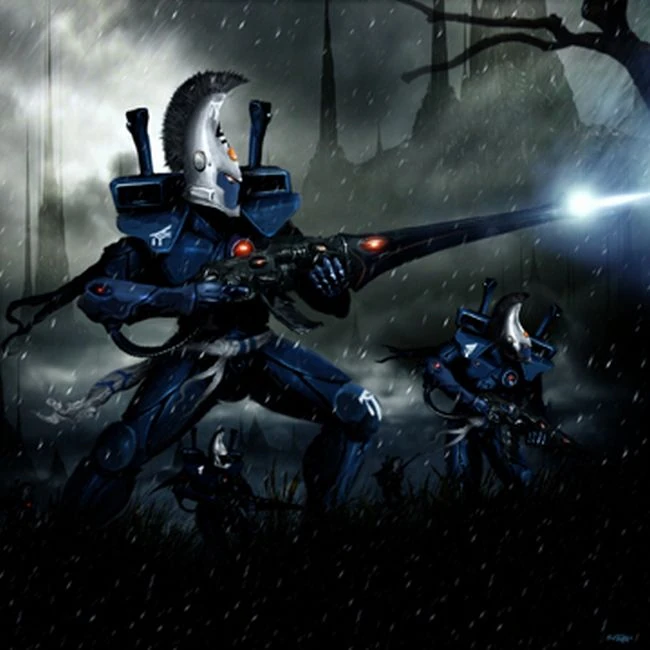

#### Vengeur Lugubre

{height=8cm}

#### Vengeur Lugubre

*Humanoïde (Asuryani) de taille moyenne, tout alignement loyal*

**Classe d'armure** 16 (armure composite)

**Points de vie** 60 (8d8+24)

**Vitesse** 9 m

FOR    | DEX    | CON    | INT    | SAG    | CHA
:---:  | :---:  | :---:  | :---:  | :---:  | :---:
13 (+1)| 16 (+3)| 14 (+2)| 12 (+1)| 15 (+2)| 12 (+1)

**Jets de sauvegarde** : For +4, Dex +6, Int +4, Sag +5

**Compétences** : Acrobatie +6, Athlétisme +5, Discretion +5, Perception +6

**Sens** : vision dans le noir 18 m., Perception passive 15

**Langues** : parle l'Aeldari et une autre

**Facteur de puissance** : 5 (1 800 XP)

##### Traits

**Évasion.** Si un Aeldari est soumis à un effet lui permettant d’effectuer un jet de sauvegarde de Dextérité pour ne subir que la moitié des dégâts, il ne subit aucun dégât s’il réussit son jet de sauvegarde, et seulement la moitié des dégâts s’il échoue.

**Agilité des Aeldari.** Les Aeldari peuvent effectuer les actions « Course » et « Désengagement » en tant qu’action bonus à chacun de leurs tours.

**Esprit clair.** L'Aeldari bénéficie d'un avantage aux jets de sauvegarde contre les effets de charme.

##### Actions

**Attaque multiple.** L’Aeldari effectue deux attaques.

**Rapier.** Attaque avec une arme de mêlée : +6 pour toucher, portée de 1,5 mètres, une cible. Touché : 7 (1d8+3) points de dégâts cinétiques.

**Fusil d’assaut.** Attaque avec une arme à distance : +6 pour toucher, portée de 30/120 mètres, une cible. En cas de coup réussi : 5 (1d10+3) points de dégâts cinétiques.

