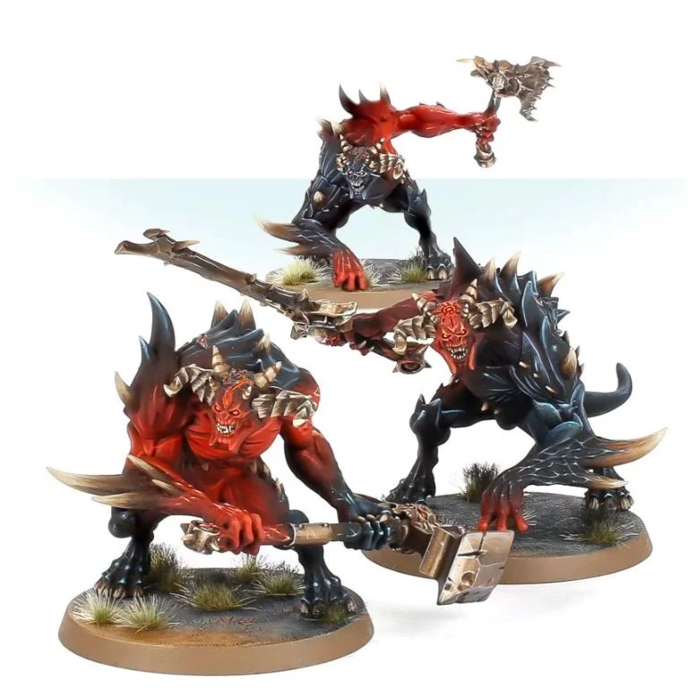

#### Brute {.newpage}

{height=8cm}

Depuis l'Hérésie d'Horus et la Longue Guerre, les brutes ont émergé du maelström des tempêtes du Warp qui ont sévi. Ces créatures, qui surpassent même les Space Marines en taille, manient aussi bien des haches gravées de runes démoniaques que des massues fabriquées à partir de barres d'armature arrachées à des infrastructures détruites ; elles constituent l'avant-garde de la horde des démons du Chaos.

#### Brutes

*Démon (Chaos indivisible) de taille grande, chaotique mauvais*

**Classe d'armure** 14 (armure naturelle)

**Points de vie** 95 (9d10+45)

**Vitesse** 9 m

FOR    | DEX    | CON    | INT    | SAG    | CHA
:---:  | :---:  | :---:  | :---:  | :---:  | :---:
18 (+4)| 13 (+1)| 20 (+5)| 13 (+1)| 9 (-1)| 10 (0)

**Compétences** : Intimidation +3, Perception +2

**Résistances aux dégâts** :aux dégâts d’énergie et cinétiques infligés par des attaques non améliorées et non bénies.

**Sens** : vision dans le noir 24 m., Perception passive 12

**Langues** : parle le chaotique

**Facteur de puissance** : 5 (1 800 XP)

##### Traits

**Agressif.** En tant qu'action bonus, la brute peut se déplacer jusqu'à sa vitesse vers une créature hostile qu'elle peut voir.

**Anathème psychique.** La brute bénéficie d'un avantage aux jets de sauvegarde contre les pouvoirs psychiques.

##### Actions

**Attaque multiple.** La brute effectue deux attaques : l'une avec sa morsure et l'autre avec sa grande épée.

**Morsure.** Attaque au corps à corps : +7 pour toucher, portée de 1,5 mètre, une cible. Touché : 5 (1d8+4) points de dégâts cinétiques.

**Grande épée.** Attaque avec une arme de mêlée : +7 pour toucher, portée de 1,5 mètre, une cible. Touché : 11 (1d12+4) points de dégâts cinétiques.

##### Réaction

**Fureur déchaînée.** Lorsqu'il est touché par une attaque au corps à corps, la brute peut effectuer une attaque au corps à corps avec avantage contre l'attaquant.

