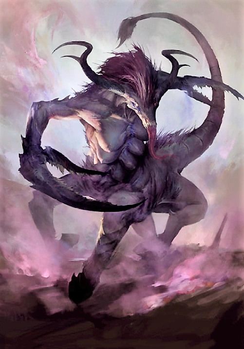

#### Charnelle de Slaanesh (Fiend) {#charnelle-de-slaanesh .newpage}

{height=8cm}

Les charnelles de Slaanesh sont des bêtes hideuses, qui se présentent sous la forme de torses humanoïdes associés à des corps de centaures, voire de monstres à multiples pattes dotés d'une seule bouche béante. Capables d'émettre d'horribles cris stridents, ces créatures peuvent paralyser et neutraliser leurs adversaires avant de leur soutirer vie et vitalité grâce à leur pouvoir d'aspiration d'âmes.

#### Charnelle

*Démon (Slaanesh) de taille grande, chaotique mauvais*

**Classe d'armure** 15 (armure naturelle)

**Points de vie** 84 (13d10+13)

**Vitesse** 15 m (escalade 15 m)

FOR    | DEX    | CON    | INT    | SAG    | CHA
:---:  | :---:  | :---:  | :---:  | :---:  | :---:
15 (+2)| 15 (+2)| 14 (+2)| 11 (0)| 14 (+2)| 10 (0)

**Compétences** : Perception +5

**Résistances aux dégâts** : au poison, aux dégâts pyschiques, à la foudre ; aux dégâts d’énergie et cinétiques infligés par des attaques non améliorées et non bénies.

**Sens** : vision aveugle 3 m, vision dans le noir 18 m., Perception passive 15

**Langues** : parle le chaotique, télépathie 18 m

**Jets de sauvegardes** : Dex +5, Sag +5

**Facteur de puissance** : 6 (2 300 XP)

##### Traits

**Ouïe et odorat aiguisés.** Le démon bénéficie d’un avantage aux jets de Sagesse (Perception) qui reposent sur l’ouïe et l’odorat.

**Anathème psychique.** Le démon bénéficie d’un avantage aux jets de sauvegarde contre les pouvoirs psychiques.

**Cri strident.** Le démon émet un cri strident horrible auquel les démons de Slaanesh sont immunisés. Toute autre créature qui commence son tour à moins de 9 mètres du démon doit réussir un jet de sauvegarde de Constitution avec un DD de 12, sous peine de perdre connaissance pendant 10 minutes. Une créature qui n’entend pas le cri réussit automatiquement son jet de sauvegarde. L’effet sur la créature prend fin si elle subit des dégâts ou si une autre créature effectue une action pour l’asperger d’eau bénite. Si le jet de sauvegarde d’une créature est réussi ou si l’effet prend fin pour elle, elle est immunisée contre le bourdonnement pendant les 24 heures suivantes.

##### Actions

**Léchage.** Attaque au corps à corps : +5 pour toucher, portée de 1,5 mètre, une créature. Touché : 16 (4d6 + 2) points de dégâts perforants plus 24 (7d6) points de dégâts nécrotiques ; le maximum de points de vie de la cible est réduit d’un montant égal aux dégâts nécrotiques subis. Si cet effet réduit le maximum de points de vie d’une créature à 0, celle-ci meurt. Cette réduction du maximum de points de vie d’une créature dure jusqu’à ce que celle-ci termine un long repos ou jusqu’à ce qu’elle soit affectée par un pouvoir tel que « Restauration supérieure ».

