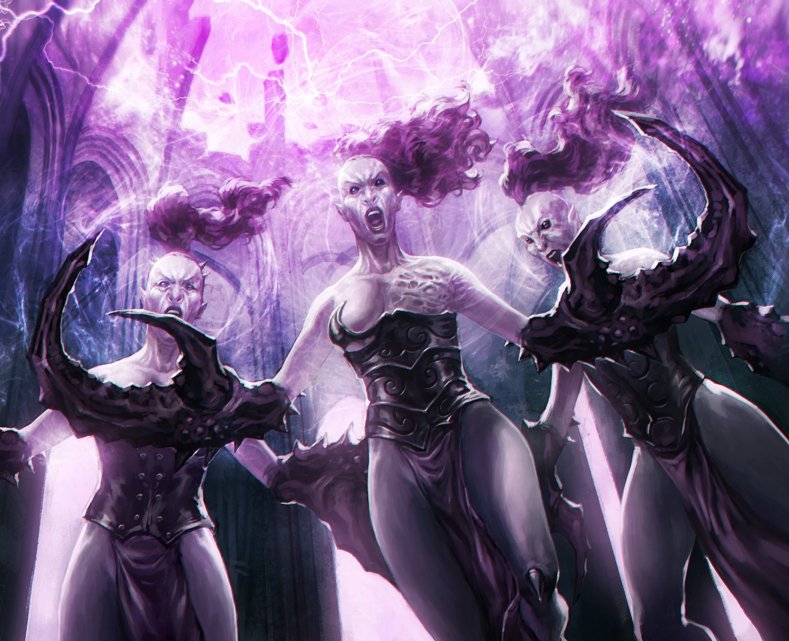

#### Démonette {.newpage}

{height=8cm}

Les Démonettes de Slaanesh sont des créatures humanoïdes difformes, recouvertes d'écailles roses, dotées de langues fourchues, de cornes tordues et de pinces semblables à celles d'un homard, capables de déchirer aussi bien l'armure que la chair. Ces Démonettes servent le dieu du plaisir en plaçant des victimes sans méfiance sous leur emprise, les poussant ainsi à fonder des cultes hédonistes.

#### Démonette

*Démon (Slaanesh) de taille moyenne, chaotique neutre*

**Classe d'armure** 15 (armure naturelle)

**Points de vie** 66 (12d8+12)

**Vitesse** 9 m

FOR    | DEX    | CON    | INT    | SAG    | CHA
:---:  | :---:  | :---:  | :---:  | :---:  | :---:
8 (-1)| 17 (+3)| 13 (+1)| 13 (+1)| 12 (+1)| 20 (+5)

**Compétences** : Discrétion +7, Perception +5, Perspicacité +5, Persuasion +9, Tromperie +9

**Résistances aux dégâts** : feu, poison, psychique, foudre ; dégâts énergétiques et cinétiques infligés par des armes non bénies

**Sens** : vision dans le noir 24 m., Perception passive 15

**Langues** : parle le chaotique, télépathie 24 mètres

**Facteur de puissance** : 4 (1 100 XP)

##### Traits

**Lien télépathique.** La démonette ignore la restriction de portée de sa télépathie lorsqu’elle communique avec une créature qu’elle a envoûtée. Il n’est même pas nécessaire que les deux se trouvent sur le même plan d’existence.

##### Actions

**Attaque multiple.** La démonette effectue deux attaques avec ses griffes, puis utilise « Nectar ».

**Charme.** Un humanoïde que la démonette peut voir à moins de 9 mètres d’elle doit réussir un jet de sauvegarde de Sagesse (DD 15) ou être sous l’emprise d’un charme psychique pendant 1 jour. La cible charmée obéit aux ordres verbaux ou télépathiques de la démonette. Si la cible subit des dégâts ou reçoit un ordre suicidaire, elle peut répéter le jet de sauvegarde ; en cas de réussite, l’effet prend fin. Si la cible réussit son jet de sauvegarde contre cet effet, ou si l’effet dont elle fait l’objet prend fin, elle est immunisée contre le Charme de cette démonette pendant les 24 heures suivantes.

La démonette ne peut envoûter qu’une seule cible à la fois. Si elle envoûte une autre cible, l’effet sur la cible précédente prend fin.

**Griffe.** Attaque au corps à corps : +6, portée 1,5 mètres, une cible. Touché : 10 (2d6+3) points de dégâts cinétiques.

**Nectar.** La démonette libère des émanations toxiques et du nectar, tentant d’endormir psychiquement un humanoïde situé à moins de 9 mètres. La cible doit réussir un jet de sauvegarde de Sagesse avec un DD de 11, sinon elle perd connaissance et s’endort. Cet effet dure 1 minute, jusqu’à ce que la personne endormie subisse des dégâts, ou jusqu’à ce qu’une autre créature utilise une action pour la secouer ou la gifler afin de la réveiller.

