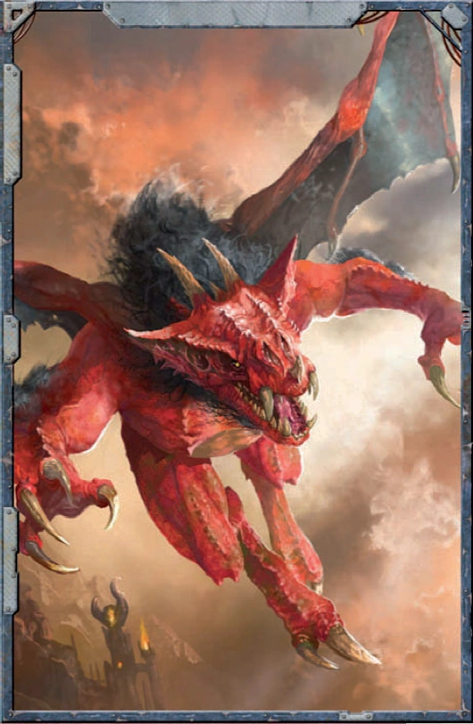

#### Furie (bêtes du chaos) {.newpage}

{height=8cm}

Ces créatures volantes, semblables à des gargouilles, sont connues pour plonger depuis les tempêtes du Warp grâce à leurs ailes de cuir, semant le chaos sur les champs de bataille. Selon certaines hypothèses, ces créatures ne ressentiraient que quelques émotions, qui ne seraient toutes que des variantes déformées de la rage, de la haine et de la douleur éternelle.

 Les érudits pensent que les furies sont l’incarnation d’âmes piégées au sein de l’Immaterium, condamnées à souffrir éternellement et à nourrir les dieux sombres auxquels elles sont désormais asservies. Lorsqu’elles ne tuent pas l’une de leurs victimes, on les a vues les traîner à travers des portails pour les ramener dans l’Immaterium, peut-être pour qu’elles soient soumises à des expériences menées par des apothicaires déchus ou des forgerons du Warp, ou simplement pour être torturées.

#### Furie

*Démon (Chaos indivisible) de taille moyenne, chaotique mauvais*

**Classe d'armure** 19 (armure de combat corrompue)

**Points de vie** 82 (11d8+33)

**Vitesse** 9 m , vol 18 m

FOR    | DEX    | CON    | INT    | SAG    | CHA
:---:  | :---:  | :---:  | :---:  | :---:  | :---:
18 (+4)| 18 (+4)| 16 (+3)| 14 (+2)| 12 (+1)| 16 (+3)

**Jets de sauvegardes** : For +7, Con +6, Int +5, Cha +6

**Compétences** : Discretion +7, Intimidation +6, Perception +4, Tromperie +6

**Résistances aux dégâts** : au feu, au froid, à la foudre, au poison ; aux dégâts d’énergie et cinétiques infligés par des attaques non améliorées et non bénies.

**Sens** : vision dans le noir 18 m., Perception passive 13

**Langues** : Parle le chaotique et l'hérétique

**Facteur de puissance** : 5 (1 800 XP)

##### Traits

**Bénédiction impie.** La CA de la furie inclut son bonus de Charisme.

**Lanceur de pouvoir psychique**. La capacité de lancement de pouvoir psychiques de la furie est le Charisme (jet de sauvegarde psychique : DD 14). La furie peut lancer les pouvoirs suivants :

- 3 fois par jour chacun : « Détection du Warp », « Métamorphose », « Ordre »
- 1 fois par jour : « Déplacement planaire Shift » (pour elle-même uniquement)

##### Actions

**Attaque multiple.** La furie effectue deux attaques au corps à corps ou utilise deux fois son Rayon de feu.

**Lance.** Attaque au corps à corps ou à distance : +7 pour toucher, portée de 1,5 mètres ou 6/18 mètres, une cible. En cas de coup réussi : 7 (1d6+4) points de dégâts cinétique, ou 8 (1d8+4) points de dégâts cinétique si l'arme est utilisée à deux mains pour effectuer une attaque au corps à corps, plus 3 (1d6) points de dégâts de feu.

**Rayon de feu.** Attaque de sort à distance : +7 pour toucher, portée de 36 mètres, une cible. En cas de coup réussi : 10 (3d6) points de dégâts de feu.

