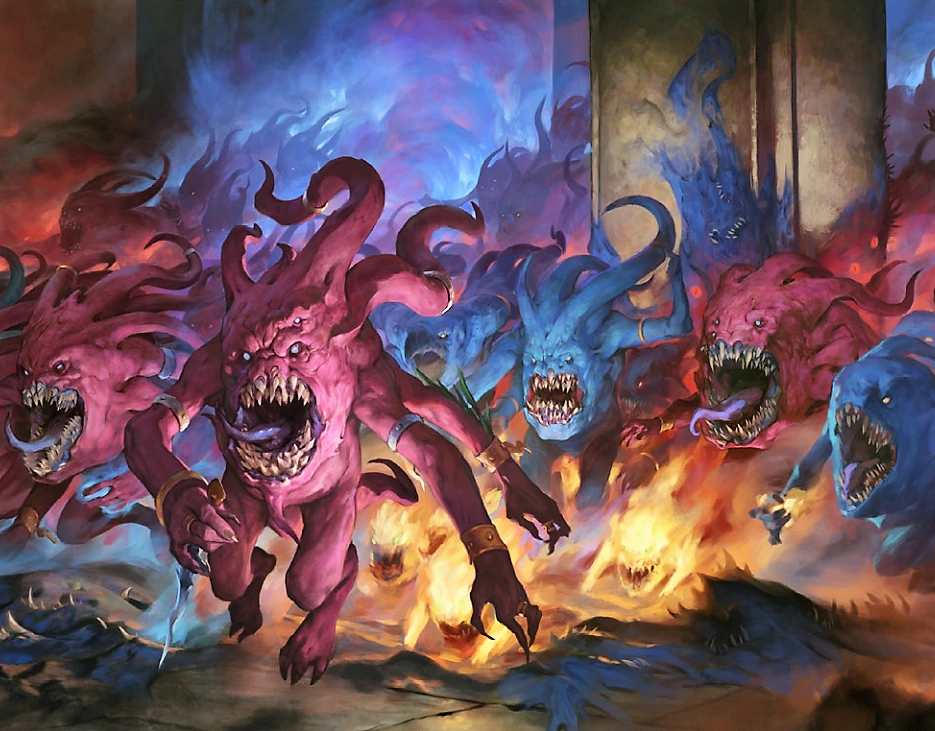

#### Horreur de Tzeentch {.newpage}

{height=8cm}

Les horreurs de Tzeentch sont de petits démons ressemblant à des masses informes, dotés d’une gueule béante remplie de dents circulaires qui crachent des flammes et transpercent le métal et les armures grâce à leur mâchoire acérée comme un rasoir. Ces démons sont surtout connus pour leur capacité à se diviser en deux nouvelles horreurs à leur mort.

**Des monstres qui se multiplient.** Lorsqu’une horreur est tuée, deux autres horreurs apparaissent à sa place. Grâce à cette capacité, elles sont capables d’envahir rapidement les ennemis par leur nombre si un nombre suffisant d’entre elles est tué. Les Seigneurs du Changement qui gouvernent ces créatures les utilisent le plus souvent en masse pour briser rapidement les avant-gardes à l’aide de centaines de monstres cracheurs de flammes, semant le chaos et la destruction partout où ils passent.

**Hiérarchie colorée.** Les horreurs obéissent à une logique de division bien précise. Au sommet de la hiérarchie des horreurs se trouve l’horreur rose. Lorsque l’horreur rose est tuée, elle se divise en deux horreurs bleues, et lorsque celles-ci sont tuées, elles se divisent à leur tour en petites boules de feu appelées « horreurs de soufre ».

#### Horreur de Tzeentch

*Démon (Tzeentch) de taille petite, chaotique mauvais*

**Classe d'armure** 13 (armure naturelle)

**Points de vie** 27 (6d6+6)

**Vitesse** 10 m

FOR    | DEX    | CON    | INT    | SAG    | CHA
:---:  | :---:  | :---:  | :---:  | :---:  | :---:
6 (-2)| 15 (+2)| 12 (+1)| 7 (-2)| 11 (0)| 14 (+5)

**Compétences** :  Perception +2

**Résistances aux dégâts** : au froid ; aux dégâts psychiques, d’énergie et cinétiques infligés par des attaques non améliorées et non bénies.

**Immunités aux dégat** : au feu

**Sens** : vision dans le noir 24 m., Perception passive 12

**Langues** : parle le chaotique, télépathie 24 m

**Facteur de puissance** : 4 (1 100 XP)

##### Traits

**Division.** Lorsqu’une horreur de Tzeentch meurt, elle se divise en deux nouvelles horreurs disposant chacune de **13 points de vie**, appelées « horreurs bleues ». Lorsque ces horreurs bleues meurent, elles se divisent chacune en deux nouvelles horreurs disposant chacune de **6 points de vie**, appelées « horreurs de soufre ». Les nouvelles horreurs ainsi créées disposent de toutes les capacités et caractéristiques, même si l’horreur d’origine les avait déjà utilisées.

**Tactiques de meute.** L’horreur bénéficie d’un avantage lors d’un jet d’attaque contre une créature si au moins un de ses alliés se trouve à moins de 1,5 mètre de cette créature et que cet allié n’est pas hors de combat.

**Lanceur de pouvoir psychique.** La capacité de lanceur de pouvoir de l’horreur est le Charisme (jet de sauvegarde psychique de difficulté 12, +4 pour toucher avec les attaques psychiques). L’horreur peut lancer les pouvoirs suivants :

- À volonté : éclair de feu, main psychique
- 1 fois par jour chacun : mains brûlantes, charme de personne, détection des pensées, rayon brûlant

##### Actions

**Morsure.**  Attaque à l'arme de mêlée : +4, portée de 1,5 mètre, une cible. En cas de coup réussi : 5 (1d6+2) points de dégâts cinétiques plus 7 (2d6) points de dégâts de feu

