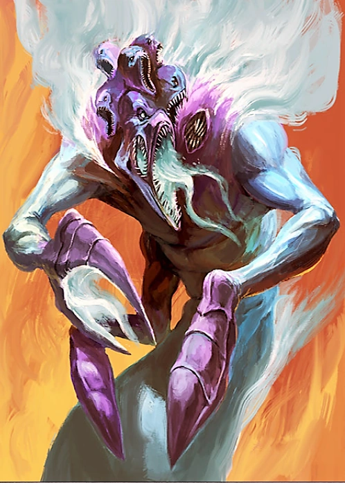

#### Incendiaire {#incendiaire .newpage}

{height=8cm}

Les Incendiaires de Tzeentch sont des démons flamboyants du Dieu du Changement, dont les flammes ésotériques consument aussi bien la chair que l'esprit. Leurs jets de feu aux couleurs irréelles ne se contentent pas de brûler leurs victimes : ils déforment la réalité et sèment le chaos sur le champ de bataille. Là où ils apparaissent, la volonté insondable de Tzeentch se manifeste dans un déluge de magie et de destruction.

#### Incendiaire

*Démon (Tzeentch) de taille moyen, chaotique mauvais*

**Classe d'armure** 13

**Points de vie** 45 (7d8+14)

**Vitesse** 1,5 m, vol 12m (vol stationnaire)

FOR    | DEX    | CON    | INT    | SAG    | CHA
:---:  | :---:  | :---:  | :---:  | :---:  | :---:
6 (-2)| 17 (+3)| 14 (+2)| 6 (-2)| 10 (0)| 16 (+3)

**Compétence** : Occultisme +2, Perception +2

**Résistances aux dégâts** : aux dégâts psychique

**Invulnérabilité aux dégâts** : au feu, au froid, au poison

**Immunités aux états** : a terre, charmé, effrayé, empoisonné

**Sens** : Vision dans le noir 18 mètres, Perception passive 12

**Langues** : parle le chaotique

**Facteur de puissance** : 5 (1 800 XP)

##### Traits

**Éclairage.** L'incendiaire diffuse une lumière vive dans un rayon de 4,5 mètres et une lumière tamisée sur 4,5 mètres supplémentaires.

**Corps enflammé.** Une créature qui touche l'incendiaire ou qui le touche avec une attaque au corps à corps à moins de 1,5 mètre de lui subit 5 (1d10) points de dégâts de feu.

**Lanceur de pouvoir psychique**. L'incendiaire est un lanceur de pouvoir psychique de niveau 5. Sa capacité de lanceur de pouvoir psychique est le Charisme (jet de sauvegarde psychique de DC 13, +5 pour toucher avec les attaques psychiques). L'incendiaire dispose de 20 points de lanceur de pouvoir psychique et connaît les pouvoirs psychiques suivants :

- À volonté : main psychique, feux follets
- Niveau 1 : mains brûlantes, trait de la sorcière
- Niveau 2 : flou, sphère de feu
- Niveau 3 : boule de feu

##### Actions

**Attaque multiple.** L'incendiaire utilise deux fois « Rayon de flammes distordues ».

**Rayon de flammes distordues.** Attaque psychique à distance : +5 pour toucher, portée de 9 mètres, une cible. En cas de coup : 10 (3d6) points de dégâts de feu.

**Morsure.** Attaque au corps à corps : +5 pour toucher, portée de 1,5 mètre, une cible. En cas de coup : 10 (2d6+3) points de dégâts cinétiques.

