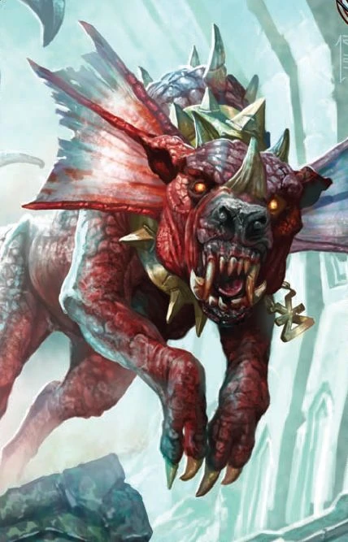

#### Molosse de Khorne {#molosse .newpage}

{height=8cm}

Les molosses de Khorne sont des bêtes voraces à quatre pattes, semblables à des loups, dont la peau semble collée à leur corps, dévoilant leurs traits émaciés et leurs muscles tordus. Ces molosse, comme de nombreux démons de Khorne, nourrissent une haine innée envers les psykers et sont envoyés en meute pour les traquer lorsque l’occasion se présente.

**Colliers en laiton.** Tous les molosses de Khorne sont équipés d’un collier en laiton (déjà pris en compte dans la fiche de caractéristiques), qui s’enfonce dans leur cou, leur causant une irritation constante.

**Poursuivants.** Les molosses sont connus pour être des poursuivants implacables, traquant parfois ceux qui ont attiré la colère de Khorne sur des kilomètres, pendant des jours, voire des semaines. Ce qui reste de leurs victimes, en particulier leurs crânes, est rapporté à leurs maîtres pour être placé sur le trône de crânes de leur seigneur.

**Cauchemars hantés.** Lorsqu’elle est pourchassée par un molosse, la victime commence à faire des cauchemars terrifiants détaillant sa poursuite. Les victimes des molosses de Khorne deviennent souvent folles à cause du manque de sommeil, se transformant rapidement en fous furieux qui ne peuvent que divaguer de manière incohérente au sujet des molosses de Khorne qui les traquent.

#### Molosse

*Démon (Khorne) de taille grande, chaotique mauvais*

**Classe d'armure** 15 (armure naturelle)

**Points de vie** 45 (7d8+15)

**Vitesse** 15 m

FOR    | DEX    | CON    | INT    | SAG    | CHA
:---:  | :---:  | :---:  | :---:  | :---:  | :---:
17 (+3)| 12 (+1)| 14 (+2)| 6 (-2)| 13 (+1)| 6 (-2)

**Compétences** : Perception +5

**Résistances aux dégâts** : aux dégâts d’énergie et cinétiques infligés par des attaques non améliorées et non bénies.

**Sens** : vision dans le noir 18 m., Perception passive 15

**Langues** : Comprend le chaotique mais ne le parle pas

**Facteur de puissance** : 3 (700 XP)

##### Traits

**Collier en laiton.** Le molosse bénéficie d’un avantage aux jets de sauvegarde contre les pouvoirs psychiques, ainsi qu’aux tests de Survie visant à pister des créatures dotées de la capacité « lanceur de pouvoir psychique ».

**Ouïe et odorat aiguisés.** Le molosse bénéficie d’un avantage aux jets de Perception qui reposent sur l’ouïe ou l’odorat.

**Tactiques de meute.** Le molosse bénéficie d’un avantage à son jet d’attaque contre une créature si au moins un de ses alliés se trouve à moins de 1,5 mètre de cette créature et que cet allié n’est pas hors de combat.

##### Actions

**Morsure.** Attaque au corps à corps : +5 pour toucher, portée de 5 pieds, une cible. Touché : 7 (1d8+3) points de dégâts perforants plus 7 (2d6) points de dégâts de feu.

**Souffle de feu (recharge 5-6).** Le molosse crache du feu dans un cône de 4,5 mètres. Chaque créature se trouvant dans cette zone doit effectuer un jet de sauvegarde de Dextérité avec un DD de 12 ; en cas d'échec, elle subit 21 (6d6) points de dégâts de feu, ou la moitié de ces dégâts en cas de réussite.

