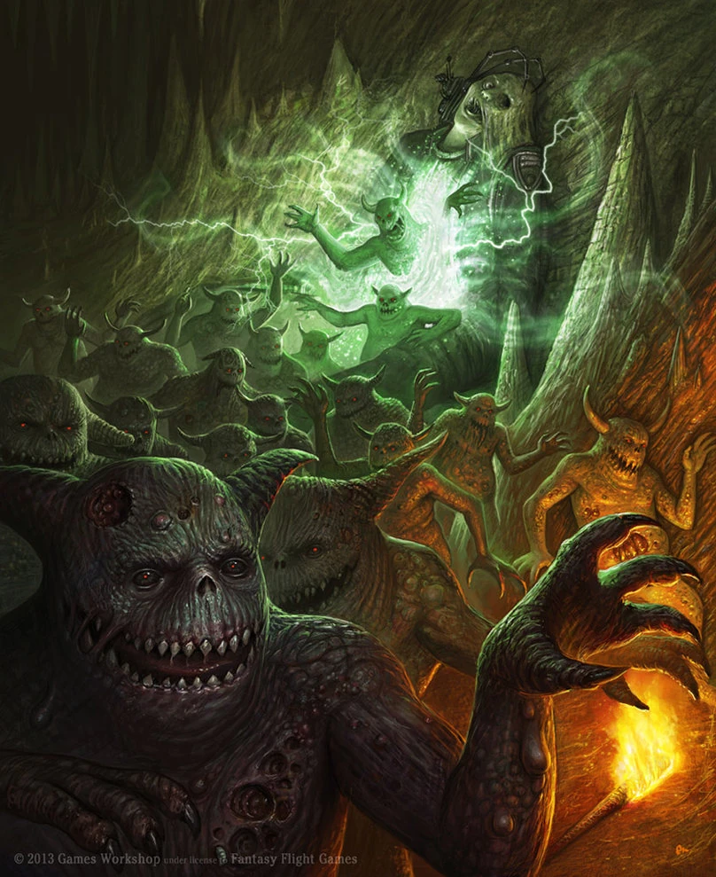

#### Nurgling {.newpage}

{height=8cm}

Réputé pour sa bonne humeur comparé aux autres Puissances de la ruine, Nurgle, le dieu de la peste, de la misère et de la non-vie, engendre souvent de petites créatures sphériques, appelées nurglings, qui ont tendance à rouler partout et à répandre ses « bénédictions » sur ceux qui les entourent.

**Des boules de joie.** Ces petits nurglings ont tendance à rouler partout, joyeux et étourdis, et tentent de répandre leurs émanations nocives sur tous ceux qui entrent en contact avec eux. Dans la plupart des cas, les nurglings sont accompagnés d’un démon supérieur, tel qu’un porteur de peste ou un sorcier, qui les guide.

**Les plus faibles des démons.** Parmi tous les démons mineurs, les nurglings comptent parmi les plus bas dans la hiérarchie. Cependant, en grand nombre, ils sont capables de déferler sur les remparts et les barricades, corrodant les armures, les armes et les métaux les plus résistants lorsqu’ils sont utilisés en nombre suffisant.

**De la chair à canon.** Dans certains cas, les nurglings sont propulsés à grande vitesse par des canons, servant d’arme de guerre biologique pour propager des fléaux par-delà les barrières et pour corroder les remparts et les positions fortifiées ennemies.

#### Nurgling

*Démon (Nurgle) de taille très petite, chaotique mauvais*

**Classe d'armure** 8 (armure naturelle)

**Points de vie** 1 (1d4-1)

**Vitesse** 4,5 m

FOR    | DEX    | CON    | INT    | SAG    | CHA
:---:  | :---:  | :---:  | :---:  | :---:  | :---:
7 (-2)| 6 (-2)| 9 (-1)| 5 (-3)| 7 (-2)| 3 (-4)

**Vulnérabilité aux dégâts** : au feu

**Résistances aux dégâts** : a l'acide, aux dégâts nécrotique ; aux dégâts d’énergie et cinétiques infligés par des attaques non améliorées et non bénies.

**Invulnérabilité aux dégâts** : au poison

**Immunités aux états** : empoisonné

**Langues** : parle le chaotique

**Facteur de puissance** : 1/2 (100 XP)

##### Traits

**Pourriture.** Les créatures qui commencent leur tour à moins de 1,5 mètre du nurgling doivent réussir un jet de sauvegarde de Constitution (DD 9) ; en cas d’échec, elles subissent 2 (1d4) points de dégâts de poison.

**Explosion mortelle.** Lorsque le nurgling atteint 0 point de vie, les créatures situées à moins de 1,5 mètre de lui doivent réussir un jet de sauvegarde de Dextérité (DD 9) au moment où il explose. En cas d’échec, la créature subit 1 point de dégâts de poison. Si la créature porte une armure non améliorée, la CA de son armure est réduite de 1, jusqu’à un maximum de 5. Si l’armure ne confère plus de bonus à la CA ou atteint la réduction maximale de 5 points de CA, elle se brise.

##### Actions

**Morsure.** Attaque au corps à corps : +0, portée 1,5 mètre, une créature. Touché : 1 (1d1) point de dégâts cinétiques. Si la cible est une créature autre qu'un mort-vivant ou un démon de Nurgle, elle doit réussir un jet de sauvegarde de Constitution ( DD 9). En cas d'échec, cette créature passe son tour suivant à utiliser une action pour tousser et vomir de manière incontrôlable.

