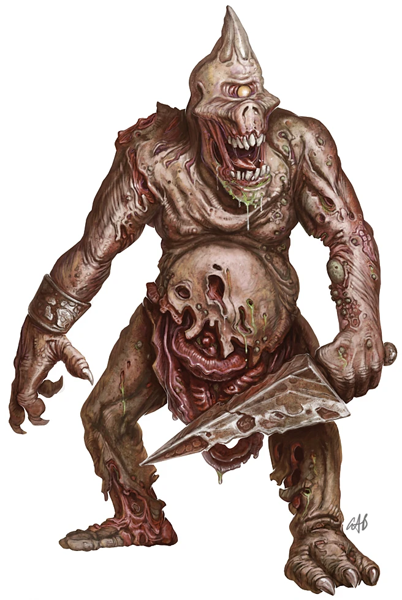

#### Porteur de la Peste {#porteur-peste .newpage}

{height=5cm}

Les Porteurs de la Peste constituent l’infanterie de ligne des légions démoniaques de Nurgle. Ces créatures rongées par la peste sont souvent gonflées, suintantes de pourriture et de maladie, et présentent une teinte verdâtre ou brunâtre malsaine, accompagnée d’une odeur de chair en décomposition qui imprègne leur présence.

**La pourriture de Nurgle.** La tristement célèbre pourriture de Nurgle est connue pour corrompre non seulement la chair, mais aussi l’âme d’une créature, la déformant et la transformant en ces abominations que l’on appelle les porteurs de peste.

**Épées de peste.** Chaque porteur de peste est équipé d’une épée de peste, une arme imprégnée des énergies nécrotiques des bénédictions de Nurgle. À l’aide de ces épées de la peste, ils continuent de propager leurs maladies parmi les ennemis qu’ils combattent.

**Devoirs.** Le devoir des porteurs de la peste est de recenser les nouvelles maladies, les symptômes et les maux créés par le père des pestes, et il est de leur devoir absolu de propager ces maladies à un plus grand nombre de personnes, afin que tous puissent connaître la douce étreinte du Grand-Père Nurgle.

#### Porteur de la Peste

*Démon (Nurgle) de taille moyen, chaotique mauvais*

**Classe d'armure** 15 (armure naturelle)

**Points de vie** 95 (10d8+50)

**Vitesse** 9 m

|FOR    | DEX    | CON    | INT    | SAG    | CHA|
|:---:  | :---:  | :---:  | :---:  | :---:  | :---:|
|18 (+4)| 13 (+1)| 20 (+5)| 7 (-2)| 9 (-1)| 7 (-2)|

**Compétence** : Perception +2

**Résistances aux dégâts** : a l'acide, aux dégâts nécrotique ; aux dégâts d’énergie et cinétiques infligés par des attaques non améliorées et non bénies.

**Invulnérabilité aux dégâts** : au poison

**Immunités aux états** : empoisonné

**Sens** : Vision dans le noir 18 mètres, Perception passive 12

**Langues** : parle le chaotique

**Facteur de puissance** : 7 (2 900 XP)

##### Traits

**Corps infecté.** Lorsque le porteur de la peste subit des dégâts de n’importe quel type, à l’exception des dégâts psychique, chaque créature située à moins de 1,5 mètre de lui subit 9 (2d8) points de dégâts de poison.

**Régénération.** Le porteur de la peste regagne 10 points de vie au début de chacun de ses tours. Si le porteur de la peste subit des dégâts de feu ou de radiant, cette capacité ne fonctionne pas avant le début de son tour suivant. Le porteur de la peste ne meurt que s’il commence son tour avec 0 point de vie et ne se régénère pas.

##### Actions

**Attaque multiple.** Le porteur de peste effectue deux attaques avec son épée de peste, puis utilise la Pourriture de Nurgle.

**Épée de peste.** Attaque au corps à corps : +7 pour toucher, portée de 1,5 mètre, une cible. Touché : 11 (2d6+4) points de dégâts de cinétique ainsi que 7 (2d6) points de dégâts nécrotiques.

**Pourriture de Nurgle.** Un humanoïde situé à moins de 3 mètres du porteur de peste doit effectuer un jet de sauvegarde de Constitution avec un DD de 16 ; en cas d’échec, il est empoisonné pendant 1 minute. Si le poison dure 1 minute et n’est pas soigné, l’humanoïde est atteint de la pourriture de Nurgle, une maladie démoniaque renforcée qui commence lentement à faire pourrir la chair de la cible, lui faisant perdre 5 (1d10) points de vie maximum toutes les 24 heures. Si l’humanoïde atteint 0 point de vie maximum, il meurt. Après avoir trouvé la mort de cette manière, la créature ressuscite sous la forme d’un porteur de peste. Cette maladie peut être guérie par les effets de « medicae major », de « restauration majeure » ou d’un effet de « pouvoir supérieur ».

