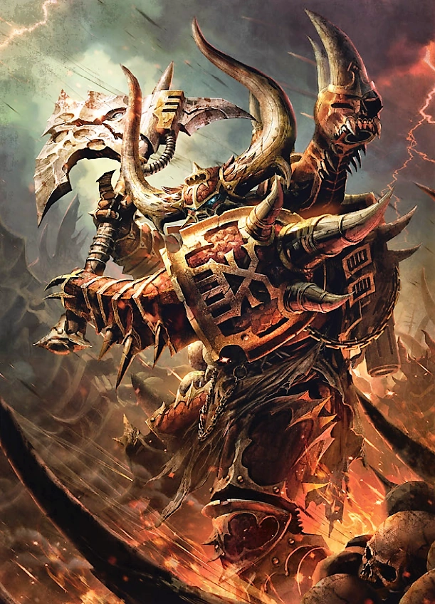

#### Champion du Chaos {#champion}

{height=8cm}

Les champions du Chaos sont ceux à qui les dieux du Chaos ont accordé leur faveur impie. Ces individus peuvent être fortifiés par une cohorte de démons qui les guident ou les utilisent à des fins néfastes, ou bien avoir acquis leurs pouvoirs grâce à leur propre ruse et à leur force. Ces champions servent peut-être les dieux des ténèbres, mais leur comportement, leur attitude, leurs ambitions et leurs objectifs peuvent varier considérablement, et beaucoup d’entre eux héritent de dons différents de la part des dieux qu’ils servent.

#### Champion du Chaos (Indivisible)

*Humain (Corrompu) de taille grande, chaotique mauvais*

**Classe d'armure** 18 (armure énergétique)

**Points de vie** 127 (17d8+51)

**Vitesse** 12 m

FOR    | DEX    | CON    | INT    | SAG    | CHA
:---:  | :---:  | :---:  | :---:  | :---:  | :---:
19 (+4)| 16 (+3)| 17 (+3)| 14 (+2)| 15 (+2)| 16 (+3)

**Jets de sauvegardes** : Dex +6, Con +7, Sag +6, Cha +7

**Compétences** : Athlétisme +8, Intimidation +7, Perception +6

**Résistances aux dégâts** : au feu; aux dégâts d’énergie et cinétiques infligés par des attaques non améliorées et non bénies.

**Sens** : vision aveugle 3 m, vision dans le noir 36 m., Perception passive 16

**Langues** : parle l'hérétique et le bas-gothique

**Facteur de puissance** : 10 (5 900 XP)

##### Traits

**Présence redoutable.** Toute créature hostile qui commence son tour à moins de 18 mètres du champion doit effectuer un jet de sauvegarde de Sagesse avec un DD de 16. En cas d’échec, la créature est effrayée pendant 1 minute. Une créature peut répéter ce jet de sauvegarde à la fin de chacun de ses tours ; en cas de réussite, l’effet qui la touche prend fin. Si le jet de sauvegarde d’une créature est réussi ou si l’effet prend fin pour elle, la créature est immunisée contre la Présence redoutable de tout champion pendant les 24 heures suivantes.

**Saut de téléportation** (recharge 4-6). En tant qu’action bonus, le champion peut se téléporter jusqu’à 9 mètres vers un espace inoccupé qu’il peut voir.

##### Actions

**Attaque multiple.** Le champion effectue deux attaques avec son arme.

**Grande épée.** Attaque au corps à corps : +8 pour toucher, portée de 1,5 mètre, une cible. Touché : 14 (3d6 +4) points de dégâts cinétiques ainsi que 4 (1d8) points de dégâts de feu.

**Fusil d'assaut.** Attaque à distance : +7 pour toucher, portée 30/120 mètres, une cible. Touché : 12 (2d8+3) points de dégâts cinétiques ainsi que 4 (1d8) points de dégâts de feu.

##### Réaction

**Parade.** Le champion ajoute 4 à sa CA contre une attaque au corps à corps qui l'atteindrait. Pour cela, le champion doit voir l'attaquant et manier une arme de corps à corps.

