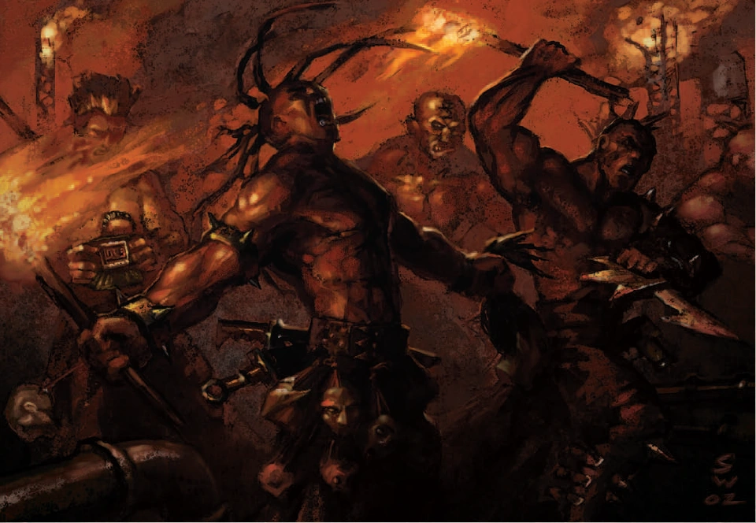

#### Cultiste du Chaos {#cultiste .newpage}

{height=5cm}

Les cultistes du Chaos sont les plus nombreux et les plus méprisés des serviteurs des Puissances de la Ruine. Fanatiques jusqu'à la mort, ils abandonnent toute loyauté envers l'Imperium pour servir leurs maîtres obscurs, convaincus que leur dévotion leur vaudra un jour une récompense divine. Individuellement peu redoutables, ils compensent leur faiblesse par leur nombre, leur fanatisme et leur totale absence de peur face à la mort.

#### Cultiste du Chaos

*Humain (humain ou corrompu) de taille moyenne, chaotique mauvais*

**Classe d'armure** 12 (armure de maille)

**Points de vie** 9 (2d8)

**Vitesse** 9 m

|FOR    | DEX    | CON    | INT    | SAG    | CHA|
|:---:  | :---:  | :---:  | :---:  | :---:  | :---:|
|11 (0)| 12 (+1)| 10 (0)| 10 (0)| 9 (-1)| 12 (+1)|

**Compétences** : Occultisme +1, Tromperie +3

**Sens** : Perception passive 9

**Langues** : parle l'hérétique et le bas-gothique

**Facteur de puissance** : 1/8 (25 XP)

##### Traits

**Dévotion obscure.** Le cultiste bénéficie d’un avantage aux jets de sauvegarde contre les effets de charme ou d’effroi.

##### Actions

**Épée courte.** Attaque au corps à corps : +3 pour toucher, portée 1,5 mètre, une cible. Touché : 4 (1d6+1) points de dégâts cinétiques.

**Pistolet laser.** Attaque à distance : +3 pour toucher, portée 12/48 mètres, une créature. Touché : 3 (1d4+1) points de dégâts d'énergie.

