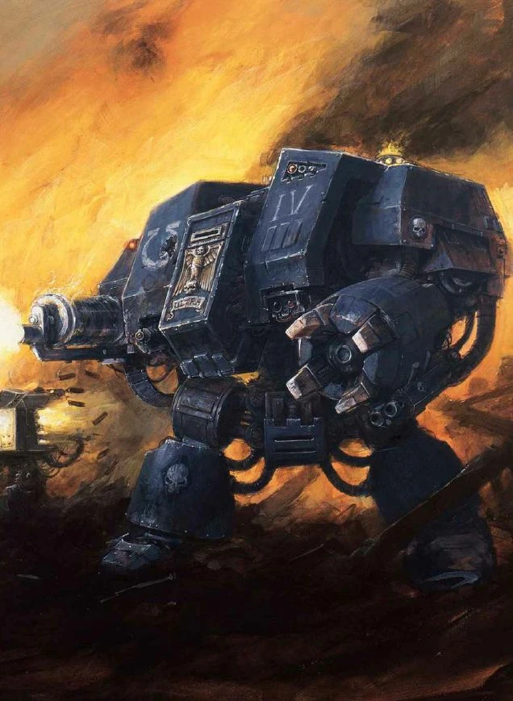

#### Dreadnought {#dreadnought .newpage}

{height=5cm}

Lorsqu’un Space Marine est mortellement blessé et que ses blessures ne peuvent être facilement soignées, il est parfois placé à l’intérieur d’un Dreadnought. Véritables mastodontes issus d’une technologie perdue, ces Dreadnoughts servent de systèmes de survie aux Space Marines qu’ils abritent, tout en constituant un mur imposant d’armes et de puissance de feu, capable à lui seul de raser des escouades entières d’ennemis.

Plus un dreadnought reste actif longtemps, plus le Space Marine qui s'y trouve perd peu à peu la raison. C'est pourquoi de nombreux dreadnoughts sont maintenus dans un état de dormance, leur occupant étant dans le coma, jusqu'à ce qu'une grande bataille éclate.

#### Dreadnought

*Contruct de grande taille, de tout alignement loyal*

**Classe d'armure** 19 (armure naturelle)

**Points de vie** 253 (22d10 + 90)

**Vitesse** 12 m

|FOR    | DEX    | CON    | INT    | SAG    | CHA|
|:---:  | :---:  | :---:  | :---:  | :---:  | :---:|
|28 (+9)| 7 (-2)| 22 (+6)| 13 (+1)| 15 (+2)| 13 (+1)|

**Jet de sauvegarde** : Dex +3, Con +11, Sag +7, Cha +6

**Compétences** : Perception +7

**Résistance aux dégats** : feu

**Immunisé aux dégâts** : au poison, aux dégâts d’énergie et cinétiques infligés par des attaques non améliorées et non bénies.

**Immunisé aux états** : Charmé, fatigué, effrayé, paralysé, pétrifié, empoisonné, immobilisé

**Sens** : Vision aveugle 9 mètres, Vision dans le noir 36 m,  Perception passive 17

**Langues** : parle le bas-gothique, les codes impériaux et le haut-gothique

**Facteur de puissance** : 16 (15 000 XP)

##### Traits

**Machinerie divine.** Le Dreadnought bénéficie d’un avantage lors des jets de sauvegarde contre les pouvoirs technologiques.

**Armes améliorées.** Les attaques à l’arme du chevalier sont améliorées.

##### Actions

**Attaque multiple.** Le Dreadnought attaque une fois avec son canon automatique et deux fois avec son bolter d'assaut. A la place, il peut choisir d'attaquer trois fois avec son poing énergétique.

**Canon automatique.** Attaque à distance : +10 pour toucher, portée 30/120 mètres, une cible. Touché : 22 (3d10+6) points de dégâts cinétiques.

**Bolter d'assaut.** Attaque à distance : +10 pour toucher, portée 30/120 mètres, une cible. Touché : 10 (1d8+6) points de dégâts cinétiques et 7 (2d6) points de dégâts de feu.

**Poing énergétique.** Attaque à l'arme de mêlée : +13 pour toucher, portée de 1,5 mètres, une cible. Touché : 14 (1d10+9) points de dégâts cinétiques et 9 (2d8) points de dégâts de foudre. Une cible touchée doit réussir un jet de sauvegarde de Force avec un DD de 17, sinon elle est renversée.

**Salve (Recharge 5-6).** Le dreadnought tire une salve dévastatrice dans un cône de 18 mètres. Chaque créature se trouvant dans cette zone doit effectuer un jet de sauvegarde de Dextérité de difficulté 17 ; en cas d’échec, elle subit 42 (12d6) points de dégâts cinétiques et 21 (6d6) points de dégâts de feu ; en cas de réussite, elle subit la moitié de ces dégâts.

##### Actions légendaires

**Détection.** Le dreadnought effectue un jet de Perception.

**Poing énergétique.** Le dreadnought effectue une attaque avec son poing énergétique.

**Storm Bolter.** Le dreadnought effectue une attaque avec son Storm Bolter.

**Piétinement (coûte 2 actions).** Le Dreadnought charge sur une distance maximale de 9 mètres en ligne droite et sur une largeur de 3 mètres ; sa charge s’arrête prématurément lorsqu’il entre en collision avec une créature ou un objet de taille Grande ou supérieure. Chaque créature se trouvant dans la zone d’effet doit réussir un jet de sauvegarde de Force avec un DD de 17, sinon elle subit 25 (3d10+9) points de dégâts cinétiques et est renversée.

