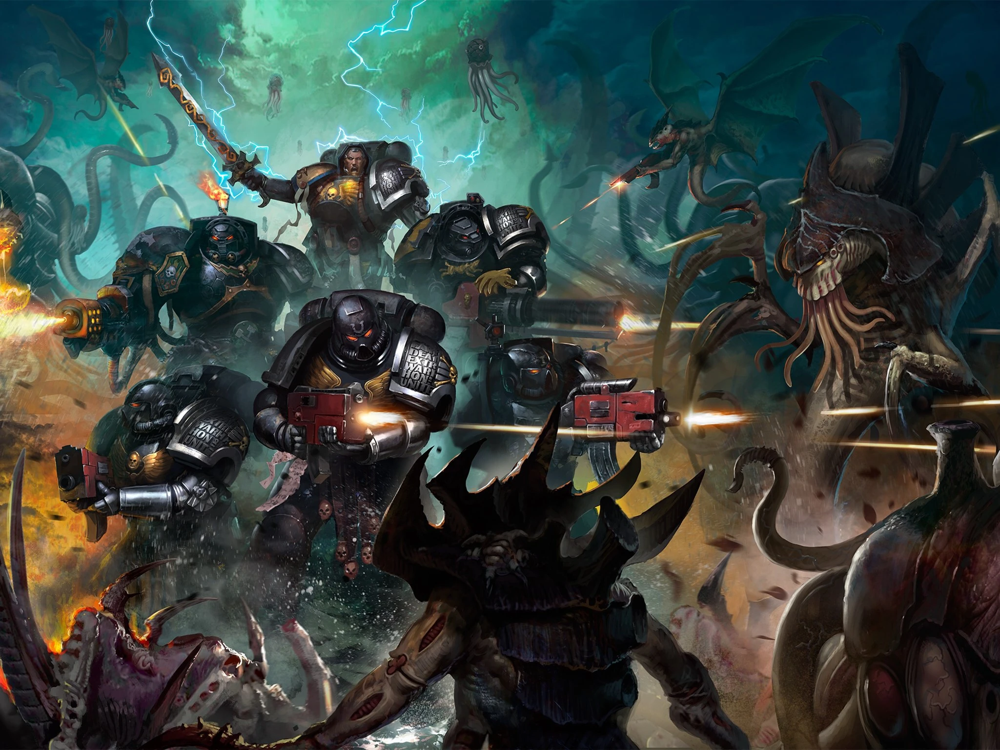

#### SpaceMarine de la Deathwatch {#deatwatch .newpage}

{height=5cm}

Les Space Marines de la Deathwatch servent l’Ordo Xenos de l’Inquisition impériale en tant que Chambre Militante : ce sont les guerriers de dernier recours lorsque l’Inquisition a besoin d’une puissance de feu supérieure à celle que peuvent fournir l’Astra Militarum, une équipe de ses propres acolytes ou même les Agents du Trône.

Sur mille hommes, un seul pourrait être apte à devenir Space Marine. Sur cent Space Marines, un seul pourrait être apte à rejoindre la Deathwatch.

Bien que la Deathwatch soit considérée comme l’une des forces de combat les plus d’élite dont dispose l’Imperium, certains rejoignent ses rangs par honte. Les Space Marines qui ont échoué dans leur mission — que ce soit par manque de foi, par une erreur tactique ou même par la moindre faute au combat n’ayant pas de conséquences durables — peuvent rejoindre volontairement la Deathwatch en guise de pénitence.

#### SpaceMarine de la Deathwatch

*SpaceMarine (toute origine loyaliste) de taille moyenne, loyal bon*

**Classe d'armure** 18 (armure énergétique)

**Points de vie** 127 (15d8 + 60)

**Vitesse** 9 m

|FOR    | DEX    | CON    | INT    | SAG    | CHA|
|:---:  | :---:  | :---:  | :---:  | :---:  | :---:|
|20 (+5)| 16 (+3)| 19 (+4)| 15 (+2)| 16 (+3)| 15 (+2)|

**Jet de sauvegarde** : For +9, Con +8, Sag +7

**Compétences** : Athlétisme +9, Intimidation +6, Perception +7

**Résistance aux dégats** : Poison

**Sens** : Vision dans le noir 18 mètres, Perception passive 17

**Langues** : parle le bas-gothique, les codes impériaux et le haut-gothique

**Facteur de puissance** : 8 (3 900 XP)

##### Traits

**Courage.** Le Space Marine bénéficie d’un avantage aux jets de sauvegarde contre l’effroi.

**Armes améliorées.** Les attaques à l’arme du Space Marine sont améliorées.

**Biologie surhumaine.** Le Space Marine bénéficie d’un avantage aux jets de sauvegarde contre le poison et les maladies non améliorées.

**Spécialiste des armes.** Les armes infligent un dé de dégâts supplémentaire lorsque le Marine de la Deathwatch touche avec celle-ci (inclus dans l’attaque).

##### Actions

**Attaque multiple.** Le Marine Deathwatch attaque trois fois.

**Fusil d'assaut.** Attaque à distance : +7 pour toucher, portée 30/120 mètres, une cible. Touché : 14 (2d10+3) points de dégâts cinétiques.

**Hache d'armes.** Attaque avec une arme de mêlée : +9 pour toucher, portée de 1,5 mètre, une cible. Touché : 18 (2d12+5) points de dégâts cinétiques.

